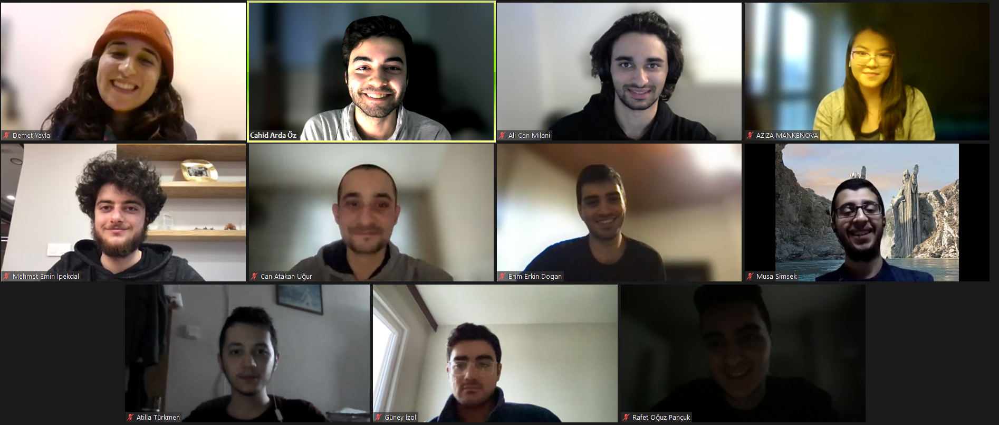

# BOUN SWE 2022 Group 7
Welcome to the GitHub repository of Group 7, we are computer engineering students at Boğaziçi University taking Fundamentals of Software Engineering (CMPE352) in Spring term of 2022. Wiki containing weekly meeting notes, member profiles, researchs and templates can be found [here](https://github.com/bounswe/bounswe2022group7/wiki).

## ideart.

ideart. is an art community platform for browsing and sharing art content. The platform will offer functionalities such as exhibitions, online galleries, discussion forum, auctions and annotations. Currently, we are offering a subset of features which will be present in the final app. With the changes in this tag, we are adding signup and signin functionalities. In addition to signin and signup, we also have home, art item and event pages where we display data we fetch mock data from the database.

* Website: https://ideart.tk/
* API: https://ideart.tk/api/
* API Documentation: https://ideart.tk/api/swagger-ui/index.html
* Annotation Service: https://ideart.tk/annotations

## How To Run
### Docker Compose:

#### Current docker-compose configuration runs the development version of the application.

`docker-compose up` command will build the images from scratch and run the containers with determined environment varibles in the first run. If this command is previously ran and a change is done on **backend**, `docker-compose up --build` command should be used if hot reload doesn't detect the changes.

`docker-compose up -d` command will detach the containers upon execution.

To stop and remove the containers use `docker-compose down`

### Note: 

MySQL data is assigned to a certain volume, so in each rebuild it will conserve the changes. To start with a clear volume, you can either remove the volume part from `docker-compose.yml` file or remove the volume with `docker volume rm mysql_data`

---
### Docker Build & Run
### Backend

`WORKDIR=./docker`

#### Development

To run the development version of the application use the following commands **filling "image-name" field with your chosen name**:

```bash
docker build -f backend.development.Dockerfile -t "image-name" ../backend
docker run --env-file=.env -p 8080:8080 -t "image-name"
```

#### Production

To run the production version of the application use the following commands:

#### Notes:
- Fill the "image-name" with your chosen image name
- For **"production-env-file.env"** create an environment variable file, you can use the current `.env` file uploaded to repository as your template.

```bash
docker build -f backend.production.Dockerfile -t "image-name" ../backend
docker run --env-file="production-env-file.env" -p 8080:8080 -t "image-name"
```

---

### Frontend

`WORKDIR=./docker`

#### Development

To run the frontend in development mode (with hot reload), `docker-compose up` will be the best way, but if you want to manually build and run the image the following command will work:

```bash
docker build -f frontend.development.Dockerfile -t "frontend-image-name"  ../frontend
docker run -p 3000:3000 -t "frontend-image-name" 
```

#### Production

The production build of frontend uses NGINX to serve static files, also NGINX works as a reverse proxy for backend application. To create the image and run:

```bash
docker build -f frontend.production.Dockerfile -t "production-frontend-image" ../frontend
docker run -p 80:80 -t "production-frontend-image
```

#### Notes:
- Fill the parts between `""` as you wish.


---

### Annotation

`WORKDIR=./docker`

#### Development

To run the annotation microservice in development mode `docker-compose up` will be the best way, but if you want to manually build and run the image the following command will work:

```bash
docker build -f annotation.development.Dockerfile -t "annotation-image-name"  ../annotations
docker run -p 3001:3001 -t "annotation-image-name" 
```

#### Production

The production build doesn't work differently then the development build, the only difference is the db connection settings on production environment. Using the following commands will build and run the image.

```bash
docker build -f annotation.production.Dockerfile -t "production-annotation-image" ../annotations
docker run -p 3001:3001 -t "production-annotation-image
```

----

## Our Team



- [Ali Can Milani](https://github.com/bounswe/bounswe2022group7/wiki/Ali-Can-Milani)
- [Atilla Türkmen](https://github.com/bounswe/bounswe2022group7/wiki/Atilla-T%C3%BCrkmen)
- [Başak Önder](https://github.com/bounswe/bounswe2022group7/wiki/Ba%C5%9Fak-%C3%96nder)
- [Cahid Arda Öz](https://github.com/bounswe/bounswe2022group7/wiki/Cahid-Arda-%C3%96z) *(Communicator)*
- [Can Atakan Uğur](https://github.com/bounswe/bounswe2022group7/wiki/Can-Atakan-U%C4%9Fur)
- [Demet Yayla](https://github.com/bounswe/bounswe2022group7/wiki/Demet-Yayla--%F0%9F%90%AC-%F0%9F%90%9A-%E2%AD%90)
- [Enes Aydoğduoğlu](https://github.com/bounswe/bounswe2022group7/wiki/Enes-Aydo%C4%9Fduo%C4%9Flu)
- [Erim Erkin Doğan](https://github.com/bounswe/bounswe2022group7/wiki/Erim-Erkin-Do%C4%9Fan)
- [Güney İzol](https://github.com/bounswe/bounswe2022group7/wiki/G%C3%BCney-%C4%B0zol)
- [Musa Şimşek](https://github.com/bounswe/bounswe2022group7/wiki/Musa-%C5%9Eim%C5%9Fek)
- [Sabri Mete Akyüz](https://github.com/bounswe/bounswe2022group7/wiki/Sabri-Mete-Akyüz)
- [M.Ekrem Gezgen](https://github.com/bounswe/bounswe2022group7/wiki/M.Ekrem-GEZGEN)

#### Former Team Members

- [~Aziza Mankenova~](https://github.com/bounswe/bounswe2022group7/wiki/Aziza-Mankenova)
- [~Hasan Bingölbali~](https://github.com/bounswe/bounswe2022group7/wiki/Hasan-Bingolbali)
- [~Mehmet Emin İpekdal~](https://github.com/bounswe/bounswe2022group7/wiki/Mehmet-Emin-%C4%B0pekdal)
- [~Rafet Oğuz Pançuk~](https://github.com/bounswe/bounswe2022group7/wiki/Rafet-O%C4%9Fuz-Pan%C3%A7uk)
