# List Of Contents

- [1. Group Milestone Review](#1-group-milestone-review)
  * [1.1. Executive Summary](#11-executive-summary)
  * [1.2. Summary of work performed by each team member](#12-summary-of-work-performed-by-each-team-member)
    + [Sabri Mete Akyüz](#sabri-mete-akyüz)
    + [Enes Aydoğduoğlu](#enes-aydoğduoğlu)
    + [Erim Erkin Doğan](#erim-erkin-doğan)
    + [Güney İzol](#güney-i̇zol)
    + [Ali Can Milani](#ali-can-milani)
    + [Başak Önder](#başak-önder)
    + [Cahid Arda Öz](#cahid-arda-öz)
    + [Musa Şimşek](#musa-şimşek)
    + [Atilla Türkmen](#atilla-türkmen)
    + [Can Atakan Uğur](#can-atakan-uğur)
    + [Demet Yayla](#demet-yayla)
  * [1.3. Progress According to Requirements](#13-progress-according-to-requirements)
  * [1.4. API Endpoints](#14-api-endpoints)
  * [1.5. User Interface & User Experience](#15-user-interface--user-experience)
    + [1.5.1. Web](#151-web)
    + [1.5.2. Mobile](#152-mobile)
  * [1.6. Annotations](#16-annotations)
  * [1.7. Standards](#17-standards)
- [2. Individual Contribution Reports](#2-individual-contribution-reports)
  * [Sabri Mete Akyüz](#sabri-mete-akyüz-1)
  * [Enes Aydoğduoğlu](#enes-aydoğduoğlu-1)
  * [Erim Erkin Doğan](#erim-erkin-doğan-1)
  * [Güney İzol](#güney-İzol-1)
  * [Ali Can Milani](#ali-can-milani-1)
  * [Başak Önder](#başak-önder-1)
  * [Cahid Arda Öz](#cahid-arda-öz-1)
  * [Musa Şimşek](#musa-şimşek-1)
  * [Atilla Türkmen](#atilla-türkmen-1)
  * [Can Atakan Uğur](#can-atakan-uğur-1)
  * [Demet Yayla](#demet-yayla-1)

# 1. Group Milestone Review

## 1.1. Executive Summary

#### What is Ideart. / Project Status
Ideart. is an art platform that was created to engage artists and art lovers by sharing events, art items, and discussion posts. Everyone can sign up as a regular user or an artist, but you can also view the public pages as a guest without additional functionalities. Regular users have the ability to follow other users, whether they are regular users or artists, post discussions, and leave comments on events, art items, and discussion posts. Along with the mentioned benefits available to regular users, artists may publish their art works and host physical exhibitions. Our application works on web and mobile both with additional annotation feature which is in developing right now! On web, you can annotate images and see the annotated parts of other users. On the mobile, you can annotate texts, however, backend part has not integrated yet. Fully functional image and text annotation is going to be added to the platform in the next version.

#### Changes from the Latest Version
* To achieve more simple UI, optional fields of sign up page are transferred to the settings page. Hence, you can sign up by providing e-mail, username, password, and user type. If you want to give us some additional information about yourself, you can complete the other optional fields whenever you want.
* Age field is updated to take birthday as input to have more consistent data about the users.
* To facilitate tracking, events are showing the exact location by using Geolocation now!
#### Upcoming Features
* Image and text annotation is going to be completed on both web and mobile and be integrated with the backend. Sidebar is going to be added for viewing all the annotations on the page.
* Artists will be able to create online galleries, similar to the physical exhibition but on the online platform.
* Artists will be able to sell their art works with bidding system.
* All art items is going to be protected by our copyright system. Users will be able to report art works and the artists for copyright infringement by filling the details about the original art work.
* Semantic search is going to be provided on search bar alongside with filtering option.

## 1.2. Summary of work performed by each team member

### Sabri Mete Akyüz

| **Task** | **Link** |
| -------- | ------------ |
| Meeting for planning the group report in first milestone | - |
| Attended weekly group meeting. | https://github.com/bounswe/bounswe2022group7/wiki/CMPE451-Meeting-Notes-%235 |
| Attended backend group meeting. | https://github.com/bounswe/bounswe2022group7/wiki/BACKEND-Meeting-Notes-%234 |
| Fix HTTP Token Error |  https://github.com/bounswe/bounswe2022group7/issues/379 |
| Update endpoints to return JSON |  https://github.com/bounswe/bounswe2022group7/issues/390 |
| Update signup endpoint according to customer feedback | https://github.com/bounswe/bounswe2022group7/issues/391 |
| Combine generic and user specific endpoints |  https://github.com/bounswe/bounswe2022group7/issues/393 |
| Create an endpoint to return a user |  https://github.com/bounswe/bounswe2022group7/issues/416 |
| Return token directly after signup | https://github.com/bounswe/bounswe2022group7/issues/419 |
| Add Artist user signup | https://github.com/bounswe/bounswe2022group7/issues/423 |
| Implement Discussion Post DTO | https://github.com/bounswe/bounswe2022group7/issues/455 |
| Fix a bug related with authentication of a discussion post endpoint | https://github.com/bounswe/bounswe2022group7/issues/469 |
| Implement Event DTO | https://github.com/bounswe/bounswe2022group7/issues/472 |
| Add Json related annotations | https://github.com/bounswe/bounswe2022group7/issues/384 |
| Review of multiple issues of backend team | [#377](https://github.com/bounswe/bounswe2022group7/issues/377), [#379](https://github.com/bounswe/bounswe2022group7/issues/379), [#382](https://github.com/bounswe/bounswe2022group7/issues/382), [#394](https://github.com/bounswe/bounswe2022group7/issues/394), [#420](https://github.com/bounswe/bounswe2022group7/issues/420), [#449](https://github.com/bounswe/bounswe2022group7/issues/449), [#450](https://github.com/bounswe/bounswe2022group7/issues/450), [#454](https://github.com/bounswe/bounswe2022group7/issues/454), [#477](https://github.com/bounswe/bounswe2022group7/issues/477)|
| Review of multiple PR's of backend team | [#PR380](https://github.com/bounswe/bounswe2022group7/pull/380), [#PR383](https://github.com/bounswe/bounswe2022group7/pull/383), [#PR385](https://github.com/bounswe/bounswe2022group7/pull/385), [#PR386](https://github.com/bounswe/bounswe2022group7/pull/386), [#PR413](https://github.com/bounswe/bounswe2022group7/pull/413), [#PR428](https://github.com/bounswe/bounswe2022group7/pull/428), [#PR448](https://github.com/bounswe/bounswe2022group7/pull/448), [#PR451](https://github.com/bounswe/bounswe2022group7/pull/451), [#PR462](https://github.com/bounswe/bounswe2022group7/pull/452), [#PR474](https://github.com/bounswe/bounswe2022group7/pull/474), [#PR476](https://github.com/bounswe/bounswe2022group7/pull/476), [#PR477](https://github.com/bounswe/bounswe2022group7/pull/477)
| One of the notetakers during the Customer Milestone 2||
| Wrote individual milestone report||
| Wrote the API documentation part of the deliverables||

### Enes Aydoğduoğlu

### Erim Erkin Doğan
| Task | Link |
| --- | --- |
| Setup Swagger for endpoint documentation | [#399](https://github.com/bounswe/bounswe2022group7/issues/399), [PR #404](https://github.com/bounswe/bounswe2022group7/pull/404) |
| Configuring Continuous Integration workflow for mobile application | [#408](https://github.com/bounswe/bounswe2022group7/issues/408), PRs [#411](https://github.com/bounswe/bounswe2022group7/pull/411), [#412](https://github.com/bounswe/bounswe2022group7/pull/412) |
| Revising sign-up experience in frontend | [#418](https://github.com/bounswe/bounswe2022group7/issues/418), [PR #452](https://github.com/bounswe/bounswe2022group7/pull/452) |
| Fixing frontend's layout behaviour in Low Resolution Screens | [#422](https://github.com/bounswe/bounswe2022group7/issues/422), [PR #429](https://github.com/bounswe/bounswe2022group7/pull/429) |
| Fixing Android CI to run on Pull Requests | [#425](https://github.com/bounswe/bounswe2022group7/issues/425), [PR #426](https://github.com/bounswe/bounswe2022group7/pull/426) |
| Updating frontend homepage's visual style and fixing the api connection | [#487](https://github.com/bounswe/bounswe2022group7/issues/487), [PR #498](https://github.com/bounswe/bounswe2022group7/pull/498) |
| Revising the frontend's navigation bar design | [#489](https://github.com/bounswe/bounswe2022group7/issues/489), [PR #503](https://github.com/bounswe/bounswe2022group7/pull/503) |
| Setup deployment & tests for Annotation microservice | [#517](https://github.com/bounswe/bounswe2022group7/issues/526), [PR #520](https://github.com/bounswe/bounswe2022group7/pull/517) |
| Fixing the connection of annotation microservice to MongoDB | [#523](https://github.com/bounswe/bounswe2022group7/issues/523), [PR #525](https://github.com/bounswe/bounswe2022group7/pull/525) | 
| Creating tag for milestone 2 | [#526](https://github.com/bounswe/bounswe2022group7/issues/526), [Tag](https://github.com/bounswe/bounswe2022group7/tree/customer-presentation-2) |
| Researching Web Annotation Protocol | [#466](https://github.com/bounswe/bounswe2022group7/issues/466) |

### Güney İzol
| Task | Link |
| --- | --- |
| Research for web annotation | [#441](https://github.com/bounswe/bounswe2022group7/issues/441) |
| Implement web annotation service | [#488](https://github.com/bounswe/bounswe2022group7/issues/488) |
| Implement image annotation frontend functionality | [#501](https://github.com/bounswe/bounswe2022group7/issues/501) |
| Merge pull request for web annotation functionality | [#502](https://github.com/bounswe/bounswe2022group7/pull/502) |
| Reviewed pull request | [#498](https://github.com/bounswe/bounswe2022group7/pull/498) |
| Write the annotation part of the report | [#512](https://github.com/bounswe/bounswe2022group7/issues/512) |

### Ali Can Milani
| Task | Link |
| ----- | ------|
| Implementation of Event Creation Page UI |[Issue #397](https://github.com/bounswe/bounswe2022group7/issues/397), [PR #430](https://github.com/bounswe/bounswe2022group7/pull/430)|
| Implementation of Event Creation Page Network Calls |[Issue #398](https://github.com/bounswe/bounswe2022group7/issues/398), [PR #465](https://github.com/bounswe/bounswe2022group7/pull/465)|
| Change Image Widgets in View Event Page |[Issue #431](https://github.com/bounswe/bounswe2022group7/issues/431), [PR #432](https://github.com/bounswe/bounswe2022group7/pull/432)|
| Implementing Follow Functionality |[Issue #435](https://github.com/bounswe/bounswe2022group7/issues/435), [PR #499](https://github.com/bounswe/bounswe2022group7/pull/499)|
| Update Event View and Create Page Endpoints |[Issue #479](https://github.com/bounswe/bounswe2022group7/issues/479), [PR #480](https://github.com/bounswe/bounswe2022group7/pull/480)|
| Test for Event Create Page |[Issue #482](https://github.com/bounswe/bounswe2022group7/issues/482), [PR #483](https://github.com/bounswe/bounswe2022group7/pull/483)|
| Implementing Discussions |[Issue #504](https://github.com/bounswe/bounswe2022group7/issues/504), [PR #506](https://github.com/bounswe/bounswe2022group7/pull/506)|
| Mobile User Interface / User Experience |[Issue #530](https://github.com/bounswe/bounswe2022group7/issues/530)|
| Issues I Reviewed |[Issue #403](https://github.com/bounswe/bounswe2022group7/issues/403), [Issue #446](https://github.com/bounswe/bounswe2022group7/issues/446)|
| Pull Requests I Reviewed |[PR #406](https://github.com/bounswe/bounswe2022group7/pull/406), [PR #475](https://github.com/bounswe/bounswe2022group7/pull/475), [PR #508](https://github.com/bounswe/bounswe2022group7/pull/508) |
| Group Meetings I Attend | [Meeting #6](https://github.com/bounswe/bounswe2022group7/wiki/CMPE451-Meeting-Notes-%236), [Meeting #7](https://github.com/bounswe/bounswe2022group7/wiki/CMPE451-Meeting-Notes-%237)|
| Mobile Team Meeting I Attend | [Meeting #4](https://github.com/bounswe/bounswe2022group7/wiki/MOBILE-Meeting-Notes-%234), [Meeting #5](https://github.com/bounswe/bounswe2022group7/wiki/MOBILE-Meeting-Notes-%235)|

### Başak Önder
| Task | Link |
| ----- | ------|
| Attended the weekly team meeting, planned the upcoming weeks and discussed the upcoming features. Decided on the endpoint structures and their functionalities | [#235](https://github.com/bounswe/bounswe2022group7/wiki/CMPE451-Meeting-Notes-%235) | 
| Attended the weekly backend team meeting and took the meeting notes, work distribution is done among the team members | [#234](https://github.com/bounswe/bounswe2022group7/wiki/BACKEND-Meeting-Notes-%234) | 
| Edited the endpoints to return HTTP Error and Success responses with corressponding messages | [#376](https://github.com/bounswe/bounswe2022group7/issues/376)  | 
| Changed the age field of user to dateOfBirth because of the Customer Feedback during Milestone 1 |[#377](https://github.com/bounswe/bounswe2022group7/issues/377)  | 
| Started to implementing the necessary classes for Milestone 2  | [#382](https://github.com/bounswe/bounswe2022group7/issues/382)  |
| Attended weekly group meeting and took the meeting notes.|  [#236](https://github.com/bounswe/bounswe2022group7/wiki/CMPE451-Meeting-Notes-%236)|
| Continued to implementing the necessary classes for Milestone 2 | [#382](https://github.com/bounswe/bounswe2022group7/issues/382) |
| Researched about Json Indicators and edited the Json Responses to remove duplicate fields and deprecate user credentials | [#388](https://github.com/bounswe/bounswe2022group7/issues/388) |
| Research about image storing as Base64 string  | [#389](https://github.com/bounswe/bounswe2022group7/issues/389) |
| Creating a new image class and implementing POST/GET/DELETE endpoints for images |  [#389](https://github.com/bounswe/bounswe2022group7/issues/389) |
| Attended weekly group meeting, discussed about reducing the size of Json responses. | [#237](https://github.com/bounswe/bounswe2022group7/wiki/CMPE451-Meeting-Notes-%237) |
| Implementation of CREATE/DELETE endpoints for art item/physical exhibition/online gallery. | [#394](https://github.com/bounswe/bounswe2022group7/issues/394) |
| Implementation of GET/POST endpoints for discussion posts and comments. | [#438](https://github.com/bounswe/bounswe2022group7/issues/438) |
| Edited the POST image endpoint, remove base64 string from here to reduce response time | [#453](https://github.com/bounswe/bounswe2022group7/issues/453) |
| Fix Namings for Endpoint About Discussion "Forum" to "Page" |  [#454](https://github.com/bounswe/bounswe2022group7/issues/454) |
| Debugged the error of creation of several comments at once | [#458](https://github.com/bounswe/bounswe2022group7/issues/458) |
| Debugged the error of backend building on CI and rebased the PR of @CahidArda to not to take up time of from frontend building. | [#PR474](https://github.com/bounswe/bounswe2022group7/pull/474) |
| Review of multiple issues of backend team | [#472](https://github.com/bounswe/bounswe2022group7/issues/472), [#469](https://github.com/bounswe/bounswe2022group7/issues/469), [#447](https://github.com/bounswe/bounswe2022group7/issues/447), [#437](https://github.com/bounswe/bounswe2022group7/issues/437), [#423](https://github.com/bounswe/bounswe2022group7/issues/423), [#416](https://github.com/bounswe/bounswe2022group7/issues/416), [#399](https://github.com/bounswe/bounswe2022group7/issues/399), [#393](https://github.com/bounswe/bounswe2022group7/issues/393), [#391](https://github.com/bounswe/bounswe2022group7/issues/391), [#390](https://github.com/bounswe/bounswe2022group7/issues/390), [#384](https://github.com/bounswe/bounswe2022group7/issues/384), [#379](https://github.com/bounswe/bounswe2022group7/issues/379)|
| Review of multiple PR's of backend team | [#PR404](https://github.com/bounswe/bounswe2022group7/pull/404), [#PR424](https://github.com/bounswe/bounswe2022group7/pull/424), [#PR436](https://github.com/bounswe/bounswe2022group7/pull/436), [#PR448](https://github.com/bounswe/bounswe2022group7/pull/448), [#PR456](https://github.com/bounswe/bounswe2022group7/pull/456), [#PR463](https://github.com/bounswe/bounswe2022group7/pull/463), [#PR464](https://github.com/bounswe/bounswe2022group7/pull/464), [#PR468](https://github.com/bounswe/bounswe2022group7/pull/468), [#PR473](https://github.com/bounswe/bounswe2022group7/pull/473)
| One of the notetakers during the Customer Milestone 2||
| Wrote individual milestone report||
| Wrote the part 1.1, Executive Summary, of this group review|[#509](https://github.com/bounswe/bounswe2022group7/issues/509)|

### Cahid Arda Öz

| Task | Link |
| ----- | ------|
| Adding Form Layout to Sign-up and Sign-in Pages | [#387](https://github.com/bounswe/bounswe2022group7/pull/387) |
| Learning about storing images as Base64, testing it on frontend and reviewing it on backend and mobile. | [#389](https://github.com/bounswe/bounswe2022group7/issues/389) |
| Create event and create art item implementation for frontend | [#401](https://github.com/bounswe/bounswe2022group7/issues/401) |
| Adding a layout for content on the app, fixing endpoints of homepage and improved error page. | [#417](https://github.com/bounswe/bounswe2022group7/pull/417) |
| Completed integration of the new art item and new physical event pages with the endpoints | [#401](https://github.com/bounswe/bounswe2022group7/issues/401), [PR #459](https://github.com/bounswe/bounswe2022group7/pull/459) | 
| Integrated comment section with the endpoints | [#460](https://github.com/bounswe/bounswe2022group7/issues/460), [PR #476](https://github.com/bounswe/bounswe2022group7/pull/476) |
| Reported owner null bug in art item creation | [#457](https://github.com/bounswe/bounswe2022group7/issues/457) |
| Reported duplicate comments bug | [#458](https://github.com/bounswe/bounswe2022group7/issues/458) |
| Reported discussion page GET token requirement bug | [#469](https://github.com/bounswe/bounswe2022group7/issues/469) |
| Reported bugs in comment list fields of event and discussion page endpoints | [#470](https://github.com/bounswe/bounswe2022group7/issues/470) |
| Removed poster id field from the discussion post in the backend | [PR #474](https://github.com/bounswe/bounswe2022group7/pull/474) |
| Merged updates in develop branch into master for deployment | [PR #478](https://github.com/bounswe/bounswe2022group7/pull/478) |
| Added color theme to the app. Styled event, art item and discussion pages. Styled comment section component. Added start&end time selection to create physical event page | [#490](https://github.com/bounswe/bounswe2022group7/issues/490), [PR #491](https://github.com/bounswe/bounswe2022group7/pull/491) |
| CommentSection Component unit tests | [PR #521](https://github.com/bounswe/bounswe2022group7/pull/521) |       
| Mock Text Annotation for Frontend | [PR #522](https://github.com/bounswe/bounswe2022group7/pull/522) |
| Tag for milestone 2 | [#526](https://github.com/bounswe/bounswe2022group7/issues/526) |

### Musa Şimşek

| **Task** | **Link** |
| -------- | ------------- |
| Removal of Optional Fields in Signup Page | [#410](https://github.com/bounswe/bounswe2022group7/issues/410) |
| Final Version of the Profile Page | [#446](https://github.com/bounswe/bounswe2022group7/issues/446) |
| Comment Feature | [#486](https://github.com/bounswe/bounswe2022group7/issues/486) |
| Navigation From Signup Page | [#518](https://github.com/bounswe/bounswe2022group7/issues/518) |
| Review of several issues | [#335](https://github.com/bounswe/bounswe2022group7/issues/335), [#359](https://github.com/bounswe/bounswe2022group7/issues/359), [#374](https://github.com/bounswe/bounswe2022group7/issues/374), [#379](https://github.com/bounswe/bounswe2022group7/issues/375), [#398](https://github.com/bounswe/bounswe2022group7/issues/398), [#479](https://github.com/bounswe/bounswe2022group7/issues/479), [#495](https://github.com/bounswe/bounswe2022group7/issues/495), [#504](https://github.com/bounswe/bounswe2022group7/issues/504) |
| Review of several pull requests | [#465](https://github.com/bounswe/bounswe2022group7/pull/465), [#480](https://github.com/bounswe/bounswe2022group7/pull/480), [#506](https://github.com/bounswe/bounswe2022group7/pull/506), [#511](https://github.com/bounswe/bounswe2022group7/pull/511), [#524](https://github.com/bounswe/bounswe2022group7/pull/524) |
| Pull requests | [#414](https://github.com/bounswe/bounswe2022group7/pull/414), [#475](https://github.com/bounswe/bounswe2022group7/pull/475), [#508](https://github.com/bounswe/bounswe2022group7/pull/508), [#519](https://github.com/bounswe/bounswe2022group7/pull/519) |

### Atilla Türkmen

| Task | Link |
| ----- | ------|
| Research about base 64 image implementation |[Issue #389](https://github.com/bounswe/bounswe2022group7/issues/389)|
| Implementing Create Art Item Page UI |[Issue #403](https://github.com/bounswe/bounswe2022group7/issues/403), [PR #406](https://github.com/bounswe/bounswe2022group7/pull/406)|
| Implementing Geotagging in Create Event Page |[Issue #439](https://github.com/bounswe/bounswe2022group7/issues/439), [PR #443](https://github.com/bounswe/bounswe2022group7/pull/443)|
| Implementing Create Art Item Page Network Functionality |[Issue #484](https://github.com/bounswe/bounswe2022group7/issues/484), [PR #485](https://github.com/bounswe/bounswe2022group7/pull/485)|
| Error Fix when Backend Sends JPG Images |[Issue #493](https://github.com/bounswe/bounswe2022group7/issues/493), [PR #494](https://github.com/bounswe/bounswe2022group7/pull/494)|
| Implementing Text Annotaton UI |[Issue #495](https://github.com/bounswe/bounswe2022group7/issues/482), [PR #511](https://github.com/bounswe/bounswe2022group7/pull/511)|
| Pull Requests I Reviewed |[PR #407](https://github.com/bounswe/bounswe2022group7/pull/407), [PR #426](https://github.com/bounswe/bounswe2022group7/pull/426), [PR #430](https://github.com/bounswe/bounswe2022group7/pull/430), [PR #444](https://github.com/bounswe/bounswe2022group7/pull/444), [PR #529](https://github.com/bounswe/bounswe2022group7/pull/529) |
| Group Meetings I Attend | [Meeting #6](https://github.com/bounswe/bounswe2022group7/wiki/CMPE451-Meeting-Notes-%236), [Meeting #7](https://github.com/bounswe/bounswe2022group7/wiki/CMPE451-Meeting-Notes-%237)|
| Mobile Team Meeting I Attend | [Meeting #4](https://github.com/bounswe/bounswe2022group7/wiki/MOBILE-Meeting-Notes-%234), [Meeting #5](https://github.com/bounswe/bounswe2022group7/wiki/MOBILE-Meeting-Notes-%235)|

### Can Atakan Uğur

| **Task** | **Remarks** |
| -------- | ------------ |
| Create Mobile Metting Notes #4 | [#409](https://github.com/bounswe/bounswe2022group7/issues/409) |
| Complete post widgets in homepage | [#442](https://github.com/bounswe/bounswe2022group7/issues/442), [PR #444](https://github.com/bounswe/bounswe2022group7/pull/444) |
| Update Home Page endpoints & images | [#445](https://github.com/bounswe/bounswe2022group7/issues/442), [PR #471](https://github.com/bounswe/bounswe2022group7/pull/471) | 
|Implement user profile settings | [#481](https://github.com/bounswe/bounswe2022group7/issues/481), [PR #505](https://github.com/bounswe/bounswe2022group7/pull/505)|
| Implement the UI for Image Annotations | [#507](https://github.com/bounswe/bounswe2022group7/issues/507), [PR #524](https://github.com/bounswe/bounswe2022group7/pull/524)|
| Add widget tests for Settings Page | [#528](https://github.com/bounswe/bounswe2022group7/issues/528), [PR #529](https://github.com/bounswe/bounswe2022group7/pull/529)|
| Prepare the scenario for the presentation and present the mobile part | [Issue comment](https://github.com/bounswe/bounswe2022group7/issues/497#issuecomment-1336476540)| 
| Contribute to fixing the image processing issue | [Commit](https://github.com/bounswe/bounswe2022group7/commit/8d79b5fd26ce676918dc16a84ff8772fea0afad9), [PR #494](https://github.com/bounswe/bounswe2022group7/pull/494)|
| *Review the Removal of Optional Fields in Signup Page* | [#410](https://github.com/bounswe/bounswe2022group7/issues/410)|
| *Review the Follow feature* | [#435](https://github.com/bounswe/bounswe2022group7/issues/435), [PR #499](https://github.com/bounswe/bounswe2022group7/pull/499), [Approval with feedback](https://github.com/bounswe/bounswe2022group7/pull/499#pullrequestreview-1203698532) |
| *Review the Geotagging feature* | [#439](https://github.com/bounswe/bounswe2022group7/issues/439), [PR #443](https://github.com/bounswe/bounswe2022group7/pull/443)|
| *Review the Art Item model fix* | [#484](https://github.com/bounswe/bounswe2022group7/issues/484), [PR #485](https://github.com/bounswe/bounswe2022group7/pull/485), [Approval with feedback](https://github.com/bounswe/bounswe2022group7/pull/485#pullrequestreview-1203465465) |
| *Review updates in develop branch into master for deployment* | [PR #478](https://github.com/bounswe/bounswe2022group7/pull/478) |
| *Review the Comment feature* | [#486](https://github.com/bounswe/bounswe2022group7/issues/486), [PR #519](https://github.com/bounswe/bounswe2022group7/pull/519), [Requested changes](https://github.com/bounswe/bounswe2022group7/pull/519#pullrequestreview-1205223883), [Final approval](https://github.com/bounswe/bounswe2022group7/pull/519#pullrequestreview-1205555360)|

### Demet Yayla

| **Task** | **Link** |
| -------- | ------------ |
|Create-delete events & art items|[#394](https://github.com/bounswe/bounswe2022group7/issues/394) |
|Author field missing fix and DTO addition.|[#420](https://github.com/bounswe/bounswe2022group7/issues/420)|
|Endpoint for update and view profile settings.|[#437](https://github.com/bounswe/bounswe2022group7/issues/437)|
|Endpoint to follow user.|[#447](https://github.com/bounswe/bounswe2022group7/issues/447)|
|Converting a string to list of strings.|[#450](https://github.com/bounswe/bounswe2022group7/issues/450)|
|Art item creator error bug fix.|[#457](https://github.com/bounswe/bounswe2022group7/issues/457)|
|Change structure for upvote downvote.|[#467](https://github.com/bounswe/bounswe2022group7/issues/467)|
|Attempt to write tests.|[#358](https://github.com/bounswe/bounswe2022group7/issues/358)|
|Review of the issues.|[#453](https://github.com/bounswe/bounswe2022group7/issues/453), [#455](https://github.com/bounswe/bounswe2022group7/issues/455), [#457](https://github.com/bounswe/bounswe2022group7/issues/457), [#388](https://github.com/bounswe/bounswe2022group7/issues/388 ), [#438](https://github.com/bounswe/bounswe2022group7/issues/438), [#372](https://github.com/bounswe/bounswe2022group7/issues/372)|
|Reviewer of PRs|[#440](https://github.com/bounswe/bounswe2022group7/pull/440), [#345](https://github.com/bounswe/bounswe2022group7/pull/345)|
|Owner of the PRs|[#428](https://github.com/bounswe/bounswe2022group7/pull/428), [#436](https://github.com/bounswe/bounswe2022group7/pull/436), [#448](https://github.com/bounswe/bounswe2022group7/pull/448), [#456](https://github.com/bounswe/bounswe2022group7/pull/456), [#468](https://github.com/bounswe/bounswe2022group7/pull/468), [#477](https://github.com/bounswe/bounswe2022group7/pull/477)|
|Form sample data to showcase in milestone presentation.|[#496](https://github.com/bounswe/bounswe2022group7/issues/496)|
|Discussion on scenarios for milestone presentation.|[#497](https://github.com/bounswe/bounswe2022group7/issues/497)|
|Tracking requirement progress for milestone report.|[#515](https://github.com/bounswe/bounswe2022group7/issues/515)|
|Notetaker|[The meeting note](https://github.com/bounswe/bounswe2022group7/wiki/Meeting-Notes-%2315)|
|Writing part three of group review for milestone 1.|[#370](https://github.com/bounswe/bounswe2022group7/issues/370)|
|One of the notetakers for milestone 2 presentations.||

## 1.3. Progress According to Requirements

## 1\. Functional Requirements

### 1.1.1. Sign Up

| Requirement | Status |
| ----- | ------|
| 1.1.1.1: Guest users shall be able to register for an account by providing an email address and a password. | Completed |
| 1.1.1.2: Duplicate email addresses shall not be accepted. | Completed |
| 1.1.1.3: Guest users who are trying to sign up shall also pick a unique username to complete the registration process. | Completed |
| 1.1.1.4: Duplicate usernames shall not be accepted. | Completed |
| 1.1.1.5: Guest users could provide extra information while signing up, like name, surname, location, age. | Completed |
| 1.1.1.6: Guest users shall choose their account type, "Artist" or a "Regular User". | Completed |
|1.1.1.7: Users shall be able to change their email address and password, anytime.|In progress|
|1.1.1.8: Users shall be able to delete their accounts without any requisites, anytime.|Not yet started|

### 1.1.2. Sign In

| Requirement | Status |
| ----- | ------|
| 1.1.2.1: Users shall be able to sign in using their email and password combination.|Completed|
| 1.1.2.2: Users shall be able to sign out without a restriction.|Completed|
|1.1.2.3: Users shall be able to use "Remember Me" option when signing in. This way, they will automatically be signed in when they access the platform|Not yet started|

Rest not yet started

### 1.1.3. Guest Users

| Requirement | Status |
| ----- | ------|
| 1.1.3.1: Guest Users shall be able to view profile pages, art items, pages of online/physical exhibitions. |Completed|
|1.1.3.2: Guest Users shall be able to use the search/filter functionality.|In progress|
| 1.1.3.3: Guest Users shall not be able to make any changes in the state of the system. |Completed| 

### 1.1.4 Comments

| Requirement | Status |
| ----- | ------|
| 1.1.4.1: Registered users and artists shall be able to view comments that belong to art items or exhibitions |Completed|
| 1.1.4.2: Registered users and artists shall be able to create comments on the discussion page. |Completed|
| 1.1.4.2.1: Registered users and artists shall be able to edit their comments in the discussion page. |Completed|
|1.1.4.2.2: Registered users and artists shall be able to remove their comments in the discussion page.|Not yet started|

### 1.1.5 Events

| Requirement | Status |
| ----- | ------|
| 1.1.5.1: Artists shall be able to arrange physical events |Completed|
|1.1.5.2: Artists shall be able to edit events|Not yet started|
|1.1.5.3: Artists shall be able to remove events they created.|In progress|
|1.1.5.4: Artists shall be able to arrange Online Galleries using the platform|In progress|
| 1.1.5.5: Artists shall be able to arrange **Physical Exhibitions** using the platform.|Completed|
| 1.1.5.5.1: Artists shall be able to mark event location in Physical Exhibitions via using geotagging. |Completed|
|1.1.5.6: Users shall be able to indicate that their participation in the event.|Not yet started|
|1.1.5.7: Users shall be able to cancel their participation to a event.|Not yet started|
|1.1.5.8: Users shall be notified when an event is created by a followed artist.|Not yet started|

### 1.1.6 Copyright
NOT YET STARTED

### 1.1.7 Account Verification
NOT YET STARTED

### 1.1.8 Bidding
NOT YET STARTED

### 1.1.9 Home Page

| Requirement | Status |
| ----- | ------|
| 1.1.9.1: The home page shall highlight the most popular artworks and events of the previous week as well as the events in the coming days that are highly anticipated by the users for the guests.|Completed|
|1.1.9.2: The home page shall be customized for registered users with upcoming events and artworks of the followed artists.|Not yet started|
|1.1.9.3: Guest users shall be able to see popular artworks and events in the home page.| Not yet started|

### 1.1.10 Profile Page

| Requirement | Status |
| ----- | ------|
| 1.1.10.1 Followers and the users that a certain user follows shall be visible in his/her profile page.|Completed|
|1.1.10.2 The physical exhibitions/online galleries that a user is attending shall be visible in his/her profile page.|Not yet started|
| 1.1.10.3 The profile page shall include name, surname, location, username and profile picture.|Completed|
|1.1.10.4 The profile page shall include the art items that the user has made a bid for.|Not yet started|
|1.1.10.5 The profile page shall include the verification status of the user.|In progress|
| 1.1.10.6 The users shall be able to edit the information included in their profile pages.|Completed|
| 1.1.10.7 Art items that an artist have shall be visible in his/her profile page.|Completed|

### 1.1.11 Reporting and Blocking
NOT YET STARTED

### 1.1.12 Communications
| Requirement | Status |
| ----- | ------|
|1.1.12.1: Registered users and artists shall be able to follow other users.|In progress|
|1.1.12.2: Registered users and artists shall be notified about activities done by followed users.|Not yet started|

### 1.1.13 Annotations

| Requirement | Status |
| ----- | ------|
| 1.1.13.1: Users shall be able to annotate text content on the platform. (Should be marked as In progress)|Completed|
|1.1.13.2: Users shall be able to annotate images on the platform. (Should be marked as In progress)|Completed|
|1.1.13.3: Registered users shall be able to bookmark discussion comments, art items, exhibitions and online galleries.|Not yet started|

### 1.1.14 Search and Filter
NOT YET STARTED

### 1.1.15 Admin User
NOT YET STARTED

### 1.2 System Requirements
| Requirement | Status |
| ----- | ------|
|1.2.1.1: System shall keep track of the artists followed by the user or artist.|Completed|
|1.2.1.2: System shall track certain activities and calculate interaction level|Completed|
|1.2.1.3: System shall keep track of number of followers, number of copyrighted items and number of art exhibitions. Using these data, system shall calculate a popularity level.|Not yet started|
|1.2.1.6: System shall enable or disable a user's certain activities according to the user's level.|Not yet started|
|1.2.2.1: System shall keep track of the geotagging information of the physically held events. This information will be used to infer the location of the events by search engine.|Completed|
|1.2.3.1: When a user or an artist applies to be verified, system shall be able to verify their account based on calculated artistic values. (See the glossary for the definition of artistic values and the factors that affect the calculations.)|Not yet started|
|1.2.4.1: System shall end the auction after some time, say 1 day|Not yet started|
|1.2.5.1: System shall be able to recommend users artworks or artists based on their activities|Not yet started|
|1.2.5.2: System shall be able to recommend the user events using the data about the events attended by the user.|Not yet started|
|1.2.6.1: System shall calculate artistic values of its users so that additional functionalities are provided to those users who have sufficient artistic value.|Not yet started|
|1.2.6.2: Custom coefficients shall be used to calculate a user's activity points.|Not yet started|

## 2\. Non-Functional Requirements

### 2.1 Annotations

| Requirement | Status |
| ----- | ------|
| 2.1.1 Annotations shall comply with the [W3C Web Annotation Data Model](https://www.w3.org/TR/annotation-model/#annotations).|Partially completed|
| 2.1.2 Annotations shall follow [W3C standards](https://www.w3.org/TR/annotation-model/#annotations).|Partially completed|

### 2.2 Accessibility

| Requirement | Status |
| ----- | ------|
| 2.2.1 Platform shall support English language. |Completed|
| 2.2.2 Platform shall be accessible via a web browser and an android device. |Completed|
| 2.2.2.1 Platform shall support modern web browsers (Chrome, Opera, Safari, Firefox, Edge) |Completed|
| 2.2.2.2 Platform shall support Android version 10 or above. |Completed|
| 2.2.2.3 The size of android application should be less than 200MB. |Completed|
| 2.2.3 The user interface of the platform (color theme, design etc.) shall not obscure the artworks displayed on the screen. The design shall emphasize and bring the displayed artworks into the forefront.|Completed|

### 2.3 Performance and Reliability

| Requirement | Status |
| ----- | ------|
| 2.3.1 The uptime shall be at least 99%. |Completed|
| 2.3.2 The response time shall be as short as possible(maximum limit 3 sec). |In progress|
| 2.3.3 The platform shall support at least 5000 users actively using it at the same time. |In progress|
| 2.3.4 The platform shall have 85 percent maintainability for 24 hours. |Completed|

### 2.4 Security

| Requirement | Status |
| ----- | ------|
| 2.4.1 The platform shall support HTTPS protocol |Completed|
| 2.4.2 The passwords of users shall be encrypted in the database |Completed|
| 2.4.3 The password shall be at least 8 characters long, with at least 1 uppercase letter, 1 lowercase letter and 1 special symbol. |Completed|
| 2.4.4 A verification email shall be sent for the verification of the user email address. |Completed|

### 2.5 Legal and Ethical Issues

NOT YET STARTED

## 1.4. API Endpoints

### The API documentation:

Can be found here: http://3.121.123.234/api/swagger-ui/index.html#/

### Link to the API:
http://3.121.123.234/api/

### Example Calls for API:
3 Core functionalties: signup, create art item, get events while surfing on homepage

To run the endpoints from Postman, following environment variables must be defined:
- URL (in this case it is http://3.121.123.234)
- userToken: required format is like this: "Bearer {TOKEN}". 
TOKEN should be obtained by signing up as Regular user
- artistToken: required format is like this: "Bearer {TOKEN}". 
TOKEN should be obtained by signing up as Artist user

## 1.5. User Interface & User Experience
### 1.5.1. Web:

Note that the images are taken with different amounts of zoom.

- [Home Page:](../../frontend/src/pages/HomePage/HomePage.js)

- [Sing in Page:](../../frontend/src/pages/Authentication/SignInPage.js)

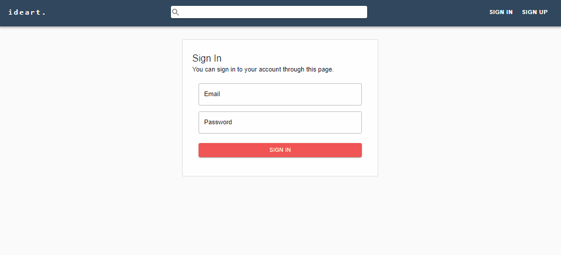

- [Sign up Page:](../../frontend/src/pages/Authentication/SignUpPage.js)

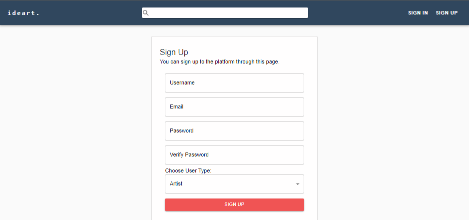

- [Sign up, stage 2 Page:](../../frontend/src/components/EditUserInfo.js)

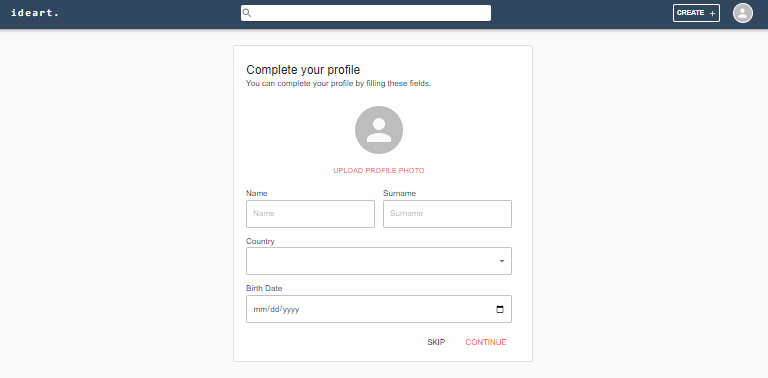

- [Profile Page:](../../frontend/src/pages/ProfilePage/Profile.js)

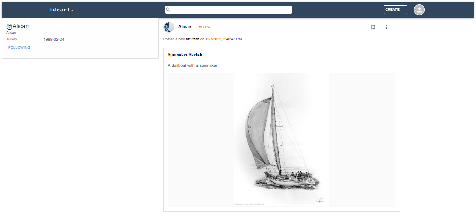

- [Edit Profile Page:](../../frontend/src/pages/ProfilePage/SettingsPage.js)

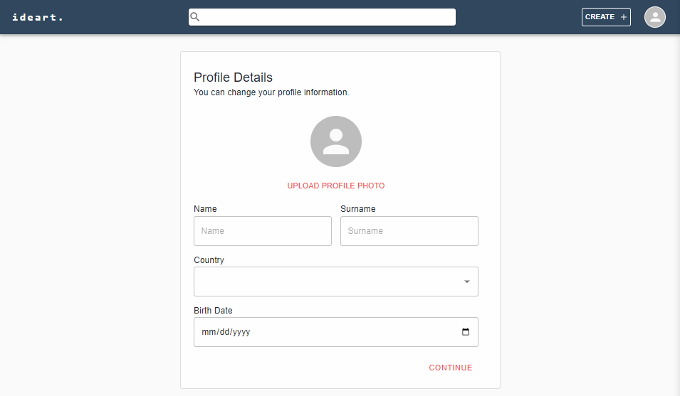

- [Art Item Page:](../../frontend/src/pages/ArtItemPage/ArtItemPage.js)

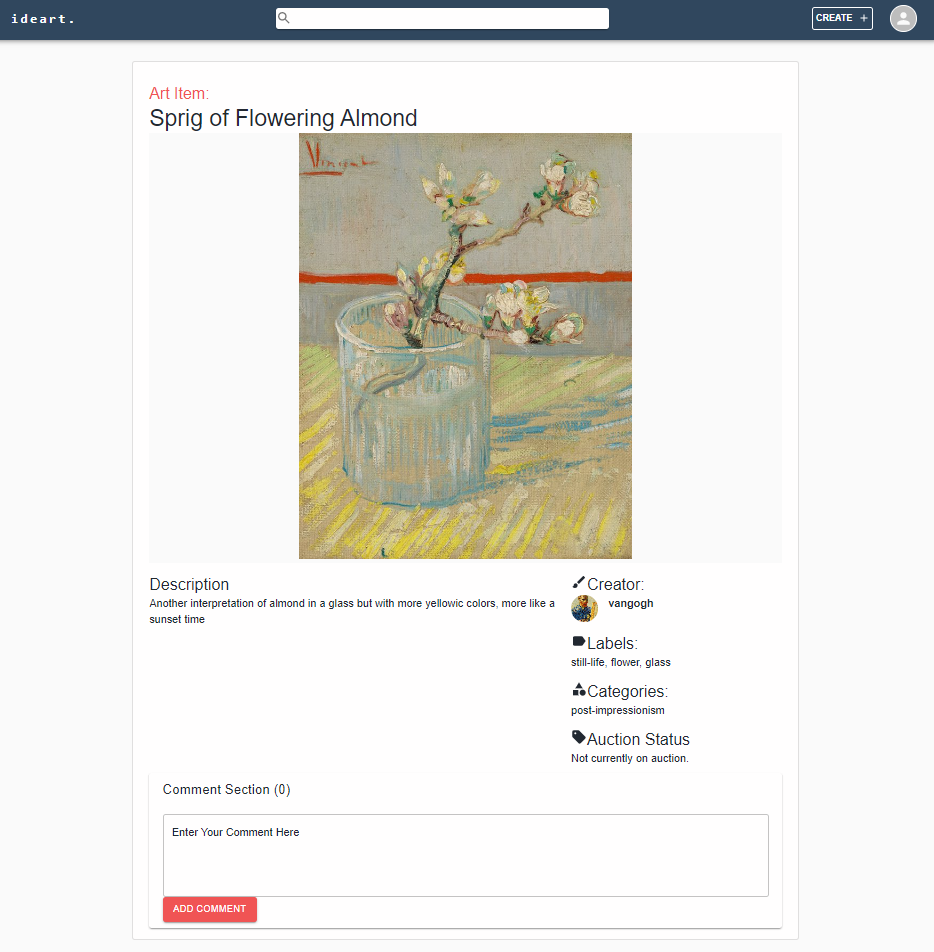

- [Create Art Item Page:](../../frontend/src/pages/ArtItemPage/CreateArtItemPage.js)

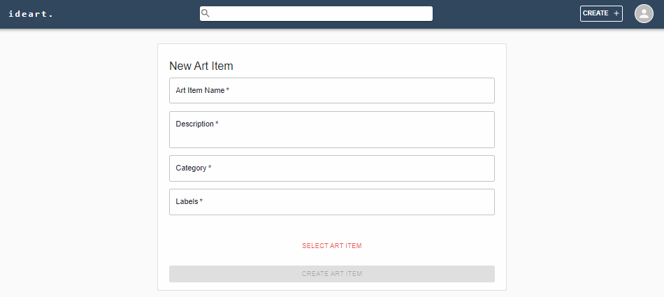

- [Physical Event Page:](../../frontend/src/pages/EventPage/EventPage.js)

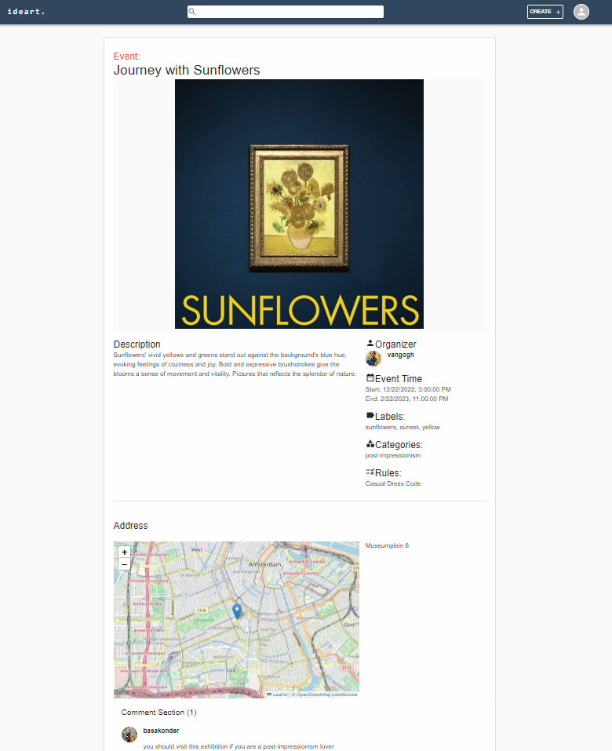

- [Create Physical Event Page:](../../frontend/src/pages/EventPage/CreatePhysicalEventPage.js)

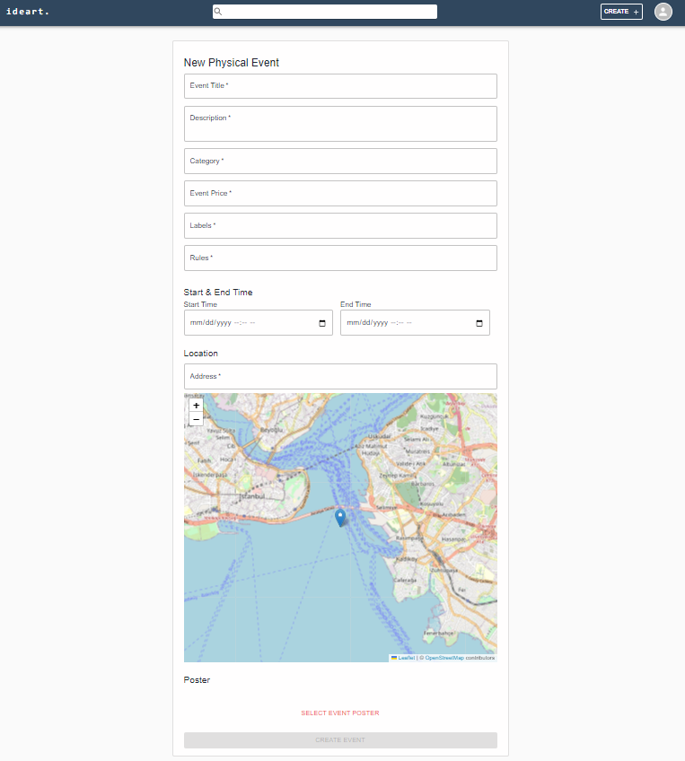

- [Discussion Post Page:](../../frontend/src/pages/DiscussionPage/DiscussionPostPage.js)

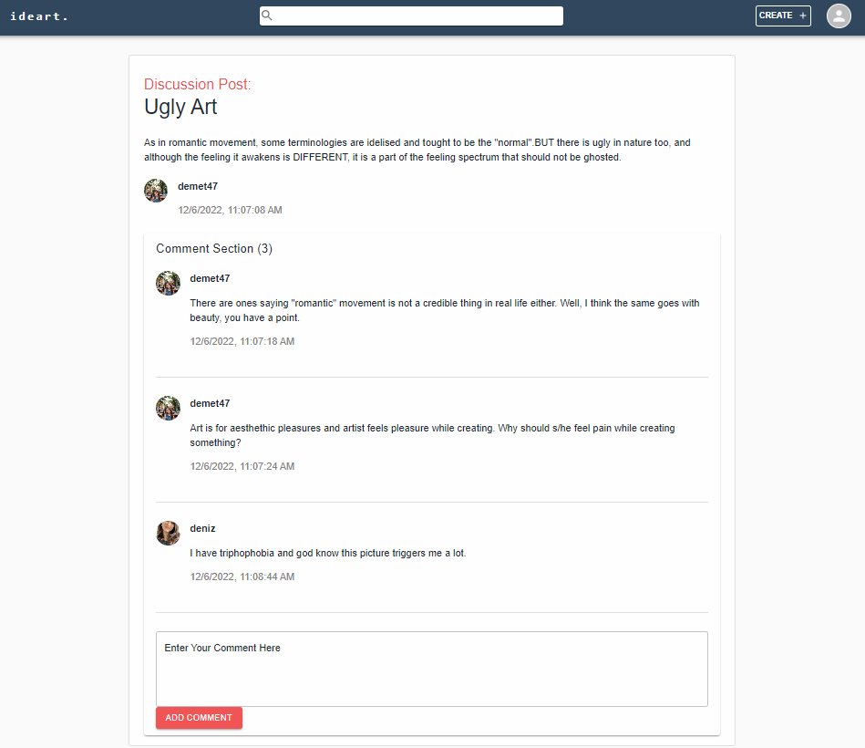

- [New Discussion Post Page:](../../frontend/src/pages/DiscussionPage/CreateDiscussionPostPage.js)

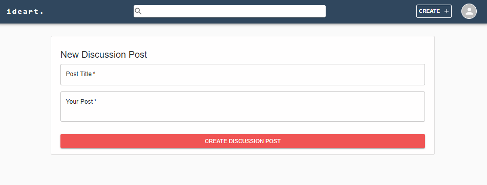

- [Text Annotation:](../../frontend/src/App.js#53)

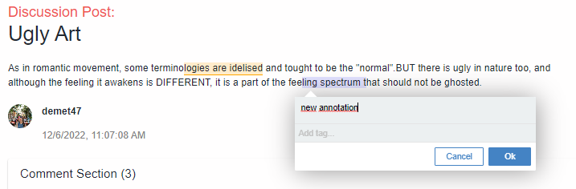

- [Image Annotation:](../../frontend/src/components/ImageComponent.js#23)

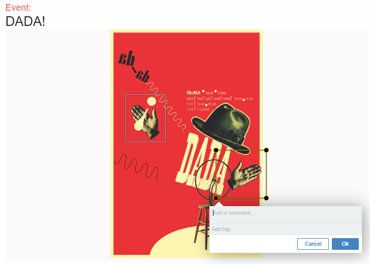

### 1.5.2. Mobile:
- [Home Page:](../../android/lib/pages/home_page.dart#229)

- [Login Page:](../../android/lib/pages/login.dart)

- [Sign-up Page:](../../android/lib/pages/register.dart)

- [Drawer Menu:](../../android/lib/pages/home_page.dart#L72)

- [Profile Page:](../../android/lib/pages/profile_page.dart#L61)

- [Settings Page:](../../android/lib/pages/settings_page.dart)

- [Personal Information Page:](../../android/lib/pages/account_info_page.dart)

- [Create Art Item Page:](../../android/lib/pages/create_art_item_page.dart)

- [Create Event Page:](../../android/lib/pages/create_event_page.dart)

- [View Art Item Page:](../../android/lib/pages/art_item_page.dart)

- [View Event Page:](../../android/lib/pages/event_page.dart)

- [Discussions Page:](../../android/lib/pages/discussion_forum_page.dart#L117)

- [View Discussion Page:](../../android/lib/pages/discussion_page.dart)

- [Commenting:](../../android/lib/widgets/comment.dart)

- [Text Annotation:](../../android/lib/widgets/annotatable_text.dart)

- [Image Annotation:](../../android/lib/pages/art_item_page.dart#L42)

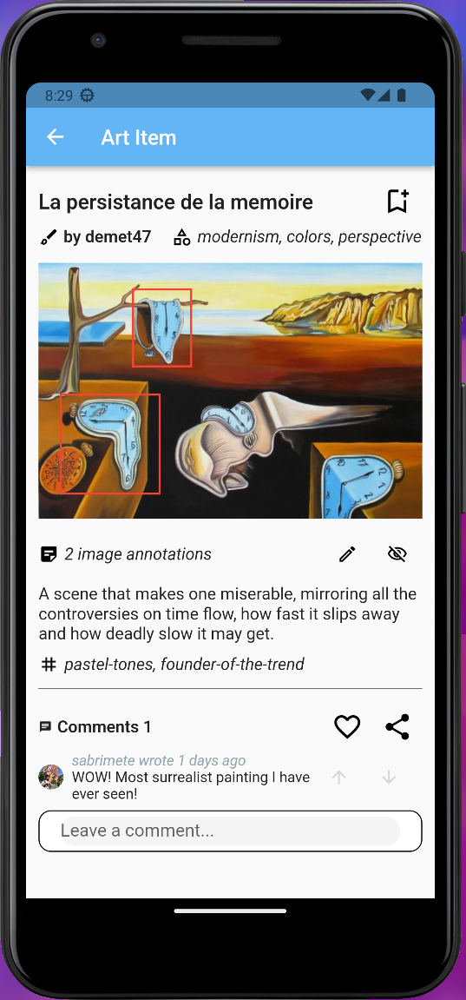

## 1.6. Annotations

### Web

The web annotation feature uses the JSON-LD data format to store and transfer annotations. It has various fields, the two most important ones are the target and the body. The target indicates which web resource the annotation annotates and the body contains the annotation content.

We implemented the annotation server using Koa, a ligthweight web framework that runs on the Node.js platform. As the data store, MongoDB is very well-suited for JSON data, so we used it as our database of the web annotation service.

[Annotorious](https://recogito.github.io/annotorious/) is an open source image annotation library that complies with the web annotation standard. We used it to provide a reliable image annotation functionality to our users. It works well with React, the frontend library that we use to implement our web frontend.

### Mobile

Although we were not able to complete the entire implementation of annotations, we provided a fundamental UI for creating and viewing them. There is no connection with the back-end yet but this basic interface shows how our final implementation will look like. Speaking of the standards that we should follow according to the requirements of the customer, since we are not done with the back-end implementation and we did not actually create annotations yet, we also did not work on creating annotation objects that comply with the W3C standards. However, we made our research and we are going to prioritize the completion of annotations, right after this milestone.

## 1.7. Standards

In our current implementation of annotations, we tried to stick to 2 standards: [Web Annotation Protocol](https://www.w3.org/TR/annotation-model/) and [Web Annotation Data Model](https://www.w3.org/TR/annotation-model/). 

The Web Annotation Protocol standard ensures that the calls between the annotation and the client server is standardized so that any other client can also make request to the server. So the aim of us to create a microservice meeting with the Web Annotation Protocol standard, but because of the time limit of the milestone our current implementation comforms part of the protocol standard. So far we have implemented `GET, POST, PUT, DELETE` requests as described in the document, with `HEAD, OPTIONS` requests remaining. In all implemented requests the headers and schema validation is not implemented fully as described by the protocol.

The Web Annotation Data Model standard is used to set a standard for the data medium of the annotations, which is JSON-LD. In application's current step the full checking and implementation of the WADM standard is not finalized with mobile application not having implemented the backbone of document creation. For the web application various packages (annotorious, recogito) is used to handle annotation and create document with the standard in mind.

# 2. Individual Contribution Reports

## Sabri Mete Akyüz

### Member

My name is Sabri Mete Akyuz . Contacts can be found on [my personal wiki page](https://github.com/bounswe/bounswe2022group7/wiki/Sabri-Mete-Akyüz). You can also find [my time tracking on the wiki](https://github.com/bounswe/bounswe2022group7/wiki/Sabri-Mete-Akyüz-(Effort-Tracking)).

### Responsibilities

- I am a member of the backend team. I worked on research, planning and implementation. I also helped managing the backend team.

### Main Contributions

I implemented some of the Data Transfer Objects which are needed for Milestone-2 features. I implemented functionalities for signup endpoint. Communicated with the frontend and mobile teams and decided to create one endpoint for each feature with ability to understand the requester by their JWT token and work accordingly. I created the structure and implemented it. Also, I fixed some issues on the existing code. 

Implementation related significant issues:
- [#393 Combine generic and user specific endpoints](https://github.com/bounswe/bounswe2022group7/issues/393): I created and implemented the structure for endpoints to make them able to understand the requester by their JWT token and work accordingly.
- [#416 Create an endpoint to return a user](https://github.com/bounswe/bounswe2022group7/issues/416): I implemented an endpoint for returning user information.
- [#455 Implement Discussion Post DTO](https://github.com/bounswe/bounswe2022group7/issues/455): I implemented a new DTO class for discussion posts to use while returning classes to other teams
- [#472 Implement Event DTO](https://github.com/bounswe/bounswe2022group7/issues/472): I implemented a new DTO class for events to use while returning classes to other teams
- [#532 Implementing Unit Tests on Backend](https://github.com/bounswe/bounswe2022group7/issues/532): I created unit test environment and implemented tests for image controller.(After the demo)

Debugging related significant issues:
- [#384 Adding Json Related Indicators](https://github.com/bounswe/bounswe2022group7/issues/384): There was a recursion problem while trying to convert the class into json. I fixed the problem using annotation JsonIdentityInfo.
- [#390 Update endpoints to return JSON](https://github.com/bounswe/bounswe2022group7/issues/390): Some of our endpoints weren't returning response in json format. I updated them.
- [#391 Update signup endpoint according to customer feedback](https://github.com/bounswe/bounswe2022group7/issues/391): Removed optional fields from signup request and endpoint.
- [#419 Return token directly after signup](https://github.com/bounswe/bounswe2022group7/issues/419): After signup, I directly made the users logged in and returned the jwt token in response of the signup request.
- [#469 Fix a bug related with authentication of a discussion post endpoint](https://github.com/bounswe/bounswe2022group7/issues/469): There was a bug related with security configurations. It was a quick fix.

### Pull Requests

[#PR395](https://github.com/bounswe/bounswe2022group7/pull/395), [#PR396](https://github.com/bounswe/bounswe2022group7/pull/396), [#PR421](https://github.com/bounswe/bounswe2022group7/pull/421), [#PR424](https://github.com/bounswe/bounswe2022group7/pull/424), [#PR427](https://github.com/bounswe/bounswe2022group7/pull/427), [#PR463](https://github.com/bounswe/bounswe2022group7/pull/463), [#PR464](https://github.com/bounswe/bounswe2022group7/pull/464), [#PR473](https://github.com/bounswe/bounswe2022group7/pull/473), [#PR461](https://github.com/bounswe/bounswe2022group7/pull/461), [#PR532](https://github.com/bounswe/bounswe2022group7/pull/532)

As Reviewer:
[#PR380](https://github.com/bounswe/bounswe2022group7/pull/380), [#PR383](https://github.com/bounswe/bounswe2022group7/pull/383), [#PR385](https://github.com/bounswe/bounswe2022group7/pull/385), [#PR386](https://github.com/bounswe/bounswe2022group7/pull/386), [#PR413](https://github.com/bounswe/bounswe2022group7/pull/413), [#PR428](https://github.com/bounswe/bounswe2022group7/pull/428), [#PR448](https://github.com/bounswe/bounswe2022group7/pull/448), [#PR451](https://github.com/bounswe/bounswe2022group7/pull/451), [#PR462](https://github.com/bounswe/bounswe2022group7/pull/452), [#PR474](https://github.com/bounswe/bounswe2022group7/pull/474), [#PR476](https://github.com/bounswe/bounswe2022group7/pull/476), [#PR477](https://github.com/bounswe/bounswe2022group7/pull/477)

### Unit Tests

I tried to start writing unit tests one week before the demo. However, I was able to run unit tests after almost 6 hours of work. That's why I don't have many unit tests for now but I will add more until Final presentation.

I wrote unit tests for **Image Controller**: get/post/delete endpoints.
They can be seen here [#PR532](https://github.com/bounswe/bounswe2022group7/pull/532)

Also there are tests for discussion post and comment voting in these PRs: [#PR536](https://github.com/bounswe/bounswe2022group7/pull/536), [#PR538](https://github.com/bounswe/bounswe2022group7/pull/538) 

## Enes Aydoğduoğlu

## Erim Erkin Doğan
### Member

I am a frontend team member sometimes working on DevOps related tasks in side. My profile can be accessed [here](https://github.com/bounswe/bounswe2022group7/wiki/Erim-Erkin-Do%C4%9Fan) and time tracking information can be accessed [here](https://github.com/bounswe/bounswe2022group7/wiki/Erim-Erkin-Do%C4%9Fan-(Effort-Tracking)).

### Responsibilities

In this milestone I have generally worked on visual part and revisions on the frontend. I also worked on annotation microservice creation/research and deployment steps. I have also added and configured swagger on API for management and easier documentation for our team.

### Main Contributions

#### Code Related Significant Issues:

- [Revising sign-up experience in frontend #418](https://github.com/bounswe/bounswe2022group7/issues/418)
- [Updating frontend homepage's visual style and fixing the api connection #487](https://github.com/bounswe/bounswe2022group7/issues/487)
- [Revising the frontend's navigation bar design #489](https://github.com/bounswe/bounswe2022group7/issues/489)

#### Management Related Significant Issues:

- [Setup Swagger for endpoint documentation #399](https://github.com/bounswe/bounswe2022group7/issues/399)
- [Setup deployment & tests for Annotation microservice #517](https://github.com/bounswe/bounswe2022group7/issues/526)
- [Creating tag for milestone 2 #526](https://github.com/bounswe/bounswe2022group7/issues/526)

### Pull Requests

#### Pull Requests opened by me

- [Merge swagger configuration to develop #404](https://github.com/bounswe/bounswe2022group7/pull/404)
- [Merge android continuous workflow to master #411](https://github.com/bounswe/bounswe2022group7/pull/411)
- [Merge android continuous integration workflow to develop #412](https://github.com/bounswe/bounswe2022group7/pull/412)
- [Update and fix continuous integration workflows #426](https://github.com/bounswe/bounswe2022group7/pull/426)
- [Fix and update FormLayout for lower resolution and mobile screens #429](https://github.com/bounswe/bounswe2022group7/pull/429)
- [Revised Sign-up experience #452](https://github.com/bounswe/bounswe2022group7/pull/452)
- [[Frontend] Merge the revised homepage & QoL changes #498](https://github.com/bounswe/bounswe2022group7/pull/498)
- [[Frontend] Merge Revised Navigation Bar #503](https://github.com/bounswe/bounswe2022group7/pull/503)
- [Merge Annotation microservice CI & CD config #520](https://github.com/bounswe/bounswe2022group7/pull/520)
- [Annotation microservice bugfix for production #525](https://github.com/bounswe/bounswe2022group7/pull/525)
- [Merge the latest implementation of application to master #527](https://github.com/bounswe/bounswe2022group7/pull/527)

#### Reviewed Pull Requests

- [Content Layout and Improvements #417](https://github.com/bounswe/bounswe2022group7/pull/417)
- [return token after signup #421](https://github.com/bounswe/bounswe2022group7/pull/421)
- [Add Create Physical Event And Art Item Pages #459](https://github.com/bounswe/bounswe2022group7/pull/459)
- [Add Discussion Post #476](https://github.com/bounswe/bounswe2022group7/pull/476)
- [Milestone II Deployment Test #478](https://github.com/bounswe/bounswe2022group7/pull/478)
- [Frontend content page styling #491](https://github.com/bounswe/bounswe2022group7/pull/491)
- [dev/frontend/profilepage3 #516](https://github.com/bounswe/bounswe2022group7/pull/516)
- [Create CommentSection Tests #521](https://github.com/bounswe/bounswe2022group7/pull/521)
- [Frontend text annotation #522](https://github.com/bounswe/bounswe2022group7/pull/522)

### Unit Tests

Since the frontend part along with components, pages changed a lot, unit tests were not written for the frontend. I tried to implement unit tests to finalized components of the web application. As the pages finalize there will be page tests created for them.

- [LoadingButton unit test](https://github.com/bounswe/bounswe2022group7/blob/customer-presentation-2/frontend/src/tests/LoadingButton.test.js)
- [FeedCard unit test](https://github.com/bounswe/bounswe2022group7/blob/customer-presentation-2/frontend/src/tests/FeedCard.test.js)

## Güney İzol

### Member
I am a member of the frontend team.
- [Personal wiki page](https://github.com/bounswe/bounswe2022group7/wiki/G%C3%BCney-%C4%B0zol)
- [Effort tracking page](https://github.com/bounswe/bounswe2022group7/wiki/G%C3%BCney-%C4%B0zol-(Effort-Tracking))

### Responsibilities
I have worked on both the backend and frontend implementation of web annotation features of our project. I researched about the web annotation standard and read the standard's documents.

### Main Contributions
#### Issues
- Research for web annotation - [#441](https://github.com/bounswe/bounswe2022group7/issues/441)
- Implement web annotation service - [#488](https://github.com/bounswe/bounswe2022group7/issues/488)
- Implement image annotation frontend functionality - [#501](https://github.com/bounswe/bounswe2022group7/issues/501)
- Write the annotation part of the report - [#512](https://github.com/bounswe/bounswe2022group7/issues/512)

#### Pull requests
- Merge pull request for web annotation functionality - [#502](https://github.com/bounswe/bounswe2022group7/pull/502)
- Reviewed pull request - [#498](https://github.com/bounswe/bounswe2022group7/pull/498)

## Ali Can Milani

### Member
&emsp; My name is Alican Milani. I am a member of Group 7 and the mobile team. 
- [My Personal Wiki Page](https://github.com/bounswe/bounswe2022group7/wiki/Ali-Can-Milani)
- [My Effort Trackings](https://github.com/bounswe/bounswe2022group7/wiki/Ali-Can-Milani-(Effort-Tracking)#cmpe-451)

### Responsibilities
&emsp; I worked on the mobile application implementation and debugging. My main responsibilities was the event creation and view features, discussions part.

### Main Contributions
#### &emsp; My Code Related Issues
- [Implementation of Event Creation Page UI #397](https://github.com/bounswe/bounswe2022group7/issues/397)
- [Implementation of Event Creation Page Network Calls #398](https://github.com/bounswe/bounswe2022group7/issues/398)
- [Change image widgets in view event page #431](https://github.com/bounswe/bounswe2022group7/issues/431)
- [Implementing follow functionality #435](https://github.com/bounswe/bounswe2022group7/issues/435)
- [Update Event View and Create Page endpoints #479](https://github.com/bounswe/bounswe2022group7/issues/479)
- [Test for Event Create Page #482](https://github.com/bounswe/bounswe2022group7/issues/482)
- [Implementing Discussions #504](https://github.com/bounswe/bounswe2022group7/issues/504)

#### &emsp; My Management Related Issues
- [Mobile User Interface / User Experience #530](https://github.com/bounswe/bounswe2022group7/issues/530)

#### &emsp; Issues I Reviewed
- [Art Item Creation Page UI #403](https://github.com/bounswe/bounswe2022group7/issues/403)
- [Final Version of the Profile Page #446](https://github.com/bounswe/bounswe2022group7/issues/446)

### Pull Requests
#### &emsp; PRs I Oppened
- [#430](https://github.com/bounswe/bounswe2022group7/pull/430)
- [#432](https://github.com/bounswe/bounswe2022group7/pull/432)
- [#465](https://github.com/bounswe/bounswe2022group7/pull/465)
- [#480](https://github.com/bounswe/bounswe2022group7/pull/480)
- [#483](https://github.com/bounswe/bounswe2022group7/pull/483)
- [#499](https://github.com/bounswe/bounswe2022group7/pull/499)
- [#506](https://github.com/bounswe/bounswe2022group7/pull/506)
#### &emsp; PRs I Reviewed
- [#406](https://github.com/bounswe/bounswe2022group7/pull/406)
- [#475](https://github.com/bounswe/bounswe2022group7/pull/475)
- [#508](https://github.com/bounswe/bounswe2022group7/pull/508)
### Unit Tests
- [Test for Event Create Page](https://github.com/bounswe/bounswe2022group7/blob/master/android/test/widget_test/create_event_test.dart)

## Başak Önder

### Member

My name is Başak Önder. Contacts can be found on [my personal wiki page](https://github.com/bounswe/bounswe2022group7/wiki/Başak-Önder). You can also find [my time tracking on the wiki](https://github.com/bounswe/bounswe2022group7/wiki/Başak-Önder-(Effort-Tracking)).

### Responsibilities

- I am a member of the backend team. I worked on research and implementation, and also debugging according to the reports and feedbacks from Frontend and Mobile team. 

### Main Contributions

I implemented the remaining classes of backend which are needed for Milestone-2 features. I also implemented some of the endpoints that are decided on group meetings. Communicated with the frontend and mobile teams about the structure of these endpoints. Also, debugged and fixed some errors reported by the other teams.

Implementation related significant issues:
- [#382 Remaining Classes Implementation](https://github.com/bounswe/bounswe2022group7/issues/382): I implemented the remaining nine classes which are needed for Milestone 2.
- [#394 Implementing Post/Delete Endpoints for Event/ArtItem](https://github.com/bounswe/bounswe2022group7/issues/394): I implemented six creating and deleting endpoints for art items, online galleries and physical exhibitions.
- [#438 Implementing Get/Post Endpoints for DiscussionPost/Comment](https://github.com/bounswe/bounswe2022group7/issues/438): I implemented five getting and creating endpoints for discussion posts and comments.
- [#389 Backend Implementation of Base64 Image](https://github.com/bounswe/bounswe2022group7/issues/389): I implemented a new class for images which has a field that is long enough to store base64 strings. I also implemented GET/POST/DELETE endpoints for this image class.

Debugging related significant issues:
- [#376 Editing the HTTP Status in Responses](https://github.com/bounswe/bounswe2022group7/issues/376): We had been returning HTTP 200 for every endpoint before Milestone 1. I updated the Json response of the endpoints to return the corresponding HTTP response error and message in case of any failure. This is updated to facilitate the job of frontend and mobile teams and also have a more consistent endpoint structure.
- [#388 Editing the Json Response of Artist User](https://github.com/bounswe/bounswe2022group7/issues/388): I debugged the duplicate fields bug and also the issue of returning user credentials in the Json Response. I deprecated the credentials and duplicate fields from response.

### Pull Requests

[#PR345](https://github.com/bounswe/bounswe2022group7/pull/345), [#PR380](https://github.com/bounswe/bounswe2022group7/pull/380), [#PR383](https://github.com/bounswe/bounswe2022group7/pull/383), [#PR385](https://github.com/bounswe/bounswe2022group7/pull/385), [#PR386](https://github.com/bounswe/bounswe2022group7/pull/386), [#PR413](https://github.com/bounswe/bounswe2022group7/pull/413), [#PR440](https://github.com/bounswe/bounswe2022group7/pull/440), [#PR451](https://github.com/bounswe/bounswe2022group7/pull/451), [#PR461](https://github.com/bounswe/bounswe2022group7/pull/461), [#PR462](https://github.com/bounswe/bounswe2022group7/pull/462), [#PR474](https://github.com/bounswe/bounswe2022group7/pull/474)

As Reviewer:
[#PR404](https://github.com/bounswe/bounswe2022group7/pull/404), [#PR424](https://github.com/bounswe/bounswe2022group7/pull/424), [#PR436](https://github.com/bounswe/bounswe2022group7/pull/436), [#PR448](https://github.com/bounswe/bounswe2022group7/pull/448), [#PR456](https://github.com/bounswe/bounswe2022group7/pull/456), [#PR463](https://github.com/bounswe/bounswe2022group7/pull/463), [#PR464](https://github.com/bounswe/bounswe2022group7/pull/464), [#PR468](https://github.com/bounswe/bounswe2022group7/pull/468), [#PR473](https://github.com/bounswe/bounswe2022group7/pull/473)

### Unit Tests
[Comment Controller Tests](https://github.com/bounswe/bounswe2022group7/pull/532) 

[Following Feature Tests](https://github.com/bounswe/bounswe2022group7/pull/540) 

[Art Item Controller Tests](https://github.com/bounswe/bounswe2022group7/pull/535)

[Profile Controller Tests](https://github.com/bounswe/bounswe2022group7/pull/539)

We had some issues about integrating the test tool Mockito to Kotlin because of the differences between Java and Kotlin. Unfortunately, we could not figure out the problems before Milestone 2. After this issue had solved by @sabrimete, I started to implement unit tests immediately. We are going to complete the unit tests of endpoints before the final presentation as backend team.

## Cahid Arda Öz

### Member

Group communicator and frontend team member. Links to [wiki page](https://github.com/bounswe/bounswe2022group7/wiki/Cahid-Arda-%C3%96z) and [time tracking page](https://github.com/bounswe/bounswe2022group7/wiki/Cahid-Arda-%C3%96z-(Effort-Tracking)).

### Responsibilities

- Group communicator
- Frontend team member
- Milestone 2, frontend presenter
- Creating View/Create Content (art item, event, discussion post) Pages
- Comment Section Feature

### Main Contributions

Code Related Significant Issues:
- [#421](https://github.com/bounswe/bounswe2022group7/issues/421): In this issue, I worked on adding create art item and physical event pages.
- [#457](https://github.com/bounswe/bounswe2022group7/issues/457): In this issue, I reported a bug I noticed in the create art item endpoint.
- [#458](https://github.com/bounswe/bounswe2022group7/issues/458): In this issue, I reported a bug I noticed in the create comment endpoint.
- [#460](https://github.com/bounswe/bounswe2022group7/issues/460): In this issue, I worked on integrating the comment section I had written for milestone 1 to the new endpoints.
- [#469](https://github.com/bounswe/bounswe2022group7/issues/469): In this issue, I reported a bug I noticed in the get discussion post endpoint.
- [#470](https://github.com/bounswe/bounswe2022group7/issues/470): In this issue, I reported a bug I noticed in the create comment endpoint.
- [#490](https://github.com/bounswe/bounswe2022group7/issues/490): In this issue, I worked on restyling content pages (art item, discussion post and physical event pages). I also styled the comment section.

Management Related Significant Issues:
- [#389](https://github.com/bounswe/bounswe2022group7/issues/389): In this issue, we looked into the possibilty of using base64 encoding when passing images.
- [#526](https://github.com/bounswe/bounswe2022group7/issues/389): In this issue, we worked on creating a tag for milestone 2.

### Pull Requests

PRs I created:
- [#387](https://github.com/bounswe/bounswe2022group7/pull/387): I created a form layout to contain the sign-in and sign-up forms.
- [#417](https://github.com/bounswe/bounswe2022group7/pull/417): I added another layout to contain content pages. I also improved the error page and fixed endpoint requests in the home page.
- [#459](https://github.com/bounswe/bounswe2022group7/pull/459): I added create art item and physical event pages.
- [#474](https://github.com/bounswe/bounswe2022group7/pull/474): I removed an unnecessary field from a table in the backend and updated the requests. Field was `posterId` for discussion posts.
- [#476](https://github.com/bounswe/bounswe2022group7/pull/476): Updated discussion post get respose of the endpoint and added create/view art item pages.
- [#478](https://github.com/bounswe/bounswe2022group7/pull/478): We created a PR to transfer all changes to master branch.
- [#491](https://github.com/bounswe/bounswe2022group7/pull/491): I restyled the content pages.
- [#521](https://github.com/bounswe/bounswe2022group7/pull/521): I added unit tests to the CommentSection component.
- [#522](https://github.com/bounswe/bounswe2022group7/pull/522): I added mock text annotation for milestone presentation.

PRs I reviewed:
- [#412](https://github.com/bounswe/bounswe2022group7/pull/412)
- [#426](https://github.com/bounswe/bounswe2022group7/pull/426)
- [#429](https://github.com/bounswe/bounswe2022group7/pull/429)
- [#452](https://github.com/bounswe/bounswe2022group7/pull/452)
- [#503](https://github.com/bounswe/bounswe2022group7/pull/503)
- [#520](https://github.com/bounswe/bounswe2022group7/pull/520)

### Unit Tests

I have written [unit tests](../../frontend/src/tests/CommentSection.test.js) for the [CommentSection](../../frontend/src/common/CommentSection.js) component I wrote which was used under the content pages.

## Musa Şimşek

## Atilla Türkmen

## Can Atakan Uğur

## Demet Yayla

### MEMBER
I am Demet Yayla and am a member of group seven. I am a part of the backend team, and also the team leader for it.
### RESPONSIBILITIES
I write the endpoints for the features we plan to implement along with required entities, repositories, DTOs, services. I had a major contribution with the testing but unfortunately just before the week of milestone 2, I learned that integration tests were not required. I searched and tried a lot to write integration tests with different kinds of libraries but never could overcome the compiler errors or runtime errors I faced.
### MAIN CONTRIBUTIONS
**CODE RELATED CONTRIBUTIONS**
- In [issue #394]( https://github.com/bounswe/bounswe2022group7/issues/394) I was assigned to write endpoints to create and delete events and art items. I faced a lot of interconnected errors which we expected to face while writing the entity classes (spring boot annotations are really complex and since we had many connections between entities it was a hard task I could not overcome on my own). I had a really hard time solving them and collaborated with @askabderon after a point.
- In [issue #420]( https://github.com/bounswe/bounswe2022group7/issues/420) we had author field missing for comments. I converted the return type to a DTO and tidied the code a little while solving the problem.
- In [issue #437]( https://github.com/bounswe/bounswe2022group7/issues/437) I wrote the endpoints for updating and viewing user settings.
- In [issue #447]( https://github.com/bounswe/bounswe2022group7/issues/447) I wrote endpoints for following a user. 
- In [issue #450]( https://github.com/bounswe/bounswe2022group7/issues/450) I wrote endpoints for converting a string of list to a list.
- In [issue #457]( https://github.com/bounswe/bounswe2022group7/issues/457) I fixed an error, art item creation owner is now not absent.
- In [issue #467]( https://github.com/bounswe/bounswe2022group7/issues/467) I added a logic for enabling tracking who liked what. Otherwise we couldn’t see who liked and one could like multiple times also.
- In [issue #358]( https://github.com/bounswe/bounswe2022group7/issues/358) I attempted to write tests.

- Reviewer of [this issue]( https://github.com/bounswe/bounswe2022group7/issues/453)
- Reviewer of [this issue]( https://github.com/bounswe/bounswe2022group7/issues/455)
- Reviewer of [this issue]( https://github.com/bounswe/bounswe2022group7/issues/457)
- Reviewer of [this issue](https://github.com/bounswe/bounswe2022group7/issues/388 )
- Reviewer of [this issue](https://github.com/bounswe/bounswe2022group7/issues/438 )
- Reviewer of [this PR]( https://github.com/bounswe/bounswe2022group7/pull/440 )
- Reviewer of [this PR]( https://github.com/bounswe/bounswe2022group7/pull/345)

- Owner of [this PR]( https://github.com/bounswe/bounswe2022group7/pull/428)
- Owner of [this PR](https://github.com/bounswe/bounswe2022group7/pull/436)
- Owner of [this PR]( https://github.com/bounswe/bounswe2022group7/pull/448)
- Owner of [this PR]( https://github.com/bounswe/bounswe2022group7/pull/456)
- Owner of [this PR]( https://github.com/bounswe/bounswe2022group7/pull/468)
- Owner of [this PR]( https://github.com/bounswe/bounswe2022group7/pull/477)
**MANAGEMENT RELATED CONTRIBUTIONS**
- [Issue #372]( https://github.com/bounswe/bounswe2022group7/issues/372) reviewer.
- In [issue #496]( https://github.com/bounswe/bounswe2022group7/issues/496) we formed the sample data to be showcased in milestone 2 group presentations.
- In [issue #497]( https://github.com/bounswe/bounswe2022group7/issues/497) we discussed about scenarios for milestone 2 group presentations.
- In [issue #515]( https://github.com/bounswe/bounswe2022group7/issues/515) I took the part of tracking progression related to project requirements for milestone 2 group report.
- I was the notetaker for [meeting 15]( https://github.com/bounswe/bounswe2022group7/wiki/Meeting-Notes-%2315)
- Writing part three of group review for milestone 1 in [this issue]( https://github.com/bounswe/bounswe2022group7/issues/370) 
### UNIT TESTS
- As I had been working on integration testing for a long time, I hadn’t gotten to unit tests yet, and this week was a week of all my lectures’ projects without exception, I couldn’t write them till milestone 2. I learned just last week we didn’t need integration tests.
### ADDITIONAL INFORMATION
- Some tasks that I undertake took a lot of research and struggle without being reflected to code base much but draining my time. One was writing create and delete endpoints for events and art items. That was going to be the first time we were to test the annotations of spring & hibernate on database and it blowed up in my hands. I tried loads of combinations and changed but it is not reflected in commit history. Another was as I mentioned the testing task. I had incredible errors which could not get comprehended by my term mates when I consulted them. I hope I don’t get low grading due to my unluck. Another long-lasting error was the request body always being filled with null. I spent hours to learn at the end that it was because I was importing from the wrong library the right annotation… 
