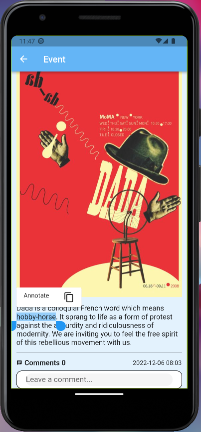

# List Of Contents

- [1. Group Milestone Review](#1-group-milestone-review)
  * [1.1. Executive Summary](#11-executive-summary)
  * [1.2. Summary of work performed by each team member](#12-summary-of-work-performed-by-each-team-member)
    + [Sabri Mete Akyüz](#sabri-mete-akyüz)
    + [Enes Aydoğduoğlu](#enes-aydoğduoğlu)
    + [Erim Erkin Doğan](#erim-erkin-doğan)
    + [Güney İzol](#güney-i̇zol)
    + [Ali Can Milani](#ali-can-milani)
    + [Başak Önder](#başak-önder)
    + [Cahid Arda Öz](#cahid-arda-öz)
    + [Musa Şimşek](#musa-şimşek)
    + [Atilla Türkmen](#atilla-türkmen)
    + [Can Atakan Uğur](#can-atakan-uğur)
    + [Demet Yayla](#demet-yayla)
  * [1.3. Progress According to Requirements](#13-progress-according-to-requirements)
  * [1.4. API Endpoints](#14-api-endpoints)
  * [1.5. User Interface & User Experience](#15-user-interface--user-experience)
    + [1.5.1. Web](#151-web)
    + [1.5.2. Mobile](#152-mobile)
  * [1.6. Annotations](#16-annotations)
  * [1.7. Standards](#17-standards)
- [2. Individual Contribution Reports](#2-individual-contribution-reports)
  * [Sabri Mete Akyüz](#sabri-mete-akyüz-1)
  * [Enes Aydoğduoğlu](#enes-aydoğduoğlu-1)
  * [Erim Erkin Doğan](#erim-erkin-doğan-1)
  * [Güney İzol](#güney-İzol-1)
  * [Ali Can Milani](#ali-can-milani-1)
  * [Başak Önder](#başak-önder-1)
  * [Cahid Arda Öz](#cahid-arda-öz-1)
  * [Musa Şimşek](#musa-şimşek-1)
  * [Atilla Türkmen](#atilla-türkmen-1)
  * [Can Atakan Uğur](#can-atakan-uğur-1)
  * [Demet Yayla](#demet-yayla-1)

# 1. Group Milestone Review

## 1.1. Executive Summary

#### What is Ideart. / Project Status
Ideart. is an art platform that was created to engage artists and art lovers by sharing events, art items, and discussion posts. Everyone can sign up as a regular user or an artist, but you can also view the public pages as a guest without additional functionalities. Regular users have the ability to follow other users, whether they are regular users or artists, post discussions, and leave comments on events, art items, and discussion posts. Along with the mentioned benefits available to regular users, artists may publish their art works and host physical exhibitions. Our application works on web and mobile both with additional annotation feature which is in developing right now! On web, you can annotate images and see the annotated parts of other users. On the mobile, you can annotate texts, however, backend part has not integrated yet. Fully functional image and text annotation is going to be added to the platform in the next version.

#### Changes from the Latest Version
* To achieve more simple UI, optional fields of sign up page are transferred to the settings page. Hence, you can sign up by providing e-mail, username, password, and user type. If you want to give us some additional information about yourself, you can complete the other optional fields whenever you want.
* Age field is updated to take birthday as input to have more consistent data about the users.
* To facilitate tracking, events are showing the exact location by using Geolocation now!
#### Upcoming Features
* Image and text annotation is going to be completed on both web and mobile and be integrated with the backend. Sidebar is going to be added for viewing all the annotations on the page.
* Artists will be able to create online galleries, similar to the physical exhibition but on the online platform.
* Artists will be able to sell their art works with bidding system.
* All art items is going to be protected by our copyright system. Users will be able to report art works and the artists for copyright infringement by filling the details about the original art work.
* Semantic search is going to be provided on search bar alongside with filtering option.

## 1.2. Summary of work performed by each team member

### Sabri Mete Akyüz

| **Task** | **Link** |
| -------- | ------------ |
| Meeting for planning the group report in first milestone | - |
| Attended weekly group meeting. | https://github.com/bounswe/bounswe2022group7/wiki/CMPE451-Meeting-Notes-%235 |
| Attended backend group meeting. | https://github.com/bounswe/bounswe2022group7/wiki/BACKEND-Meeting-Notes-%234 |
| Fix HTTP Token Error |  https://github.com/bounswe/bounswe2022group7/issues/379 |
| Update endpoints to return JSON |  https://github.com/bounswe/bounswe2022group7/issues/390 |
| Update signup endpoint according to customer feedback | https://github.com/bounswe/bounswe2022group7/issues/391 |
| Combine generic and user specific endpoints |  https://github.com/bounswe/bounswe2022group7/issues/393 |
| Create an endpoint to return a user |  https://github.com/bounswe/bounswe2022group7/issues/416 |
| Return token directly after signup | https://github.com/bounswe/bounswe2022group7/issues/419 |
| Add Artist user signup | https://github.com/bounswe/bounswe2022group7/issues/423 |
| Implement Discussion Post DTO | https://github.com/bounswe/bounswe2022group7/issues/455 |
| Fix a bug related with authentication of a discussion post endpoint | https://github.com/bounswe/bounswe2022group7/issues/469 |
| Implement Event DTO | https://github.com/bounswe/bounswe2022group7/issues/472 |
| Add Json related annotations | https://github.com/bounswe/bounswe2022group7/issues/384 |
| Review of multiple issues of backend team | [#377](https://github.com/bounswe/bounswe2022group7/issues/377), [#379](https://github.com/bounswe/bounswe2022group7/issues/379), [#382](https://github.com/bounswe/bounswe2022group7/issues/382), [#394](https://github.com/bounswe/bounswe2022group7/issues/394), [#420](https://github.com/bounswe/bounswe2022group7/issues/420), [#449](https://github.com/bounswe/bounswe2022group7/issues/449), [#450](https://github.com/bounswe/bounswe2022group7/issues/450), [#454](https://github.com/bounswe/bounswe2022group7/issues/454), [#477](https://github.com/bounswe/bounswe2022group7/issues/477)|
| Review of multiple PR's of backend team | [#PR380](https://github.com/bounswe/bounswe2022group7/pull/380), [#PR383](https://github.com/bounswe/bounswe2022group7/pull/383), [#PR385](https://github.com/bounswe/bounswe2022group7/pull/385), [#PR386](https://github.com/bounswe/bounswe2022group7/pull/386), [#PR413](https://github.com/bounswe/bounswe2022group7/pull/413), [#PR428](https://github.com/bounswe/bounswe2022group7/pull/428), [#PR448](https://github.com/bounswe/bounswe2022group7/pull/448), [#PR451](https://github.com/bounswe/bounswe2022group7/pull/451), [#PR462](https://github.com/bounswe/bounswe2022group7/pull/452), [#PR474](https://github.com/bounswe/bounswe2022group7/pull/474), [#PR476](https://github.com/bounswe/bounswe2022group7/pull/476), [#PR477](https://github.com/bounswe/bounswe2022group7/pull/477)
| One of the notetakers during the Customer Milestone 2||
| Wrote individual milestone report||
| Wrote the API documentation part of the deliverables||

### Enes Aydoğduoğlu

### Erim Erkin Doğan

### Güney İzol
| Task | Link |
| --- | --- |
| Research for web annotation | [#441](https://github.com/bounswe/bounswe2022group7/issues/441) |
| Implement web annotation service | [#488](https://github.com/bounswe/bounswe2022group7/issues/488) |
| Implement image annotation frontend functionality | [#501](https://github.com/bounswe/bounswe2022group7/issues/501) |
| Merge pull request for web annotation functionality | [#502](https://github.com/bounswe/bounswe2022group7/pull/502) |
| Reviewed pull request | [#498](https://github.com/bounswe/bounswe2022group7/pull/498) |
| Write the annotation part of the report | [#512](https://github.com/bounswe/bounswe2022group7/issues/512) |

### Ali Can Milani
| Task | Link |
| ----- | ------|
| Implementation of Event Creation Page UI |[Issue #397](https://github.com/bounswe/bounswe2022group7/issues/397), [PR #430](https://github.com/bounswe/bounswe2022group7/pull/430)|
| Implementation of Event Creation Page Network Calls |[Issue #398](https://github.com/bounswe/bounswe2022group7/issues/398), [PR #465](https://github.com/bounswe/bounswe2022group7/pull/465)|
| Change Image Widgets in View Event Page |[Issue #431](https://github.com/bounswe/bounswe2022group7/issues/431), [PR #432](https://github.com/bounswe/bounswe2022group7/pull/432)|
| Implementing Follow Functionality |[Issue #435](https://github.com/bounswe/bounswe2022group7/issues/435), [PR #499](https://github.com/bounswe/bounswe2022group7/pull/499)|
| Update Event View and Create Page Endpoints |[Issue #479](https://github.com/bounswe/bounswe2022group7/issues/479), [PR #480](https://github.com/bounswe/bounswe2022group7/pull/480)|
| Test for Event Create Page |[Issue #482](https://github.com/bounswe/bounswe2022group7/issues/482), [PR #483](https://github.com/bounswe/bounswe2022group7/pull/483)|
| Implementing Discussions |[Issue #504](https://github.com/bounswe/bounswe2022group7/issues/504), [PR #506](https://github.com/bounswe/bounswe2022group7/pull/506)|
| Mobile User Interface / User Experience |[Issue #530](https://github.com/bounswe/bounswe2022group7/issues/530)|
| Issues I Reviewed |[Issue #403](https://github.com/bounswe/bounswe2022group7/issues/403), [Issue #446](https://github.com/bounswe/bounswe2022group7/issues/446)|
| Pull Requests I Reviewed |[PR #406](https://github.com/bounswe/bounswe2022group7/pull/406), [PR #475](https://github.com/bounswe/bounswe2022group7/pull/475), [PR #508](https://github.com/bounswe/bounswe2022group7/pull/508) |
| Group Meetings I Attend | [Meeting #6](https://github.com/bounswe/bounswe2022group7/wiki/CMPE451-Meeting-Notes-%236), [Meeting #7](https://github.com/bounswe/bounswe2022group7/wiki/CMPE451-Meeting-Notes-%237)|
| Mobile Team Meeting I Attend | [Meeting #4](https://github.com/bounswe/bounswe2022group7/wiki/MOBILE-Meeting-Notes-%234), [Meeting #5](https://github.com/bounswe/bounswe2022group7/wiki/MOBILE-Meeting-Notes-%235)|

### Başak Önder
| Task | Link |
| ----- | ------|
| Attended the weekly team meeting, planned the upcoming weeks and discussed the upcoming features. Decided on the endpoint structures and their functionalities | [#235](https://github.com/bounswe/bounswe2022group7/wiki/CMPE451-Meeting-Notes-%235) | 
| Attended the weekly backend team meeting and took the meeting notes, work distribution is done among the team members | [#234](https://github.com/bounswe/bounswe2022group7/wiki/BACKEND-Meeting-Notes-%234) | 
| Edited the endpoints to return HTTP Error and Success responses with corressponding messages | [#376](https://github.com/bounswe/bounswe2022group7/issues/376)  | 
| Changed the age field of user to dateOfBirth because of the Customer Feedback during Milestone 1 |[#377](https://github.com/bounswe/bounswe2022group7/issues/377)  | 
| Started to implementing the necessary classes for Milestone 2  | [#382](https://github.com/bounswe/bounswe2022group7/issues/382)  |
| Attended weekly group meeting and took the meeting notes.|  [#236](https://github.com/bounswe/bounswe2022group7/wiki/CMPE451-Meeting-Notes-%236)|
| Continued to implementing the necessary classes for Milestone 2 | [#382](https://github.com/bounswe/bounswe2022group7/issues/382) |
| Researched about Json Indicators and edited the Json Responses to remove duplicate fields and deprecate user credentials | [#388](https://github.com/bounswe/bounswe2022group7/issues/388) |
| Research about image storing as Base64 string  | [#389](https://github.com/bounswe/bounswe2022group7/issues/389) |
| Creating a new image class and implementing POST/GET/DELETE endpoints for images |  [#389](https://github.com/bounswe/bounswe2022group7/issues/389) |
| Attended weekly group meeting, discussed about reducing the size of Json responses. | [#237](https://github.com/bounswe/bounswe2022group7/wiki/CMPE451-Meeting-Notes-%237) |
| Implementation of CREATE/DELETE endpoints for art item/physical exhibition/online gallery. | [#394](https://github.com/bounswe/bounswe2022group7/issues/394) |
| Implementation of GET/POST endpoints for discussion posts and comments. | [#438](https://github.com/bounswe/bounswe2022group7/issues/438) |
| Edited the POST image endpoint, remove base64 string from here to reduce response time | [#453](https://github.com/bounswe/bounswe2022group7/issues/453) |
| Fix Namings for Endpoint About Discussion "Forum" to "Page" |  [#454](https://github.com/bounswe/bounswe2022group7/issues/454) |
| Debugged the error of creation of several comments at once | [#458](https://github.com/bounswe/bounswe2022group7/issues/458) |
| Debugged the error of backend building on CI and rebased the PR of @CahidArda to not to take up time of from frontend building. | [#PR474](https://github.com/bounswe/bounswe2022group7/pull/474) |
| Review of multiple issues of backend team | [#472](https://github.com/bounswe/bounswe2022group7/issues/472), [#469](https://github.com/bounswe/bounswe2022group7/issues/469), [#447](https://github.com/bounswe/bounswe2022group7/issues/447), [#437](https://github.com/bounswe/bounswe2022group7/issues/437), [#423](https://github.com/bounswe/bounswe2022group7/issues/423), [#416](https://github.com/bounswe/bounswe2022group7/issues/416), [#399](https://github.com/bounswe/bounswe2022group7/issues/399), [#393](https://github.com/bounswe/bounswe2022group7/issues/393), [#391](https://github.com/bounswe/bounswe2022group7/issues/391), [#390](https://github.com/bounswe/bounswe2022group7/issues/390), [#384](https://github.com/bounswe/bounswe2022group7/issues/384), [#379](https://github.com/bounswe/bounswe2022group7/issues/379)|
| Review of multiple PR's of backend team | [#PR404](https://github.com/bounswe/bounswe2022group7/pull/404), [#PR424](https://github.com/bounswe/bounswe2022group7/pull/424), [#PR436](https://github.com/bounswe/bounswe2022group7/pull/436), [#PR448](https://github.com/bounswe/bounswe2022group7/pull/448), [#PR456](https://github.com/bounswe/bounswe2022group7/pull/456), [#PR463](https://github.com/bounswe/bounswe2022group7/pull/463), [#PR464](https://github.com/bounswe/bounswe2022group7/pull/464), [#PR468](https://github.com/bounswe/bounswe2022group7/pull/468), [#PR473](https://github.com/bounswe/bounswe2022group7/pull/473)
| One of the notetakers during the Customer Milestone 2||
| Wrote individual milestone report||
| Wrote the part 1.1, Executive Summary, of this group review|[#509](https://github.com/bounswe/bounswe2022group7/issues/509)|

### Cahid Arda Öz

### Musa Şimşek

### Atilla Türkmen

### Can Atakan Uğur

### Demet Yayla

| **Task** | **Link** |
| -------- | ------------ |
|Create-delete events & art items|[#394](https://github.com/bounswe/bounswe2022group7/issues/394) |
|Author field missing fix and DTO addition.|[#420](https://github.com/bounswe/bounswe2022group7/issues/420)|
|Endpoint for update and view profile settings.|[#437](https://github.com/bounswe/bounswe2022group7/issues/437)|
|Endpoint to follow user.|[#447](https://github.com/bounswe/bounswe2022group7/issues/447)|
|Converting a string to list of strings.|[#450](https://github.com/bounswe/bounswe2022group7/issues/450)|
|Art item creator error bug fix.|[#457](https://github.com/bounswe/bounswe2022group7/issues/457)|
|Change structure for upvote downvote.|[#467](https://github.com/bounswe/bounswe2022group7/issues/467)|
|Attempt to write tests.|[#358](https://github.com/bounswe/bounswe2022group7/issues/358)|
|Review of the issues.|[#453](https://github.com/bounswe/bounswe2022group7/issues/453), [#455](https://github.com/bounswe/bounswe2022group7/issues/455), [#457](https://github.com/bounswe/bounswe2022group7/issues/457), [#388](https://github.com/bounswe/bounswe2022group7/issues/388 ), [#438](https://github.com/bounswe/bounswe2022group7/issues/438), [#372](https://github.com/bounswe/bounswe2022group7/issues/372)|
|Reviewer of PRs|[#440](https://github.com/bounswe/bounswe2022group7/pull/440), [#345](https://github.com/bounswe/bounswe2022group7/pull/345)|
|Owner of the PRs|[#428](https://github.com/bounswe/bounswe2022group7/pull/428), [#436](https://github.com/bounswe/bounswe2022group7/pull/436), [#448](https://github.com/bounswe/bounswe2022group7/pull/448), [#456](https://github.com/bounswe/bounswe2022group7/pull/456), [#468](https://github.com/bounswe/bounswe2022group7/pull/468), [#477](https://github.com/bounswe/bounswe2022group7/pull/477)|
|Form sample data to showcase in milestone presentation.|[#496](https://github.com/bounswe/bounswe2022group7/issues/496)|
|Discussion on scenarios for milestone presentation.|[#497](https://github.com/bounswe/bounswe2022group7/issues/497)|
|Tracking requirement progress for milestone report.|[#515](https://github.com/bounswe/bounswe2022group7/issues/515)|
|Notetaker|[The meeting note](https://github.com/bounswe/bounswe2022group7/wiki/Meeting-Notes-%2315)|
|Writing part three of group review for milestone 1.|[#370](https://github.com/bounswe/bounswe2022group7/issues/370)|
|One of the notetakers for milestone 2 presentations.||

## 1.3. Progress According to Requirements

## 1. Functional Requirements

## 1.1 User Requirements

### 1.1.1. Sign Up
* 1.1.1.1: Guest users shall be able to register for an account by providing an email address and a password.
* 1.1.1.2: Duplicate email addresses shall not be accepted.
* 1.1.1.3: Guest users who are trying to sign up shall also pick a unique username to complete the registration process.
* 1.1.1.4: Duplicate usernames shall not be accepted.
* 1.1.1.5: Guest users could provide extra information while signing up, like name, surname, location, age.
* 1.1.1.6: Guest users shall choose their account type, "Artist" or a "Regular User".
* 1.1.1.7: Users shall be able to change their email address and password, anytime.
* 1.1.1.8: Users shall be able to delete their accounts without any requisites, anytime.

### 1.1.2. Sign In
* 1.1.2.1: Users shall be able to sign in using their email and password combination.
* 1.1.2.2: Users shall be able to sign out without a restriction.
* 1.1.2.3: Users shall be able to use "Remember Me" option when signing in. This way, they will automatically be signed in when they access the platform.

### 1.1.3. Guest Users
* 1.1.3.1: Guest Users shall be able to view profile pages, art items, pages of online/physical exhibitions.
* 1.1.3.2: Guest Users shall be able to use the search/filter functionality.
* 1.1.3.3: Guest Users shall not be able to make any changes in the state of the system.

### 1.1.4 Comments

* 1.1.4.1: Registered users and artists shall be able to view comments that belong to art items or exhibitions
* 1.1.4.2: Registered users and artists shall be able to create comments on the discussion page.
   * 1.1.4.2.1: Registered users and artists shall be able to edit their comments in the discussion page.
   * 1.1.4.2.2: Registered users and artists shall be able to remove their comments in the discussion page.

### 1.1.5 Events

* 1.1.5.1: Artists shall be able to arrange events by themselves or collaboratively.
* 1.1.5.2: Artists shall be able to edit events. 
  * 1.1.5.2.1: Artists shall be able to add collaborators to events.
  * 1.1.5.2.2: Artists shall be able to remove collaborators from events.
  * 1.1.5.2.3: Artists shall be able to edit event information (title, description, time, etc.).  
  * 1.1.5.2.4: Artists shall be able to edit event location in Physical Exhibitions.
  * 1.1.5.2.5: Artists shall be able to edit external platform links in Online Galleries.
* 1.1.5.3: Artists shall be able to remove events they created.
* 1.1.5.4: Artists shall be able to arrange **Online Galleries** using the platform.
   * 1.1.5.4.1: Artists shall be able to add art items to Online Galleries.
   * 1.1.5.4.2: Artists shall be able to remove art items from Online Galleries.
   * 1.1.5.4.3: Artists shall be able to indicate and link an outside platform for their Online Galleries if they choose to host it in another platform.
* 1.1.5.5: Artists shall be able to arrange **Physical Exhibitions** using the platform.
   * 1.1.5.5.1: Artists shall be able to mark event location in Physical Exhibitions via using geotagging. 
* 1.1.5.6: Users shall be able to indicate that their participation in the event.
* 1.1.5.7: Users shall be able to cancel their participation to a event.
* 1.1.5.8: Users shall be notified when an event is created by a followed artist.

### 1.1.6 Copyright

* 1.1.6.1: Artists shall be able to demand copyright protection for their art items
* 1.1.6.2: Users and artists shall be able to report infringements of copyright

### 1.1.7 Account Verification

* 1.1.7.1: Users shall be able to apply to be verified.

### 1.1.8 Bidding

* 1.1.8.1: Artists shall be able to sell their copyrighted art items with a bidding system.
* 1.1.8.2: Users and artists shall be able to bid for art items on the bidding system.
   * 1.1.8.2.1: An artist shall be able to determine a minimum limit that buyer can't bid below.
   * 1.1.8.2.2: Bidders shall not be able to bid below the last offer but can increase it.
* 1.1.8.3: If an artist accepts an offer given, s/he can put a deadline for the owner of the winning offer to complete the payment so that fake bids, bid rigging, etc. can be prevented.
* 1.1.8.4: Artists shall not be able to end the bidding by withdrawing the item and not selling it at all.

### 1.1.9 Home Page

* 1.1.9.1: The home page shall highlight the most popular artworks and events of the previous week as well as the events in the coming days that are highly anticipated by the users for the guests.
* 1.1.9.2: The home page shall be customized for registered users with upcoming events and artworks of the followed artists. 
* 1.1.9.3: Guest users shall be able to see popular artworks and events in the home page.

### 1.1.10 Profile Page

* 1.1.10.1 Followers and the users that a certain user follows shall be visible in his/her profile page.
* 1.1.10.2 The physical exhibitions/online galleries that a user is attending shall be visible in his/her profile page.
* 1.1.10.3 The profile page shall include name, surname, location, username and profile picture.
* 1.1.10.4 The profile page shall include the art items that the user has made a bid for.
* 1.1.10.5 The profile page shall include the verification status of the user.
* 1.1.10.6 The users shall be able to edit the information included in their profile pages.
* 1.1.10.7 Art items that an artist have shall be visible in his/her profile page.

### 1.1.11 Reporting and Blocking

* 1.1.11.1 Users shall be able to block any other user as they would like.
* 1.1.11.2 Users shall be able to unblock the users that they have previously blocked as they would like.
* 1.1.11.3 Users shall be able to report the art works and the artists for copyright infringement by filling the details about the original art work.

### 1.1.12 Communications
* 1.1.12.1: Registered users and artists shall be able to follow other users.
* 1.1.12.2: Registered users and artists shall be notified about activities done by followed users.

### 1.1.13 Annotations
* 1.1.13.1: Registered users shall be able to annotate text segments with corresponding links.
    * 1.1.13.1.2: Registered users shall be able to annotate text segments in replies in comments.
    * 1.1.13.1.3: Artists shall be able to annotate text segments in their own exhibition descriptions and online gallery descriptions.
    * 1.1.13.1.4: Artists shall be able to annotate text segments in their own art item descriptions.
* 1.1.13.2: Registered users shall be able to annotate various content by adding custom labels.
    * 1.1.13.2.1: Registered users shall be able to label discussion comments.
    * 1.1.13.2.2: Artists shall be able to label their own exhibition and online galleries.
    * 1.1.13.2.3: Artists shall be able to label their own art items.
* 1.1.13.3: Registered users shall be able to bookmark discussion comments, art items, exhibitions and online galleries.

### 1.1.14 Search and Filter
* 1.1.14.1: Guest and registered users shall be able to use the search bar to semantically search for exhibitions, art items, users, comments on the discussion page
* 1.1.14.2: Guest and registered users shall be able to filter the search results based on artist, location, date.

### 1.1.15 Admin User

* 1.1.15.1: Admin user shall be able to view the copyright infringement reports.
* 1.1.15.2: Admin user shall be able to accept or reject a copyright infringement report. When the report is accepted, the art item will be removed.
* 1.1.15.3: Admin user shall be able to remove events from the platform.
* 1.1.15.4: Admin user shall be able to remove replies from comments.

## 1.2 System Requirements

### 1.2.1 Registered User/Artist Data

* 1.2.1.1: System shall keep track of the artists followed by the user or artist.
* 1.2.1.2: System shall track certain activities and calculate **interaction level**. 
    * 1.2.1.2.1: Replies under comments shall be tracked.
    * 1.2.1.2.2: comments about exhibitions, online galleries, collections or pieces of art shall be tracked.
* 1.2.1.3: System shall keep track of *number of followers, number of copyrighted items and number of art exhibitions*. Using these data, system shall calculate a **popularity level**.
* 1.2.1.6: System shall enable or disable a user's certain activities according to the user's level.

### 1.2.2 Events

* 1.2.2.1: System shall keep track of the geotagging information of the physically held events. This information will be used to infer the location of the events by search engine.

### 1.2.3 Account Verification

* 1.2.3.1: When a user or an artist applies to be verified, system shall be able to verify their account based on calculated artistic values. (See the glossary for the definition of artistic values and the factors that affect the calculations.)

### 1.2.4 Bidding
* 1.2.4.1: System shall end the auction after some time, say 1 day

### 1.2.5 Recommendation

* 1.2.5.1: System shall be able to recommend users artworks or artists based on their activities
* 1.2.5.2: System shall be able to recommend the user events using the data about the events attended by the user.

### 1.2.6 Artistic Value Calculation
* 1.2.6.1: System shall calculate artistic values of its users so that additional functionalities are provided to those users who have sufficient artistic value.
    * 1.2.6.1.1: The artistic value calculations include the number of online galleries hosted and the interaction those online galleries have got
    * 1.2.6.1.2: The artistic value calculations include the number of physical exhibitions attended and the interest in those physical exhibitions
    * 1.2.6.1.3: The artistic value calculations include the number of artworks published on the online platform and the interaction those artworks have got
    * 1.2.6.1.4: The artistic value calculations include the participation in the discussions that take place on the online platform

* 1.2.6.2: Custom coefficients shall be used to calculate a user's activity points.

## 2\. Non-Functional Requirements

## 2.1 Annotations

* 2.1.1 Annotations shall comply with the [W3C Web Annotation Data Model](https://www.w3.org/TR/annotation-model/#annotations
).
* 2.1.2 Annotations shall follow [W3C standards](https://www.w3.org/TR/annotation-model/#annotations
).

## 2.2 Accessibility
* 2.2.1 Platform shall support English language.
* 2.2.2 Platform shall be accessible via a web browser and an android device.
    * 2.2.2.1 Platform shall support modern web browsers (Chrome, Opera, Safari, Firefox, Edge)
    * 2.2.2.2 Platform shall support Android version 10 or above.
    * 2.2.2.3 The size of android application should be less than 200MB.
* 2.2.3 The user interface of the platform (color theme, design etc.) shall not obscure the artworks displayed on the screen. The design shall emphasize and bring the displayed artworks into the forefront.

## 2.3 Performance and Reliability
* 2.3.1 The uptime shall be at least 99%.
* 2.3.2 The response time shall be as short as possible(maximum limit 3 sec).
* 2.3.3 The platform shall support at least 5000 users actively using it at the same time.
* 2.3.4 The platform shall have 85 percent maintainability for 24 hours.

## 2.4 Security
* 2.4.1 The platform shall support HTTPS protocol
* 2.4.2 The passwords of users shall be encrypted in the database
* 2.4.3 The password shall be at least 8 characters long, with at least 1 uppercase letter, 1 lowercase letter and 1 special symbol.
* 2.4.4 A verification email shall be sent for the verification of the user email address.

## 2.5 Legal and Ethical Issues
* 2.5.1 Usage of personal information should shall comply with the rules of [GDPR](https://gdpr.eu/) and [KVKK](https://www.kvkk.gov.tr/).
* 2.5.2 Users shall read and accept “Terms of Use” and “Privacy Policy” before signing up

## 1.4. API Endpoints

### The API documentation:

Can be found here: http://3.121.123.234/api/swagger-ui/index.html#/

### Link to the API:
http://3.121.123.234/api/

### Example Calls for API:
3 Core functionalties: signup, create art item, get events while surfing on homepage

To run the endpoints from Postman, following environment variables must be defined:
- URL (in this case it is http://3.121.123.234)
- userToken: required format is like this: "Bearer {TOKEN}". 
TOKEN should be obtained by signing up as Regular user
- artistToken: required format is like this: "Bearer {TOKEN}". 
TOKEN should be obtained by signing up as Artist user

## 1.5. User Interface & User Experience
### 1.5.1. Web:

### 1.5.2. Mobile:
- [Home Page:](../../android/lib/pages/home_page.dart#229)

- [Login Page:](../../android/lib/pages/login.dart)

- [Sign-up Page:](../../android/lib/pages/register.dart)

- [Drawer Menu:](../../android/lib/pages/home_page.dart#L72)

- [Profile Page:](../../android/lib/pages/profile_page.dart#L61)

- [Settings Page:](../../android/lib/pages/settings_page.dart)

- [Personal Information Page:](../../android/lib/pages/account_info_page.dart)

- [Create Art Item Page:](../../android/lib/pages/create_art_item_page.dart)

- [Create Event Page:](../../android/lib/pages/create_event_page.dart)

- [View Art Item Page:](../../android/lib/pages/art_item_page.dart)

- [View Event Page:](../../android/lib/pages/event_page.dart)

- [Discussions Page:](../../android/lib/pages/discussion_forum_page.dart#L117)

- [View Discussion Page:](../../android/lib/pages/discussion_page.dart)

- [Commenting:](../../android/lib/widgets/comment.dart)

- [Text Annotation:](../../android/lib/widgets/annotatable_text.dart)

- [Image Annotation:](../../android/lib/pages/art_item_page.dart#L42)

## 1.6. Annotations
The web annotation feature uses the JSON-LD data format to store and transfer annotations. It has various fields, the two most important ones are the target and the body. The target indicates which web resource the annotation annotates and the body contains the annotation content.

We implemented the annotation server using Koa, a ligthweight web framework that runs on the Node.js platform. As the data store, MongoDB is very well-suited for JSON data, so we used it as our database of the web annotation service.

[Annotorious](https://recogito.github.io/annotorious/) is an open source image annotation library that complies with the web annotation standard. We used it to provide a reliable image annotation functionality to our users. It works well with React, the frontend library that we use to implement our web frontend.

## 1.7. Standards

# 2. Individual Contribution Reports

## Sabri Mete Akyüz

### Member

My name is Sabri Mete Akyuz . Contacts can be found on [my personal wiki page](https://github.com/bounswe/bounswe2022group7/wiki/Sabri-Mete-Akyüz). You can also find [my time tracking on the wiki](https://github.com/bounswe/bounswe2022group7/wiki/Sabri-Mete-Akyüz-(Effort-Tracking)).

### Responsibilities

- I am a member of the backend team. I worked on research, planning and implementation. I also helped managing the backend team.

### Main Contributions

I implemented some of the Data Transfer Objects which are needed for Milestone-2 features. I implemented functionalities for signup endpoint. Communicated with the frontend and mobile teams and decided to create one endpoint for each feature with ability to understand the requester by their JWT token and work accordingly. I created the structure and implemented it. Also, I fixed some issues on the existing code. 

Implementation related significant issues:
- [#393 Combine generic and user specific endpoints](https://github.com/bounswe/bounswe2022group7/issues/393): I created and implemented the structure for endpoints to make them able to understand the requester by their JWT token and work accordingly.
- [#416 Create an endpoint to return a user](https://github.com/bounswe/bounswe2022group7/issues/416): I implemented an endpoint for returning user information.
- [#455 Implement Discussion Post DTO](https://github.com/bounswe/bounswe2022group7/issues/455): I implemented a new DTO class for discussion posts to use while returning classes to other teams
- [#472 Implement Event DTO](https://github.com/bounswe/bounswe2022group7/issues/472): I implemented a new DTO class for events to use while returning classes to other teams
- [#532 Implementing Unit Tests on Backend](https://github.com/bounswe/bounswe2022group7/issues/532): I created unit test environment and implemented tests for image controller.(After the demo)

Debugging related significant issues:
- [#384 Adding Json Related Indicators](https://github.com/bounswe/bounswe2022group7/issues/384): There was a recursion problem while trying to convert the class into json. I fixed the problem using annotation JsonIdentityInfo.
- [#390 Update endpoints to return JSON](https://github.com/bounswe/bounswe2022group7/issues/390): Some of our endpoints weren't returning response in json format. I updated them.
- [#391 Update signup endpoint according to customer feedback](https://github.com/bounswe/bounswe2022group7/issues/391): Removed optional fields from signup request and endpoint.
- [#419 Return token directly after signup](https://github.com/bounswe/bounswe2022group7/issues/419): After signup, I directly made the users logged in and returned the jwt token in response of the signup request.
- [#469 Fix a bug related with authentication of a discussion post endpoint](https://github.com/bounswe/bounswe2022group7/issues/469): There was a bug related with security configurations. It was a quick fix.

### Pull Requests

[#PR395](https://github.com/bounswe/bounswe2022group7/pull/395), [#PR396](https://github.com/bounswe/bounswe2022group7/pull/396), [#PR421](https://github.com/bounswe/bounswe2022group7/pull/421), [#PR424](https://github.com/bounswe/bounswe2022group7/pull/424), [#PR427](https://github.com/bounswe/bounswe2022group7/pull/427), [#PR463](https://github.com/bounswe/bounswe2022group7/pull/463), [#PR464](https://github.com/bounswe/bounswe2022group7/pull/464), [#PR473](https://github.com/bounswe/bounswe2022group7/pull/473), [#PR461](https://github.com/bounswe/bounswe2022group7/pull/461), [#PR532](https://github.com/bounswe/bounswe2022group7/pull/532)

As Reviewer:
[#PR380](https://github.com/bounswe/bounswe2022group7/pull/380), [#PR383](https://github.com/bounswe/bounswe2022group7/pull/383), [#PR385](https://github.com/bounswe/bounswe2022group7/pull/385), [#PR386](https://github.com/bounswe/bounswe2022group7/pull/386), [#PR413](https://github.com/bounswe/bounswe2022group7/pull/413), [#PR428](https://github.com/bounswe/bounswe2022group7/pull/428), [#PR448](https://github.com/bounswe/bounswe2022group7/pull/448), [#PR451](https://github.com/bounswe/bounswe2022group7/pull/451), [#PR462](https://github.com/bounswe/bounswe2022group7/pull/452), [#PR474](https://github.com/bounswe/bounswe2022group7/pull/474), [#PR476](https://github.com/bounswe/bounswe2022group7/pull/476), [#PR477](https://github.com/bounswe/bounswe2022group7/pull/477)

### Unit Tests

I tried to start writing unit tests one week before the demo. However, I was able to run unit tests after almost 6 hours of work. That's why I don't have many unit tests for now but I will add more until Final presentation.

I wrote unit tests for Image Controller: get/post/delete endpoints.
They can be seen here [#PR532](https://github.com/bounswe/bounswe2022group7/pull/532)

## Enes Aydoğduoğlu

## Erim Erkin Doğan

## Güney İzol

### Member
I am a member of the frontend team.
- [Personal wiki page](https://github.com/bounswe/bounswe2022group7/wiki/G%C3%BCney-%C4%B0zol)
- [Effort tracking page](https://github.com/bounswe/bounswe2022group7/wiki/G%C3%BCney-%C4%B0zol-(Effort-Tracking))

### Responsibilities
I have worked on both the backend and frontend implementation of web annotation features of our project. I researched about the web annotation standard and read the standard's documents.

### Main Contributions
#### Issues
- Research for web annotation - [#441](https://github.com/bounswe/bounswe2022group7/issues/441)
- Implement web annotation service - [#488](https://github.com/bounswe/bounswe2022group7/issues/488)
- Implement image annotation frontend functionality - [#501](https://github.com/bounswe/bounswe2022group7/issues/501)
- Write the annotation part of the report - [#512](https://github.com/bounswe/bounswe2022group7/issues/512)

#### Pull requests
- Merge pull request for web annotation functionality - [#502](https://github.com/bounswe/bounswe2022group7/pull/502)
- Reviewed pull request - [#498](https://github.com/bounswe/bounswe2022group7/pull/498)

## Ali Can Milani

### Member
&emsp; My name is Alican Milani. I am a member of Group 7 and the mobile team. 
- [My Personal Wiki Page](https://github.com/bounswe/bounswe2022group7/wiki/Ali-Can-Milani)
- [My Effort Trackings](https://github.com/bounswe/bounswe2022group7/wiki/Ali-Can-Milani-(Effort-Tracking)#cmpe-451)

### Responsibilities
&emsp; I worked on the mobile application implementation and debugging. My main responsibilities was the event creation and view features, discussions part.

### Main Contributions
#### &emsp; My Code Related Issues
- [Implementation of Event Creation Page UI #397](https://github.com/bounswe/bounswe2022group7/issues/397)
- [Implementation of Event Creation Page Network Calls #398](https://github.com/bounswe/bounswe2022group7/issues/398)
- [Change image widgets in view event page #431](https://github.com/bounswe/bounswe2022group7/issues/431)
- [Implementing follow functionality #435](https://github.com/bounswe/bounswe2022group7/issues/435)
- [Update Event View and Create Page endpoints #479](https://github.com/bounswe/bounswe2022group7/issues/479)
- [Test for Event Create Page #482](https://github.com/bounswe/bounswe2022group7/issues/482)
- [Implementing Discussions #504](https://github.com/bounswe/bounswe2022group7/issues/504)

#### &emsp; My Management Related Issues
- [Mobile User Interface / User Experience #530](https://github.com/bounswe/bounswe2022group7/issues/530)

#### &emsp; Issues I Reviewed
- [Art Item Creation Page UI #403](https://github.com/bounswe/bounswe2022group7/issues/403)
- [Final Version of the Profile Page #446](https://github.com/bounswe/bounswe2022group7/issues/446)

### Pull Requests
#### &emsp; PRs I Oppened
- [#430](https://github.com/bounswe/bounswe2022group7/pull/430)
- [#432](https://github.com/bounswe/bounswe2022group7/pull/432)
- [#465](https://github.com/bounswe/bounswe2022group7/pull/465)
- [#480](https://github.com/bounswe/bounswe2022group7/pull/480)
- [#483](https://github.com/bounswe/bounswe2022group7/pull/483)
- [#499](https://github.com/bounswe/bounswe2022group7/pull/499)
- [#506](https://github.com/bounswe/bounswe2022group7/pull/506)
#### &emsp; PRs I Reviewed
- [#406](https://github.com/bounswe/bounswe2022group7/pull/406)
- [#475](https://github.com/bounswe/bounswe2022group7/pull/475)
- [#508](https://github.com/bounswe/bounswe2022group7/pull/508)
### Unit Tests
- [Test for Event Create Page](https://github.com/bounswe/bounswe2022group7/blob/master/android/test/widget_test/create_event_test.dart)

## Başak Önder

### Member

My name is Başak Önder. Contacts can be found on [my personal wiki page](https://github.com/bounswe/bounswe2022group7/wiki/Başak-Önder). You can also find [my time tracking on the wiki](https://github.com/bounswe/bounswe2022group7/wiki/Başak-Önder-(Effort-Tracking)).

### Responsibilities

- I am a member of the backend team. I worked on research and implementation, and also debugging according to the reports and feedbacks from Frontend and Mobile team. 

### Main Contributions

I implemented the remaining classes of backend which are needed for Milestone-2 features. I also implemented some of the endpoints that are decided on group meetings. Communicated with the frontend and mobile teams about the structure of these endpoints. Also, debugged and fixed some errors reported by the other teams.

Implementation related significant issues:
- [#382 Remaining Classes Implementation](https://github.com/bounswe/bounswe2022group7/issues/382): I implemented the remaining nine classes which are needed for Milestone 2.
- [#394 Implementing Post/Delete Endpoints for Event/ArtItem](https://github.com/bounswe/bounswe2022group7/issues/394): I implemented six creating and deleting endpoints for art items, online galleries and physical exhibitions.
- [#438 Implementing Get/Post Endpoints for DiscussionPost/Comment](https://github.com/bounswe/bounswe2022group7/issues/438): I implemented five getting and creating endpoints for discussion posts and comments.
- [#389 Backend Implementation of Base64 Image](https://github.com/bounswe/bounswe2022group7/issues/389): I implemented a new class for images which has a field that is long enough to store base64 strings. I also implemented GET/POST/DELETE endpoints for this image class.

Debugging related significant issues:
- [#376 Editing the HTTP Status in Responses](https://github.com/bounswe/bounswe2022group7/issues/376): We had been returning HTTP 200 for every endpoint before Milestone 1. I updated the Json response of the endpoints to return the corresponding HTTP response error and message in case of any failure. This is updated to facilitate the job of frontend and mobile teams and also have a more consistent endpoint structure.
- [#388 Editing the Json Response of Artist User](https://github.com/bounswe/bounswe2022group7/issues/388): I debugged the duplicate fields bug and also the issue of returning user credentials in the Json Response. I deprecated the credentials and duplicate fields from response.

### Pull Requests

[#PR345](https://github.com/bounswe/bounswe2022group7/pull/345), [#PR380](https://github.com/bounswe/bounswe2022group7/pull/380), [#PR383](https://github.com/bounswe/bounswe2022group7/pull/383), [#PR385](https://github.com/bounswe/bounswe2022group7/pull/385), [#PR386](https://github.com/bounswe/bounswe2022group7/pull/386), [#PR413](https://github.com/bounswe/bounswe2022group7/pull/413), [#PR440](https://github.com/bounswe/bounswe2022group7/pull/440), [#PR451](https://github.com/bounswe/bounswe2022group7/pull/451), [#PR461](https://github.com/bounswe/bounswe2022group7/pull/461), [#PR462](https://github.com/bounswe/bounswe2022group7/pull/462), [#PR474](https://github.com/bounswe/bounswe2022group7/pull/474)

As Reviewer:
[#PR404](https://github.com/bounswe/bounswe2022group7/pull/404), [#PR424](https://github.com/bounswe/bounswe2022group7/pull/424), [#PR436](https://github.com/bounswe/bounswe2022group7/pull/436), [#PR448](https://github.com/bounswe/bounswe2022group7/pull/448), [#PR456](https://github.com/bounswe/bounswe2022group7/pull/456), [#PR463](https://github.com/bounswe/bounswe2022group7/pull/463), [#PR464](https://github.com/bounswe/bounswe2022group7/pull/464), [#PR468](https://github.com/bounswe/bounswe2022group7/pull/468), [#PR473](https://github.com/bounswe/bounswe2022group7/pull/473)

## Cahid Arda Öz

## Musa Şimşek

## Atilla Türkmen

## Can Atakan Uğur

## Demet Yayla

### MEMBER
I am Demet Yayla and am a member of group seven. I am a part of the backend team, and also the team leader for it.
### RESPONSIBILITIES
I write the endpoints for the features we plan to implement along with required entities, repositories, DTOs, services. I had a major contribution with the testing but unfortunately just before the week of milestone 2, I learned that integration tests were not required. I searched and tried a lot to write integration tests with different kinds of libraries but never could overcome the compiler errors or runtime errors I faced.
### MAIN CONTRIBUTIONS
**CODE RELATED CONTRIBUTIONS**
- In [issue #394]( https://github.com/bounswe/bounswe2022group7/issues/394) I was assigned to write endpoints to create and delete events and art items. I faced a lot of interconnected errors which we expected to face while writing the entity classes (spring boot annotations are really complex and since we had many connections between entities it was a hard task I could not overcome on my own). I had a really hard time solving them and collaborated with @askabderon after a point.
- In [issue #420]( https://github.com/bounswe/bounswe2022group7/issues/420) we had author field missing for comments. I converted the return type to a DTO and tidied the code a little while solving the problem.
- In [issue #437]( https://github.com/bounswe/bounswe2022group7/issues/437) I wrote the endpoints for updating and viewing user settings.
- In [issue #447]( https://github.com/bounswe/bounswe2022group7/issues/447) I wrote endpoints for following a user. 
- In [issue #450]( https://github.com/bounswe/bounswe2022group7/issues/450) I wrote endpoints for converting a string of list to a list.
- In [issue #457]( https://github.com/bounswe/bounswe2022group7/issues/457) I fixed an error, art item creation owner is now not absent.
- In [issue #467]( https://github.com/bounswe/bounswe2022group7/issues/467) I added a logic for enabling tracking who liked what. Otherwise we couldn’t see who liked and one could like multiple times also.
- In [issue #358]( https://github.com/bounswe/bounswe2022group7/issues/358) I attempted to write tests.

- Reviewer of [this issue]( https://github.com/bounswe/bounswe2022group7/issues/453)
- Reviewer of [this issue]( https://github.com/bounswe/bounswe2022group7/issues/455)
- Reviewer of [this issue]( https://github.com/bounswe/bounswe2022group7/issues/457)
- Reviewer of [this issue](https://github.com/bounswe/bounswe2022group7/issues/388 )
- Reviewer of [this issue](https://github.com/bounswe/bounswe2022group7/issues/438 )
- Reviewer of [this PR]( https://github.com/bounswe/bounswe2022group7/pull/440 )
- Reviewer of [this PR]( https://github.com/bounswe/bounswe2022group7/pull/345)

- Owner of [this PR]( https://github.com/bounswe/bounswe2022group7/pull/428)
- Owner of [this PR](https://github.com/bounswe/bounswe2022group7/pull/436)
- Owner of [this PR]( https://github.com/bounswe/bounswe2022group7/pull/448)
- Owner of [this PR]( https://github.com/bounswe/bounswe2022group7/pull/456)
- Owner of [this PR]( https://github.com/bounswe/bounswe2022group7/pull/468)
- Owner of [this PR]( https://github.com/bounswe/bounswe2022group7/pull/477)
**MANAGEMENT RELATED CONTRIBUTIONS**
- [Issue #372]( https://github.com/bounswe/bounswe2022group7/issues/372) reviewer.
- In [issue #496]( https://github.com/bounswe/bounswe2022group7/issues/496) we formed the sample data to be showcased in milestone 2 group presentations.
- In [issue #497]( https://github.com/bounswe/bounswe2022group7/issues/497) we discussed about scenarios for milestone 2 group presentations.
- In [issue #515]( https://github.com/bounswe/bounswe2022group7/issues/515) I took the part of tracking progression related to project requirements for milestone 2 group report.
- I was the notetaker for [meeting 15]( https://github.com/bounswe/bounswe2022group7/wiki/Meeting-Notes-%2315)
- Writing part three of group review for milestone 1 in [this issue]( https://github.com/bounswe/bounswe2022group7/issues/370) 
### UNIT TESTS
- As I had been working on integration testing for a long time, I hadn’t gotten to unit tests yet, and this week was a week of all my lectures’ projects without exception, I couldn’t write them till milestone 2. I learned just last week we didn’t need integration tests.
### ADDITIONAL INFORMATION
- Some tasks that I undertake took a lot of research and struggle without being reflected to code base much but draining my time. One was writing create and delete endpoints for events and art items. That was going to be the first time we were to test the annotations of spring & hibernate on database and it blowed up in my hands. I tried loads of combinations and changed but it is not reflected in commit history. Another was as I mentioned the testing task. I had incredible errors which could not get comprehended by my term mates when I consulted them. I hope I don’t get low grading due to my unluck. Another long-lasting error was the request body always being filled with null. I spent hours to learn at the end that it was because I was importing from the wrong library the right annotation… 
