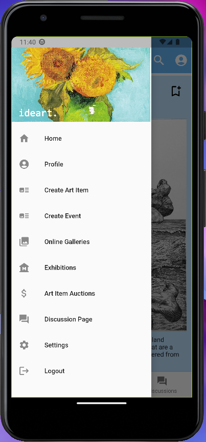

# List Of Contents

- [1. Group Milestone Review](#1-group-milestone-review)
  * [1.1. Executive Summary](#11-executive-summary)
  * [1.2. Summary of work performed by each team member](#12-summary-of-work-performed-by-each-team-member)
    + [Sabri Mete Akyüz](#sabri-mete-akyüz)
    + [Enes Aydoğduoğlu](#enes-aydoğduoğlu)
    + [Erim Erkin Doğan](#erim-erkin-doğan)
    + [Güney İzol](#güney-İzol)
    + [Ali Can Milani](#ali-can-milani)
    + [Başak Önder](#başak-önder)
    + [Cahid Arda Öz](#cahid-arda-öz)
    + [Musa Şimşek](#musa-şimşek)
    + [Atilla Türkmen](#atilla-türkmen)
    + [Can Atakan Uğur](#can-atakan-uğur)
    + [Demet Yayla](#demet-yayla)
  * [1.3. Progress According to Requirements](#13-progress-according-to-requirements)
  * [1.4. API Endpoints](#14-api-endpoints)
  * [1.5. User Interface & User Experience](#15-user-interface---user-experience)
  * [1.6. Annotations](#16-annotations)
  * [1.7. Standards](#17-standards)
- [2. Individual Contribution Reports](#2-individual-contribution-reports)
  * [Sabri Mete Akyüz](#sabri-mete-akyüz-1)
  * [Enes Aydoğduoğlu](#enes-aydoğduoğlu-1)
  * [Erim Erkin Doğan](#erim-erkin-doğan-1)
  * [Güney İzol](#güney-İzol-1)
  * [Ali Can Milani](#ali-can-milani-1)
  * [Başak Önder](#başak-önder-1)
  * [Cahid Arda Öz](#cahid-arda-öz-1)
  * [Musa Şimşek](#musa-şimşek-1)
  * [Atilla Türkmen](#atilla-türkmen-1)
  * [Can Atakan Uğur](#can-atakan-uğur-1)
  * [Demet Yayla](#demet-yayla-1)

# 1. Group Milestone Review

## 1.1. Executive Summary

#### What is Ideart.
Ideart. is an art platform that was created to engage artists and art lovers by sharing events, art items, and discussion posts. Everyone can sign up as a regular user or an artist, but you can also view the public pages as a guest without additional functionalities. Regular users have the ability to follow other users, whether they are regular users or artists, post discussions, and leave comments on events, art items, and discussion posts. Along with the mentioned benefits available to regular users, artists may publish their art works and host physical exhibitions. Our application works on web and mobile both with additional annotation feature which is in developing right now! On web, you can annotate images and see the annotated parts of other users. On the mobile, you can annotate texts, however, backend part has not integrated yet. Fully functional image and text annotation is going to be added to the platform in the next version.

#### Changes from latest version
* To achieve more simple UI, optional fields of sign up page are transferred to the settings page. Hence, you can sign up by providing e-mail, username, password, and user type. If you want to give us some additional information about yourself, you can complete the other optional fields whenever you want.
* Age field is updated to take birthday as input to have more consistent data about the users.
* To facilitate tracking, events are showing the exact location by using Geolocation now!
#### Upcoming Features
* Image and text annotation is going to be completed on both web and mobile and be integrated with the backend. Sidebar is going to be added for viewing all the annotations on the page.
* Artists will be able to create online galleries, similar to the physical exhibition but on the online platform.
* Artists will be able to sell their art works with bidding system.
* All art items is going to be protected by our copyright system. Users will be able to report art works and the artists for copyright infringement by filling the details about the original art work.
* Semantic search is going to be provided on search bar alongside with filtering option.

## 1.2. Summary of work performed by each team member

### Sabri Mete Akyüz

### Enes Aydoğduoğlu

### Erim Erkin Doğan

### Güney İzol

### Ali Can Milani

### Başak Önder
| Task | Link |
| ----- | ------|
| Attended the weekly team meeting, planned the upcoming weeks and discussed the upcoming features. Decided on the endpoint structures and their functionalities | [#235](https://github.com/bounswe/bounswe2022group7/wiki/CMPE451-Meeting-Notes-%235) | 
| Attended the weekly backend team meeting and took the meeting notes, work distribution is done among the team members | [#234](https://github.com/bounswe/bounswe2022group7/wiki/BACKEND-Meeting-Notes-%234) | 
| Edited the endpoints to return HTTP Error and Success responses with corressponding messages | [#376](https://github.com/bounswe/bounswe2022group7/issues/376)  | 
| Changed the age field of user to dateOfBirth because of the Customer Feedback during Milestone 1 |[#377](https://github.com/bounswe/bounswe2022group7/issues/377)  | 
| Started to implementing the necessary classes for Milestone 2  | [#382](https://github.com/bounswe/bounswe2022group7/issues/382)  |
| Attended weekly group meeting and took the meeting notes.|  [#236](https://github.com/bounswe/bounswe2022group7/wiki/CMPE451-Meeting-Notes-%236)|
| Continued to implementing the necessary classes for Milestone 2 | [#382](https://github.com/bounswe/bounswe2022group7/issues/382) |
| Researched about Json Indicators and edited the Json Responses to remove duplicate fields and deprecate user credentials | [#388](https://github.com/bounswe/bounswe2022group7/issues/388) |
| Research about image storing as Base64 string  | [#389](https://github.com/bounswe/bounswe2022group7/issues/389) |
| Creating a new image class and implementing POST/GET/DELETE endpoints for images |  [#389](https://github.com/bounswe/bounswe2022group7/issues/389) |
| Attended weekly group meeting, discussed about reducing the size of Json responses. | [#237](https://github.com/bounswe/bounswe2022group7/wiki/CMPE451-Meeting-Notes-%237) |
| Implementation of CREATE/DELETE endpoints for art item/physical exhibition/online gallery. | [#394](https://github.com/bounswe/bounswe2022group7/issues/394) |
| Implementation of GET/POST endpoints for discussion posts and comments. | [#438](https://github.com/bounswe/bounswe2022group7/issues/438) |
| Edited the POST image endpoint, remove base64 string from here to reduce response time | [#453](https://github.com/bounswe/bounswe2022group7/issues/453) |
| Fix Namings for Endpoint About Discussion "Forum" to "Page" |  [#454](https://github.com/bounswe/bounswe2022group7/issues/454) |
| Debugged the error of creation of several comments at once | [#458](https://github.com/bounswe/bounswe2022group7/issues/458) |
| Debugged the error of backend building on CI and rebased the PR of @CahidArda to not to take up time of from frontend building. | [#PR474](https://github.com/bounswe/bounswe2022group7/pull/474) |
| One of the notetakers during the Customer Milestone 1||
| Wrote individual milestone report||
| Wrote the part 1 of this group review and my sections for part 6 & part 7|[#370](https://github.com/bounswe/bounswe2022group7/issues/370)|
| Review of multiple issues of backend team | [#472](https://github.com/bounswe/bounswe2022group7/issues/472), [#469](https://github.com/bounswe/bounswe2022group7/issues/469), [#447](https://github.com/bounswe/bounswe2022group7/issues/447), [#437](https://github.com/bounswe/bounswe2022group7/issues/437), [#423](https://github.com/bounswe/bounswe2022group7/issues/423), [#416](https://github.com/bounswe/bounswe2022group7/issues/416), [#399](https://github.com/bounswe/bounswe2022group7/issues/399), [#393](https://github.com/bounswe/bounswe2022group7/issues/393), [#391](https://github.com/bounswe/bounswe2022group7/issues/391), [#390](https://github.com/bounswe/bounswe2022group7/issues/390), [#384](https://github.com/bounswe/bounswe2022group7/issues/384), [#379](https://github.com/bounswe/bounswe2022group7/issues/379)|
| Review of multiple PR's of backend team | [#PR404](https://github.com/bounswe/bounswe2022group7/pull/404), [#PR424](https://github.com/bounswe/bounswe2022group7/pull/424), [#PR436](https://github.com/bounswe/bounswe2022group7/pull/436), [#PR448](https://github.com/bounswe/bounswe2022group7/pull/448), [#PR456](https://github.com/bounswe/bounswe2022group7/pull/456), [#PR463](https://github.com/bounswe/bounswe2022group7/pull/463), [#PR464](https://github.com/bounswe/bounswe2022group7/pull/464), [#PR468](https://github.com/bounswe/bounswe2022group7/pull/468), [#PR473](https://github.com/bounswe/bounswe2022group7/pull/473)
| One of the notetakers during the Customer Milestone 2||
| Wrote individual milestone report||
| Wrote the part 1.1, Executive Summary, of this group review|[#509](https://github.com/bounswe/bounswe2022group7/issues/509)|

### Cahid Arda Öz

### Musa Şimşek

### Atilla Türkmen

### Can Atakan Uğur

### Demet Yayla

## 1.3. Progress According to Requirements

- Signup with email and password
    - [X] backend
    - [ ] front
    - [ ] mobile
- Choosing an account type
    - [X] backend
    - [ ] front
    - [ ] mobile
- Changing email and password
    - [X] backend
    - [ ] front
    - [ ] mobile
- Signin with email and password
    - [X] backend
    - [ ] front
    - [ ] mobile
- Guest user can view profile, art item, online exhibition, physical exhibition
    - [x] backend
    - [ ] front
    - [ ] mobile
- 1.1.4.1 User can view comment belonging to art item or description **(generic user can too, but this is implied otherwise)**
    - [x] backend
    - [ ] front
    - [ ] mobile
- Creating discussion posts
    - [x] backend
    - [ ] front
    - [ ] mobile
- 1.1.5.1 Creating events that are online or physical 
    - [x] backend **(no collaborative implemented)**
    - [ ] front
    - [ ] mobile
- Deleting an event
    - [x] backend
    - [ ] front
    - [ ] mobile
- Artist is able to mark the event location for the physical exhibition via geotagging
    - [x] backend
    - [ ] front
    - [ ] mobile
- 1.1.9 User can view art items and events on the homepage 
    - [x] backend **(there is a ranking mechanism there which we haven’t implemented yet)**
    - [ ] front
    - [ ] mobile
- 1.1.10.1 Followers and the users that a certain user follows shall be visible in it’s profile page (followings can be viewed but followers cannot be viewed)
    - [x] backend
    - [ ] front
    - [ ] mobile
- Profile page contains name, surname, location, username and profile picture
    - [x] backend
    - [ ] front
    - [ ] mobile
- User can edit it’s profile page.
    - [x] backend
    - [ ] front
    - [ ] mobile
- User’s verification status can be seen from it’s profile
    - [x] backend
    - [ ] front
    - [ ] mobile
- Following another user
    - [x] backend
    - [ ] front
    - [ ] mobile
- Labelling one’s own art items and events.
    - [x] backend
    - [ ] front
    - [ ] mobile
- 1.1.13.3 bookmarking discussion comments, art items, events
    - [x] backend
    - [ ] front
    - [ ] mobile
- 1.1.14 Searching and filtering
    - [x] backend
    - [ ] front
    - [ ] mobile
- 1.1.15 Admin User requirements
    - [x] backend
    - [ ] front
    - [ ] mobile
- System keeps track of the artists followed by the user or artist.
    - [x] backend
    - [ ] front
    - [ ] mobile
- System keeps track of the data listed in 1.2.1.3
    - [x] backend
    - [ ] front
    - [ ] mobile
- System keeps track of the geotagging information of the physically held events
    - [x] backend
    - [ ] front
    - [ ] mobile
- Platform is in English
    - [x] backend
    - [ ] front
    - [ ] mobile
- 1.1.1.8 Deleting account
    - [ ] backend
    - [ ] front
    - [ ] mobile
- 1.1.2.2signing out
    - [ ] backend
    - [ ] front
    - [ ] mobile
- 1.1.2.3 remember me while signing in
    - [ ] backend
    - [ ] front
    - [ ] mobile
- 1.1.3.2 searching and filtering for guest user
    - [ ] backend
    - [ ] front
    - [ ] mobile
- 1.1.4.2.2 removing discussion post
    - [ ] backend
    - [ ] front
    - [ ] mobile
- 1.1.4.2.1 editing discussion post
    - [ ] backend
    - [ ] front
    - [ ] mobile
- 1.1.5.2 editing event
    - [ ] backend
    - [ ] front
    - [ ] mobile
- 1.1.5.4.1 adding art item to online gallery
    - [ ] backend
    - [ ] front
    - [ ] mobile
- 1.1.5.4.2 removing art item from online gallery
    - [ ] backend
    - [ ] front
    - [ ] mobile
- 1.1.5.4.3 linking an external address as a physical alternative to the online gallery
    - [ ] backend
    - [ ] front
    - [ ] mobile
- 1.1.5.6 marking attendance to a physical exhibition
    - [ ] backend
    - [ ] front
    - [ ] mobile
- 1.1.5.7 cancellation of attendance marking on physical exhibition
    - [ ] backend
    - [ ] front
    - [ ] mobile
- 1.1.5.8 notification for the follower of an artist on the artist’s new event
    - [ ] backend
    - [ ] front
    - [ ] mobile
- 1.1.6.2 reporting copyright infringement
    - [ ] backend
    - [ ] front
    - [ ] mobile
- 1.1.7.1 demanding account verification
    - [ ] backend
    - [ ] front
    - [ ] mobile
- 1.1.8 and its sub-entries (requirements related to bidding)
    - [ ] backend
    - [ ] front
    - [ ] mobile
- 1.1.9.2 customization for the recommendations seen on homepage for a registered user
    - [ ] backend
    - [ ] front
    - [ ] mobile
- 1.1.10.2 events user is attending can be seen in their profile pages (the field is hidden for now on backend size, the related data isn’t given to frontend)
    - [ ] backend
    - [ ] front
    - [ ] mobile
- 1.1.10.4 bidded art items can be seen in profile page (backend hides this existing info for now)
    - [ ] backend
    - [ ] front
    - [ ] mobile
- 1.1.10.7 art items an artist has is showcased on profile page.
    - [ ] backend
    - [ ] front
    - [ ] mobile
- 1.1.11. reporting and blocking related requirements
    - [ ] backend
    - [ ] front
    - [ ] mobile
- 1.1.12.2 notification for users about the followed users’ activities
    - [ ] backend
    - [ ] front
    - [ ] mobile
- 1.1.13.2.1 labelling comments
    - [ ] backend
    - [ ] front
    - [ ] mobile
- 1.2.1.2 interaction level calculation
    - [ ] backend
    - [ ] front
    - [ ] mobile
- 1.2.1.6 enable-disable user activities according to user’s level
    - [ ] backend
    - [ ] front
    - [ ] mobile
- 1.2.3 account verification system requirements
    - [ ] backend
    - [ ] front
    - [ ] mobile
- 1.2.4 bidding system requirements
    - [ ] backend
    - [ ] front
    - [ ] mobile
- 1.2.5 custom recommendation
    - [ ] backend
    - [ ] front
    - [ ] mobile
- 1.2.6 artistic value calculation
    - [ ] backend
    - [ ] front
    - [ ] mobile
- 2.4.1 the platform shall support HTTPS protocol (it supports HTTP)
    - [ ] backend
    - [ ] front
    - [ ] mobile
- 2.4.4 verification email shall be sent for the verification of the user email address.
    - [ ] backend
    - [ ] front
    - [ ] mobile
- 2.5.2 users shall read and accept “Terms of Use” and “Privacy Policy” before signing up
    - [ ] backend
    - [ ] front
    - [ ] mobile
- 1.1.13.1.2 Annotating text in comments.
    - [ ] backend
    - [ ] front
    - [ ] mobile
- 1.1.13.1.3 Annotating text in event descriptions (artist for its own events)
    - [ ] backend
    - [ ] front
    - [ ] mobile
- 1.1.13.1.4 Annotating art item descriptions (artist for its own item)
    - [ ] backend
    - [ ] front
    - [ ] mobile
- 2.1 Annotation standards and model complience
    - [ ] backend
    - [ ] front
    - [ ] mobile
- 2.2.2.3 Size of mobil app is less than 200 MB
    - [ ] backend
    - [ ] front
    - [ ] mobile
- 2.2.2.1&2 Application is android (> v10) and web (Chrome, Opera, Safari, Firefox, Edge) accessible
    - [ ] backend
    - [ ] front
    - [ ] mobile
- 2.3.1 The uptime shall be at least 99%.
    - [ ] backend
    - [ ] front
    - [ ] mobile
- 2.3.2 The response time shall be as short as possible(maximum limit 3 sec).
    - [ ] backend
    - [ ] front
    - [ ] mobile
- 2.3.3 The platform shall support at least 5000 users actively using it at the same time.
    - [ ] backend
    - [ ] front
    - [ ] mobile
- 2.3.4 The platform shall have 85 percent maintainability for 24 hours.
    - [ ] backend
    - [ ] front
    - [ ] mobile
- 2.4.2 The passwords of users shall be encrypted in the database.
    - [ ] backend
    - [ ] front
    - [ ] mobile
- 2.4.3 The password shall be at least 8 characters long, with at least 1 uppercase letter, 1 lowercase letter and 1 special symbol.
    - [ ] backend
    - [ ] front
    - [ ] mobile
## 1.4. API Endpoints

## 1.5. User Interface & User Experience

### Mobile:
- [Home Page:](../../android/lib/pages/home_page.dart#229)

- [Login Page:](../../android/lib/pages/login.dart)

- [Sign-up Page:](../../android/lib/pages/register.dart)

- [Drawer Menu:](../../android/lib/pages/home_page.dart#L72)

- [Profile Page:](../../android/lib/pages/profile_page.dart#L61)

- [Settings Page:](../../android/lib/pages/settings_page.dart)

- [Personal Information Page:](../../android/lib/pages/account_info_page.dart)

- [Create Art Item Page:](../../android/lib/pages/create_art_item_page.dart)

- [Create Event Page:](../../android/lib/pages/create_event_page.dart)

- [View Art Item Page:](../../android/lib/pages/art_item_page.dart)

- [View Event Page:](../../android/lib/pages/event_page.dart)

- [Discussions Page:](../../android/lib/pages/discussion_forum_page.dart#L117)

- [View Discussion Page:](../../android/lib/pages/discussion_page.dart)

- [Commenting:](../../android/lib/widgets/comment.dart)

- [Annotating:](../../android/lib/widgets/annotatable_text.dart)

## 1.6. Annotations

## 1.7. Standards

# 2. Individual Contribution Reports

## Sabri Mete Akyüz

## Enes Aydoğduoğlu

## Erim Erkin Doğan

## Güney İzol

## Ali Can Milani

## Başak Önder

### Member

My name is Başak Önder. Contacts can be found on [my personal wiki page](https://github.com/bounswe/bounswe2022group7/wiki/Başak-Önder). You can also find [my time tracking on the wiki](https://github.com/bounswe/bounswe2022group7/wiki/Başak-Önder-(Effort-Tracking)).

### Responsibilities

- I am a member of the backend team. I worked on research and implementation, and also debugging according to the reports and feedbacks from Frontend and Mobile team. 

### Main Contributions

I implemented the remaining classes of backend which are needed for Milestone-2 features. I also implemented some of the endpoints that are decided on group meetings. Communicated with the frontend and mobile teams about the structure of these endpoints. Also, debugged and fixed some errors reported by the other teams.

Implementation related significant issues:
- [#382 Remaining Classes Implementation](https://github.com/bounswe/bounswe2022group7/issues/382): I implemented the remaining nine classes which are needed for Milestone 2.
- [#394 Implementing Post/Delete Endpoints for Event/ArtItem](https://github.com/bounswe/bounswe2022group7/issues/394): I implemented six creating and deleting endpoints for art items, online galleries and physical exhibitions.
- [#438 Implementing Get/Post Endpoints for DiscussionPost/Comment](https://github.com/bounswe/bounswe2022group7/issues/438): I implemented five getting and creating endpoints for discussion posts and comments.
- [#389 Backend Implementation of Base64 Image](https://github.com/bounswe/bounswe2022group7/issues/389): I implemented a new class for images which has a field that is long enough to store base64 strings. I also implemented GET/POST/DELETE endpoints for this image class.

Debugging related significant issues:
- [#376 Editing the HTTP Status in Responses](https://github.com/bounswe/bounswe2022group7/issues/376): We had been returning HTTP 200 for every endpoint before Milestone 1. I updated the Json response of the endpoints to return the corresponding HTTP response error and message in case of any failure. This is updated to facilitate the job of frontend and mobile teams and also have a more consistent endpoint structure.
- [#388 Editing the Json Response of Artist User](https://github.com/bounswe/bounswe2022group7/issues/388): I debugged the duplicate fields bug and also the issue of returning user credentials in the Json Response. I deprecated the credentials and duplicate fields from response.

### Pull Requests

[#PR345](https://github.com/bounswe/bounswe2022group7/pull/345), [#PR380](https://github.com/bounswe/bounswe2022group7/pull/380), [#PR383](https://github.com/bounswe/bounswe2022group7/pull/383), [#PR385](https://github.com/bounswe/bounswe2022group7/pull/385), [#PR386](https://github.com/bounswe/bounswe2022group7/pull/386), [#PR413](https://github.com/bounswe/bounswe2022group7/pull/413), [#PR440](https://github.com/bounswe/bounswe2022group7/pull/440), [#PR451](https://github.com/bounswe/bounswe2022group7/pull/451), [#PR461](https://github.com/bounswe/bounswe2022group7/pull/461), [#PR462](https://github.com/bounswe/bounswe2022group7/pull/462), [#PR474](https://github.com/bounswe/bounswe2022group7/pull/474)

As Reviewer:
[#PR404](https://github.com/bounswe/bounswe2022group7/pull/404), [#PR424](https://github.com/bounswe/bounswe2022group7/pull/424), [#PR436](https://github.com/bounswe/bounswe2022group7/pull/436), [#PR448](https://github.com/bounswe/bounswe2022group7/pull/448), [#PR456](https://github.com/bounswe/bounswe2022group7/pull/456), [#PR463](https://github.com/bounswe/bounswe2022group7/pull/463), [#PR464](https://github.com/bounswe/bounswe2022group7/pull/464), [#PR468](https://github.com/bounswe/bounswe2022group7/pull/468), [#PR473](https://github.com/bounswe/bounswe2022group7/pull/473)

## Cahid Arda Öz

## Musa Şimşek

## Atilla Türkmen

## Can Atakan Uğur

## Demet Yayla
