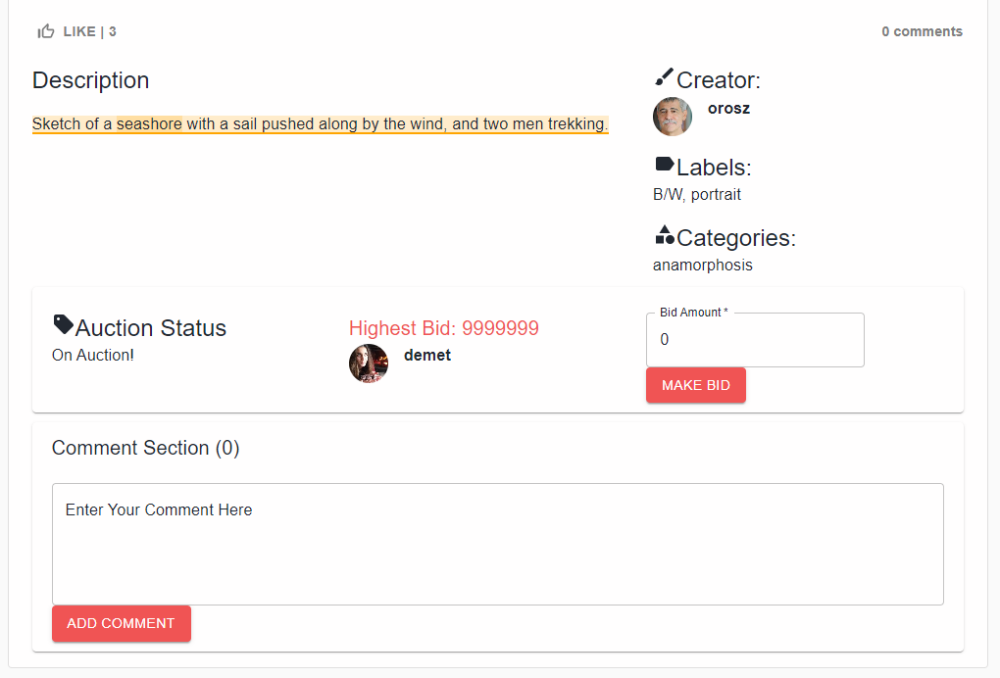
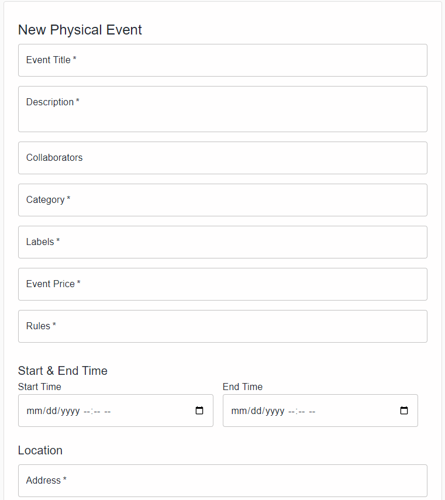
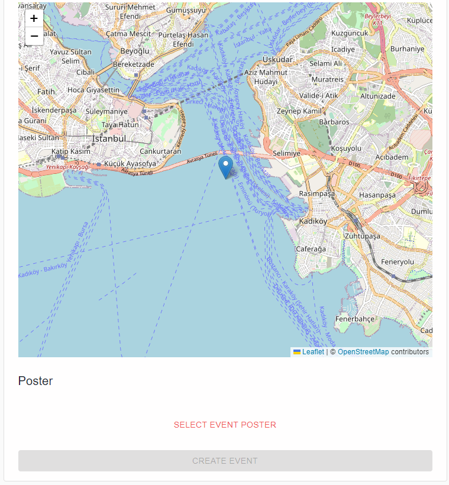
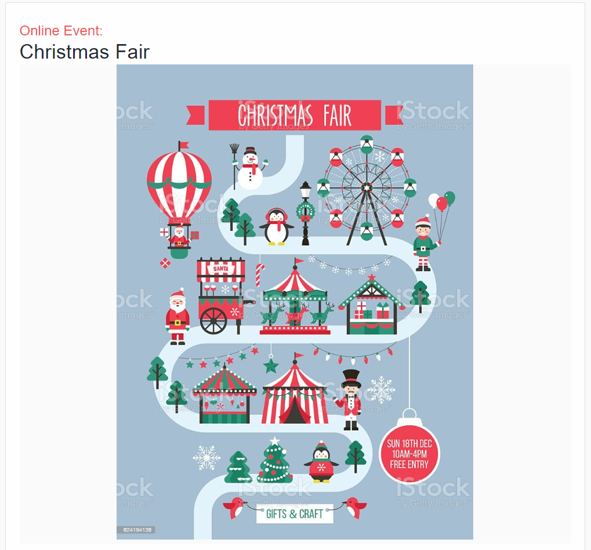
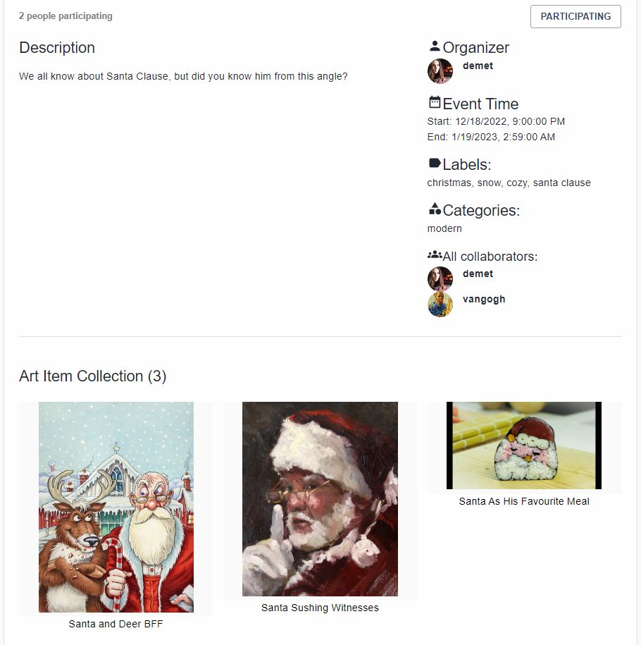
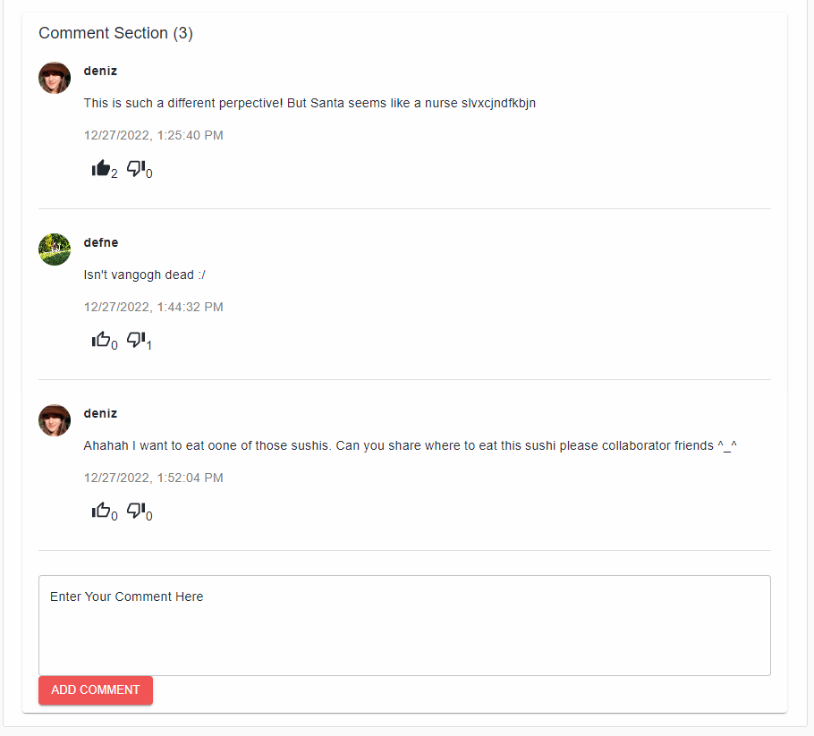
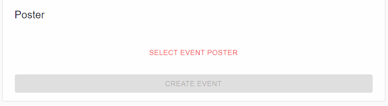
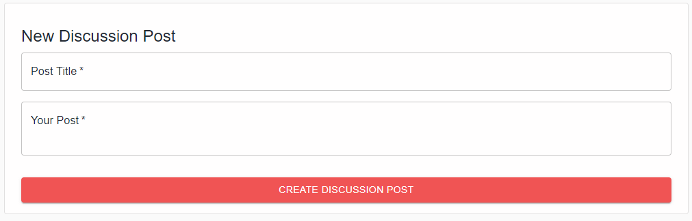

# List Of Contents

- [1. Group Milestone Review](#1-group-milestone-review)
  * [1.1. Executive Summary](#11-executive-summary)
  * [1.2. Summary of work performed by each team member](#12-summary-of-work-performed-by-each-team-member)
    + [Sabri Mete Akyüz](#sabri-mete-akyüz)
    + [Enes Aydoğduoğlu](#enes-aydoğduoğlu)
    + [Erim Erkin Doğan](#erim-erkin-doğan)
    + [Güney İzol](#güney-İzol)
    + [Ali Can Milani](#ali-can-milani)
    + [Başak Önder](#başak-önder)
    + [Cahid Arda Öz](#cahid-arda-öz)
    + [Musa Şimşek](#musa-şimşek)
    + [Atilla Türkmen](#atilla-türkmen)
    + [Can Atakan Uğur](#can-atakan-uğur)
    + [Demet Yayla](#demet-yayla)
  * [1.3. Progress According to Requirements](#13-progress-according-to-requirements)
  * [1.4. API Endpoints](#14-api-endpoints)
  * [1.5. User Interface & User Experience](#15-user-interface---user-experience)
  * [1.6. Annotations](#16-annotations)
  * [1.7. Standards](#17-standards)
  * [1.8. Scenarios](#18-scenarios)
- [2. Project Artifacts](#2-project-artifacts)
  * [2.1. Manuals](#21-manuals)
  * [2.2. Software Requirements Specification](#22-software-requirements-specification)
  * [2.3. Software Design Documents](#23-software-design-documents)
  * [2.4. User Scenarios And Mockups](#24-user-scenarios-and-mockups)
  * [2.5. Project Plan](#25-project-plan)
  * [2.6. Unit Tests](#26-unit-tests)
- [3. Individual Contribution Reports](#3-individual-contribution-reports)
  * [Sabri Mete Akyüz](#sabri-mete-akyüz-1)
  * [Enes Aydoğduoğlu](#enes-aydoğduoğlu-1)
  * [Erim Erkin Doğan](#erim-erkin-doğan-1)
  * [Güney İzol](#güney-İzol-1)
  * [Ali Can Milani](#ali-can-milani-1)
  * [Başak Önder](#başak-önder-1)
  * [Cahid Arda Öz](#cahid-arda-öz-1)
  * [Musa Şimşek](#musa-şimşek-1)
  * [Atilla Türkmen](#atilla-türkmen-1)
  * [Can Atakan Uğur](#can-atakan-uğur-1)
  * [Demet Yayla](#demet-yayla-1)

# 1. Group Milestone Review

## 1.1. Executive Summary

### 1.1.1 What is Ideart. / Summary
Ideart. is an art platform that was created to engage artists and art lovers by sharing events, art items, and discussion posts. Everyone can sign up as a regular user or an artist, but by remaining as a regular user you can still view the public pages as a guest without the additional functionalities enabled to you. Regular users have the ability to follow other user profiles (both types), create bidding on auctioned art items, attend physical exhibitions or online galleries, post discussions and leave comments on events, art items, and discussion posts. The following users have also come with the additional feature as recommendation. Items of followed users are prioritized on the homepage. In addition, users can interact with others by liking art items, participating in events and voting on discussion posts and comments. Along with the above-mentioned benefits available to regular users; artists may publish their artworks, host physical exhibitions and arrange online galleries. All uploaded art items to our site are copyright protected; report functionality can be used to inform suspicious art items and our admin shall deal with them. Moreover, artists are able to put their art items on auction and get biddings from other users. Our application is run both on mobile and the web with an additional annotation feature! You can indicate what you are thinking with increased expressiveness by annotating text and image pieces. Our search function also uses the necessary algorithms that enable semantic search for our user not only lexical one.

### 1.1.2 Status of the Deliverables
| **Deliverable** | **Last Edit Date** | **Status** | 
| -------- | ------------ | ---------------- |
|Group Milestone Report | | |
|Project Artifacts | | |
|Software Package| | |
|Individual Milestone Report | | |

### 1.1.3 Release Notes
New
* Online gallery event
* Search feature found upon MySQL's full-text-index in natural language mode
* Recommendation algorithm
* Bidding system
* Like/Participate/Report/Bookmark features
* Report functionality

Fix
* Backend integration of annotation feature

### 1.1.4 Changes
* Copyright system is modified. Instead of providing an additional copyright feature, all art items are copyright protected by default and all users can report suspicious art items.
* Recommendation system is concluded. Since not specified, by default we arranged the system such that it prioritizes the following artists' items first, and then sorts the items by their popularities which is basically related to the like count of an art item and participant number of an event. The default specification for prioritization can be changed according to the needs of the customer in future releases.
* User level is updated. We are using a simple algorithm for calculating user level; uploading art items and writing discussion posts are 1 point by each and arranging events is 2 points. The user level is shown on profile pages but it is not used as a decision mechanism for enabling features in our platform to users yet. More explicitly speaking, we created this "level" feature in order to indicate a barrier so that we can modify this levelling algorithm and "level" can be used for gradual enabling features a user is enabled to access. The main aim of this is to escalate a user's eagerness to interact with the platform.
* For the search mechanism, we did a literature scan. With the limited time and money (which could have elevated our system capacities) we had, we refrained from using an ML algorithm built on our local. Also, we didn't want to use an external API call because it would require a bulk send of many items along with their wide textual fields to be searched. These all would be too slow and it would create a bad user experience. We selected MySQL's full-text-search index. The search has many modes, we selected the mode most appropriate for our case to be **IN NATURAL LANGUAGE MODE**. Also, we can specify which fields of a database object we can do the research on with MySQL full-text-indexes.

### 1.1.5 Reflections
* Overall group communication and meetings were structured and effective. After experiencing a shortage of time for the first milestone on the frontend and mobile team side because of the backend changes, we decided to have a stricter backend deadline that is also shortened for the other milestones to give the other teams enough time for developing.
* Meetings are generally really effective. First, we start the meeting by evaluating the past week, and any remaining tasks or issues that should be mentioned to the whole team. Then the upcoming week's task is decided and the blurry parts are discussed if there are any. Usually, we have enough time to divide the tasks between the members, i.e allocating the backend tasks among the backend team members. Hence, we do not need additional team meetings for this purpose.
* Labeling is a great way to track the progress and also filter the related issues/PRs to detect the changes in a specific feature.
* Linking the PR and the corresponding issue also facilitates the workflow of the specific feature.
* For new endpoints, one member from each frontend and the mobile team is added to the backend PR to inform the request/response structures of the endpoint and get feedback about them. If any changes are needed, the backend gets informed immediately and changes are made before the PR merges. This prevents us from creating unnecessary additional fix PRs.
* In weekly team meetings, we bargain on technical details mutually affecting the workload and workflow of teams. We managed this well. Teams equilibrate and sometimes even curb each other if necessary. By this, as mentioned before, we also provide that the frontend doesn't have to redo parts that utilized the prior structure of the modified data and thus reduce workload.
 

### 1.1.6 What Could be Done Differently
* We could choose a different environment other than Kotlin / Spring Boot. We decided to work on that environment because the majority of the backend team has experience there. However, implementing the class structure at first and dealing with the SQL relations of spring boot was challenging. 

## 1.2. Summary of work performed by each team member

### Sabri Mete Akyüz

| Task | Link |
| ----- | ------|
| Created the personal wiki page and effort tracker | [#237](https://github.com/bounswe/bounswe2022group7/issues/237) | 
| Revised the requirements of the project and noted the questions about them. | [#243](https://github.com/bounswe/bounswe2022group7/issues/243) | 
| Attended the backend team meeting [#1](https://github.com/bounswe/bounswe2022group7/wiki/BACKEND-Meeting-Notes-%231---12-10-2022). Discussed the structure of the backend by using Class Diagrams. Chose the techs that we use |  |
| Researched about Kotlin and Spring Boot, watched related videos|  |
| Initialized the backend code | [#251](https://github.com/bounswe/bounswe2022group7/issues/251)|
| Implemented the Authentication and Authorization mechanism| [#271](https://github.com/bounswe/bounswe2022group7/issues/271), [#273](https://github.com/bounswe/bounswe2022group7/issues/273), [PR #317](https://github.com/bounswe/bounswe2022group7/pull/317)|
| Researched about inheritance and Hibernate integration| [#310](https://github.com/bounswe/bounswe2022group7/issues/310)|
| Implemented the signup and login endpoints| [#308](https://github.com/bounswe/bounswe2022group7/issues/308), [PR #317](https://github.com/bounswe/bounswe2022group7/pull/317)|
| Disable token requirements for some of the endpoints| [#341](https://github.com/bounswe/bounswe2022group7/issues/341), [PR #342](https://github.com/bounswe/bounswe2022group7/pull/342)|
| Attended the backend team meetings [#2](https://github.com/bounswe/bounswe2022group7/wiki/BACKEND-Meeting-Notes-%232-20-10-2022) [#3](https://github.com/bounswe/bounswe2022group7/wiki/BACKEND-Meeting-Notes-%233). | |
| Attended the general meetings and wrote the meeting report for [#3](https://github.com/bounswe/bounswe2022group7/wiki/CMPE451-Meeting-Notes-%233) | |
| Revision of multiple backend issues | [#243](https://github.com/bounswe/bounswe2022group7/issues/243), [#287](https://github.com/bounswe/bounswe2022group7/issues/287), [#295](https://github.com/bounswe/bounswe2022group7/issues/295), [#299](https://github.com/bounswe/bounswe2022group7/issues/299), [#305](https://github.com/bounswe/bounswe2022group7/issues/305), [#306](https://github.com/bounswe/bounswe2022group7/issues/306), [#323](https://github.com/bounswe/bounswe2022group7/issues/323), [#344](https://github.com/bounswe/bounswe2022group7/issues/344)   |
| Revision of backend related pull requests | [PR #276](https://github.com/bounswe/bounswe2022group7/pull/276), [PR #277](https://github.com/bounswe/bounswe2022group7/pull/277), [PR #300](https://github.com/bounswe/bounswe2022group7/pull/300), [PR #307](https://github.com/bounswe/bounswe2022group7/pull/307), [PR #311](https://github.com/bounswe/bounswe2022group7/pull/311), [PR #322](https://github.com/bounswe/bounswe2022group7/pull/322), [PR #325](https://github.com/bounswe/bounswe2022group7/pull/325), [PR #327](https://github.com/bounswe/bounswe2022group7/pull/327), [PR #345](https://github.com/bounswe/bounswe2022group7/pull/345)  |
| One of the notetakers during the Customer Milestone 1||
| Wrote individual milestone report||
| Wrote the explanation for the tools of backend team for group review and my sections for part 6 & part 7|[#372](https://github.com/bounswe/bounswe2022group7/issues/372), [#373](https://github.com/bounswe/bounswe2022group7/issues/373)|
| Meeting for planning the group report in first milestone | - |
| Attended weekly group meeting. | https://github.com/bounswe/bounswe2022group7/wiki/CMPE451-Meeting-Notes-%235 |
| Attended backend group meeting. | https://github.com/bounswe/bounswe2022group7/wiki/BACKEND-Meeting-Notes-%234 |
| Fix HTTP Token Error |  https://github.com/bounswe/bounswe2022group7/issues/379 |
| Update endpoints to return JSON |  https://github.com/bounswe/bounswe2022group7/issues/390 |
| Update signup endpoint according to customer feedback | https://github.com/bounswe/bounswe2022group7/issues/391 |
| Combine generic and user specific endpoints |  https://github.com/bounswe/bounswe2022group7/issues/393 |
| Create an endpoint to return a user |  https://github.com/bounswe/bounswe2022group7/issues/416 |
| Return token directly after signup | https://github.com/bounswe/bounswe2022group7/issues/419 |
| Add Artist user signup | https://github.com/bounswe/bounswe2022group7/issues/423 |
| Implement Discussion Post DTO | https://github.com/bounswe/bounswe2022group7/issues/455 |
| Fix a bug related with authentication of a discussion post endpoint | https://github.com/bounswe/bounswe2022group7/issues/469 |
| Implement Event DTO | https://github.com/bounswe/bounswe2022group7/issues/472 |
| Add Json related annotations | https://github.com/bounswe/bounswe2022group7/issues/384 |
| Review of multiple issues of backend team | [#377](https://github.com/bounswe/bounswe2022group7/issues/377), [#379](https://github.com/bounswe/bounswe2022group7/issues/379), [#382](https://github.com/bounswe/bounswe2022group7/issues/382), [#394](https://github.com/bounswe/bounswe2022group7/issues/394), [#420](https://github.com/bounswe/bounswe2022group7/issues/420), [#449](https://github.com/bounswe/bounswe2022group7/issues/449), [#450](https://github.com/bounswe/bounswe2022group7/issues/450), [#454](https://github.com/bounswe/bounswe2022group7/issues/454), [#477](https://github.com/bounswe/bounswe2022group7/issues/477)|
| Review of multiple PR's of backend team | [#PR380](https://github.com/bounswe/bounswe2022group7/pull/380), [#PR383](https://github.com/bounswe/bounswe2022group7/pull/383), [#PR385](https://github.com/bounswe/bounswe2022group7/pull/385), [#PR386](https://github.com/bounswe/bounswe2022group7/pull/386), [#PR413](https://github.com/bounswe/bounswe2022group7/pull/413), [#PR428](https://github.com/bounswe/bounswe2022group7/pull/428), [#PR448](https://github.com/bounswe/bounswe2022group7/pull/448), [#PR451](https://github.com/bounswe/bounswe2022group7/pull/451), [#PR462](https://github.com/bounswe/bounswe2022group7/pull/452), [#PR474](https://github.com/bounswe/bounswe2022group7/pull/474), [#PR476](https://github.com/bounswe/bounswe2022group7/pull/476), [#PR477](https://github.com/bounswe/bounswe2022group7/pull/477)
| One of the notetakers during the Customer Milestone 2||
| Wrote individual milestone report||
| Wrote the API documentation part of the deliverables||
| Sample Data Formation For Milestone 2 |  https://github.com/bounswe/bounswe2022group7/issues/496 |
| Implementing Unit Tests on Backend | https://github.com/bounswe/bounswe2022group7/issues/531 |
| Upvote/Downvote Comment Feature | https://github.com/bounswe/bounswe2022group7/issues/534 |
| Upvote/Downvote Discussion Post Feature | https://github.com/bounswe/bounswe2022group7/issues/537 |
| Add Removing Vote Functionality | https://github.com/bounswe/bounswe2022group7/issues/548 |
| Art Item Like Endpoint | https://github.com/bounswe/bounswe2022group7/issues/553 |
| Event Participation Endpoint | https://github.com/bounswe/bounswe2022group7/issues/554 |
| Report Functionality Endpoint | https://github.com/bounswe/bounswe2022group7/issues/555 |
| Creating DTO for Registered User | https://github.com/bounswe/bounswe2022group7/issues/558 |
| Collaborator Implementation | https://github.com/bounswe/bounswe2022group7/issues/573 |
| Sample Data Formation For The Final Milestone |  | |
| Note taking in Final Milestone | |
| Data Formation For Final Deliverables | |
| Team Meeting to Distribute Tasks For Final Deliverables  | |
| Multiple PR Reviews | [#PR551](https://github.com/bounswe/bounswe2022group7/pull/551), [#PR557](https://github.com/bounswe/bounswe2022group7/pull/557), [#PR559](https://github.com/bounswe/bounswe2022group7/pull/559), [#PR574](https://github.com/bounswe/bounswe2022group7/pull/574) |

### Enes Aydoğduoğlu

### Erim Erkin Doğan

### Güney İzol

| Task | Link |
| --- | --- |
| Milestone 1 | --- |
| Setup and configuration of the frontend development infrastructure | [#253](https://github.com/bounswe/bounswe2022group7/issues/253) |
| Develop the home page user interface | [#272](https://github.com/bounswe/bounswe2022group7/issues/272) |
| Develop the main navigation of the website | |
| Fetch data from the backend for the home page | [#332](https://github.com/bounswe/bounswe2022group7/issues/332) |
| Milestone 2 | --- |
| Research for web annotation | [#441](https://github.com/bounswe/bounswe2022group7/issues/441) |
| Implement web annotation service | [#488](https://github.com/bounswe/bounswe2022group7/issues/488) |
| Implement image annotation frontend functionality | [#501](https://github.com/bounswe/bounswe2022group7/issues/501) |
| Merge pull request for web annotation functionality | [#502](https://github.com/bounswe/bounswe2022group7/pull/502) |
| Reviewed pull request | [#498](https://github.com/bounswe/bounswe2022group7/pull/498) |
| Write the annotation part of the report | [#512](https://github.com/bounswe/bounswe2022group7/issues/512) |
| Final report tasks | --- |
|  Try to implement web annotations service with different tools. (We decided that we didn't needed this so this issue was canceled) | [#570](https://github.com/bounswe/bounswe2022group7/issues/570) |
| Use the [Promise API](https://developer.mozilla.org/en-US/docs/Web/JavaScript/Reference/Global_Objects/Promise) more effectively in our web annotations implementation | [#591](https://github.com/bounswe/bounswe2022group7/issues/591) |
| Text annotations | [#594](https://github.com/bounswe/bounswe2022group7/issues/594) |
| Remove the unused tag field from the annotation editor | [#623](https://github.com/bounswe/bounswe2022group7/issues/623) |
| Fix bugs in annotations | [#631](https://github.com/bounswe/bounswe2022group7/issues/631) |
| Add web client interface screenshots to the final report | [Report section](https://github.com/bounswe/bounswe2022group7/blob/master/deliverables/CMPE451_Customer_Presentation_Milestone_Final/milestone_report.md#web) |
| Write the annotations part of the final report | [Report section](https://github.com/bounswe/bounswe2022group7/blob/master/deliverables/CMPE451_Customer_Presentation_Milestone_Final/milestone_report.md#16-annotations)
| Write the standards part of the final report | [Report section](https://github.com/bounswe/bounswe2022group7/edit/master/deliverables/CMPE451_Customer_Presentation_Milestone_Final/milestone_report.md#17-standards) |

### Ali Can Milani
| Task | Link |
| --- | --- |
|Implementation of Login Page|[#280](https://github.com/bounswe/bounswe2022group7/issues/280)|
|Implement the Home page endpoint integrations|[#351](https://github.com/bounswe/bounswe2022group7/issues/351)|
|Milestone1| |
|Implementation of Event Creation Page UI|[#397](https://github.com/bounswe/bounswe2022group7/issues/397)|
|Implementation of Event Creation Page Network Calls|[#398](https://github.com/bounswe/bounswe2022group7/issues/398)|
|Change image widgets in view event page|[#431](https://github.com/bounswe/bounswe2022group7/issues/431)|
|Implementing follow functionality|[#435](https://github.com/bounswe/bounswe2022group7/issues/435)|
|Update Event View and Create Page endpoints|[#479](https://github.com/bounswe/bounswe2022group7/issues/479)|
|Test for Event Create Page|[#482](https://github.com/bounswe/bounswe2022group7/issues/482)|
|Implementing Discussions|[#504](https://github.com/bounswe/bounswe2022group7/issues/504)|
|Milestone2| |
|[Mobile] Home page image caching|[#545](https://github.com/bounswe/bounswe2022group7/issues/545)|
|[Mobile] Discussion Post Vote Functionality|[#562](https://github.com/bounswe/bounswe2022group7/issues/562)|
|[Mobile] Event Participation Functionality|[#564](https://github.com/bounswe/bounswe2022group7/issues/564)|
|[Mobile] Art Item Like and Bookmark Functionality|[#566](https://github.com/bounswe/bounswe2022group7/issues/566)|
|[Mobile] Comment Vote Functionality|[#568](https://github.com/bounswe/bounswe2022group7/issues/568)|
|[Mobile] Reporting ArtItem|[#584](https://github.com/bounswe/bounswe2022group7/issues/584)|
|[Mobile] Bookmark Functionality In Feed Page|[#587](https://github.com/bounswe/bounswe2022group7/issues/587)|
|[Mobile] Art Item Auction Network Connection|[#602](https://github.com/bounswe/bounswe2022group7/issues/602)|
|Milestone3| |

### Başak Önder

| Task | Link |
| ----- | ------|
| Created the personal wiki page and effort tracker | [#237](https://github.com/bounswe/bounswe2022group7/issues/237) | 
| Revised the requirements of the project and noted the questions about them. | [#243](https://github.com/bounswe/bounswe2022group7/issues/243) | 
| Researched about the backend tools. |  | 
| Attended the [backend team meeting](https://github.com/bounswe/bounswe2022group7/wiki/BACKEND-Meeting-Notes-%231---12-10-2022). Discussed the structure of the backend by using Class Diagrams. Chose the techs that we use |  |
| Researched about Kotlin, watched related videos, and tried several hands-on practice to experience it |  |
| Researched on Docker and started to implement the functionality of Dockerization of backend and Sql database | [#252](https://github.com/bounswe/bounswe2022group7/issues/252), [PR #276](https://github.com/bounswe/bounswe2022group7/pull/276) |
| Attended the backend team meeting and wrote [the report on wiki](https://github.com/bounswe/bounswe2022group7/wiki/BACKEND-Meeting-Notes-%232-20-10-2022). Planned the necessary fields that we should implement. | |
| Implementation of home page related classes | [#257](https://github.com/bounswe/bounswe2022group7/issues/257), [PR #277](https://github.com/bounswe/bounswe2022group7/pull/277)|
| Revision of the Mock Ups | [#247](https://github.com/bounswe/bounswe2022group7/issues/247) |
| Attended the backend [team meeting](https://github.com/bounswe/bounswe2022group7/wiki/BACKEND-Meeting-Notes-%233). | |
| Implementation of register related classes | [#299](https://github.com/bounswe/bounswe2022group7/issues/299), [#305](https://github.com/bounswe/bounswe2022group7/issues/305), [PR #300](https://github.com/bounswe/bounswe2022group7/pull/300), [PR #307](https://github.com/bounswe/bounswe2022group7/pull/307) |
| Implementation of Single Art Item endpoint | [#302](https://github.com/bounswe/bounswe2022group7/issues/302), [PR #322](https://github.com/bounswe/bounswe2022group7/pull/322)|
| Debugging the nested classes bug fix while trying to return the objects through endpoints, then update the classes structure regarding to the solution| [#323](https://github.com/bounswe/bounswe2022group7/issues/323), [#344](https://github.com/bounswe/bounswe2022group7/issues/344),  [PR #345](https://github.com/bounswe/bounswe2022group7/pull/345) |
| Merged backend into develop branch | [PR #327](https://github.com/bounswe/bounswe2022group7/pull/327)|
| Revision of the Class Diagram Update | [#296](https://github.com/bounswe/bounswe2022group7/issues/296) |
| Revision of multiple backend issues | [#247](https://github.com/bounswe/bounswe2022group7/issues/247), [#250](https://github.com/bounswe/bounswe2022group7/issues/250), [#259](https://github.com/bounswe/bounswe2022group7/issues/259), [#271](https://github.com/bounswe/bounswe2022group7/issues/271), [#301](https://github.com/bounswe/bounswe2022group7/issues/301), [#308](https://github.com/bounswe/bounswe2022group7/issues/308)  |
| Revision of backend related pull requests | [PR #275](https://github.com/bounswe/bounswe2022group7/pull/275), [PR #303](https://github.com/bounswe/bounswe2022group7/pull/303) |
| One of the notetakers during the Customer Milestone 1||
| Wrote individual milestone report||
| Wrote the part 1 of this group review and my sections for part 6 & part 7|[#370](https://github.com/bounswe/bounswe2022group7/issues/370)|
| Attended the weekly team meeting, planned the upcoming weeks and discussed the upcoming features. Decided on the endpoint structures and their functionalities | [#235](https://github.com/bounswe/bounswe2022group7/wiki/CMPE451-Meeting-Notes-%235) | 
| Attended the weekly backend team meeting and took the meeting notes, work distribution is done among the team members | [#234](https://github.com/bounswe/bounswe2022group7/wiki/BACKEND-Meeting-Notes-%234) | 
| Edited the endpoints to return HTTP Error and Success responses with corressponding messages | [#376](https://github.com/bounswe/bounswe2022group7/issues/376)  | 
| Changed the age field of user to dateOfBirth because of the Customer Feedback during Milestone 1 |[#377](https://github.com/bounswe/bounswe2022group7/issues/377)  | 
| Started to implementing the necessary classes for Milestone 2  | [#382](https://github.com/bounswe/bounswe2022group7/issues/382)  |
| Attended weekly group meeting and took the meeting notes.|  [#236](https://github.com/bounswe/bounswe2022group7/wiki/CMPE451-Meeting-Notes-%236)|
| Continued to implementing the necessary classes for Milestone 2 | [#382](https://github.com/bounswe/bounswe2022group7/issues/382) |
| Researched about Json Indicators and edited the Json Responses to remove duplicate fields and deprecate user credentials | [#388](https://github.com/bounswe/bounswe2022group7/issues/388) |
| Research about image storing as Base64 string  | [#389](https://github.com/bounswe/bounswe2022group7/issues/389) |
| Creating a new image class and implementing POST/GET/DELETE endpoints for images |  [#389](https://github.com/bounswe/bounswe2022group7/issues/389) |
| Attended weekly group meeting, discussed about reducing the size of Json responses. | [#237](https://github.com/bounswe/bounswe2022group7/wiki/CMPE451-Meeting-Notes-%237) |
| Implementation of CREATE/DELETE endpoints for art item/physical exhibition/online gallery. | [#394](https://github.com/bounswe/bounswe2022group7/issues/394) |
| Implementation of GET/POST endpoints for discussion posts and comments. | [#438](https://github.com/bounswe/bounswe2022group7/issues/438) |
| Edited the POST image endpoint, remove base64 string from here to reduce response time | [#453](https://github.com/bounswe/bounswe2022group7/issues/453) |
| Fix Namings for Endpoint About Discussion "Forum" to "Page" |  [#454](https://github.com/bounswe/bounswe2022group7/issues/454) |
| Debugged the error of creation of several comments at once | [#458](https://github.com/bounswe/bounswe2022group7/issues/458) |
| Debugged the error of backend building on CI and rebased the PR of @CahidArda to not to take up time of from frontend building. | [#PR474](https://github.com/bounswe/bounswe2022group7/pull/474) |
| Review of multiple issues of backend team | [#472](https://github.com/bounswe/bounswe2022group7/issues/472), [#469](https://github.com/bounswe/bounswe2022group7/issues/469), [#447](https://github.com/bounswe/bounswe2022group7/issues/447), [#437](https://github.com/bounswe/bounswe2022group7/issues/437), [#423](https://github.com/bounswe/bounswe2022group7/issues/423), [#416](https://github.com/bounswe/bounswe2022group7/issues/416), [#399](https://github.com/bounswe/bounswe2022group7/issues/399), [#393](https://github.com/bounswe/bounswe2022group7/issues/393), [#391](https://github.com/bounswe/bounswe2022group7/issues/391), [#390](https://github.com/bounswe/bounswe2022group7/issues/390), [#384](https://github.com/bounswe/bounswe2022group7/issues/384), [#379](https://github.com/bounswe/bounswe2022group7/issues/379)|
| Review of multiple PR's of backend team | [#PR404](https://github.com/bounswe/bounswe2022group7/pull/404), [#PR424](https://github.com/bounswe/bounswe2022group7/pull/424), [#PR436](https://github.com/bounswe/bounswe2022group7/pull/436), [#PR448](https://github.com/bounswe/bounswe2022group7/pull/448), [#PR456](https://github.com/bounswe/bounswe2022group7/pull/456), [#PR463](https://github.com/bounswe/bounswe2022group7/pull/463), [#PR464](https://github.com/bounswe/bounswe2022group7/pull/464), [#PR468](https://github.com/bounswe/bounswe2022group7/pull/468), [#PR473](https://github.com/bounswe/bounswe2022group7/pull/473)
| One of the notetakers during the Customer Milestone 2||
| Wrote individual milestone report||
| Wrote the part 1.1, Executive Summary, of this group review|[#509](https://github.com/bounswe/bounswe2022group7/issues/509)|
| Sample Data Formation For Milestone 2 |  [#496](https://github.com/bounswe/bounswe2022group7/issues/496) |
| Implementing Unit Tests on Backend | [#531](https://github.com/bounswe/bounswe2022group7/issues/531) |
| Implementation of Recommendation Algorithm |  [#550](https://github.com/bounswe/bounswe2022group7/issues/550) |
| Update User Level with Actions | [#552](https://github.com/bounswe/bounswe2022group7/issues/552) |
| Auction and Bidding Endpoints  | [#572](https://github.com/bounswe/bounswe2022group7/issues/572) |
| Sample Data Formation For The Final Milestone | |
| Team Meeting to Distribute Tasks For Final Deliverables  ||
| Data Formation For Final Deliverables | |
| Writing Executive Summary for Final Deliverables | |
| Revision of 4 backend PR | [#PR549](https://github.com/bounswe/bounswe2022group7/pull/549), [#PR560](https://github.com/bounswe/bounswe2022group7/pull/560), [#PR571](https://github.com/bounswe/bounswe2022group7/pull/571), [#PR575](https://github.com/bounswe/bounswe2022group7/pull/575) |

### Cahid Arda Öz

| Task | Link |
| --- | --- |
| Revision of Requirements. New members in the team took notes and wrote questions. I answered these questions and made an action plan | [#243](https://github.com/bounswe/bounswe2022group7/issues/243) |
| Preparing Customer Questions. I used the notes I took in [#243](https://github.com/bounswe/bounswe2022group7/issues/243) to prepare questions for the TA. | [#242](https://github.com/bounswe/bounswe2022group7/issues/242) |   
| Prepared meeting report for our meeting on tuesday | [#249](https://github.com/bounswe/bounswe2022group7/issues/249) |
| Attended the frontend team meeting and wrote [the report on wiki](https://github.com/bounswe/bounswe2022group7/wiki/FRONTEND-Meeting-Notes-%231---15-10-2022). Planned the system requirements revision during the meeting. | [#254](https://github.com/bounswe/bounswe2022group7/issues/254) |
| Implemented router for the frontend | [#268](https://github.com/bounswe/bounswe2022group7/issues/268), [#269](https://github.com/bounswe/bounswe2022group7/pull/269) |
| Implemented comment section for the frontend | [#270](https://github.com/bounswe/bounswe2022group7/issues/270), [#269](https://github.com/bounswe/bounswe2022group7/pull/269) |
| Implemented static signup and signin pages. Had to learn about handling user inputs and button submits with react hooks. | [#284](https://github.com/bounswe/bounswe2022group7/issues/284), [#288](https://github.com/bounswe/bounswe2022group7/pull/288) |
| Extended the Comment component by replacing it with UserCard component. Created the art item page with mock data using the UserCard component to demonstrate it. Had to learn more about hooks and how buttons work | [#289](https://github.com/bounswe/bounswe2022group7/issues/289) |
| Implemented authentication and token handling. Had to learn more about hooks, contexts and routers. | [#290](https://github.com/bounswe/bounswe2022group7/issues/290), [#291](https://github.com/bounswe/bounswe2022group7/pull/291) |
| Research and testing text/image annotations. Planned future steps for adding Annotations. | [#297](https://github.com/bounswe/bounswe2022group7/issues/297) |
| Preparing deliverables for the milestone | [#329](https://github.com/bounswe/bounswe2022group7/issues/329) |
| Finding out, debugging and reporting an error in the database | [#344](https://github.com/bounswe/bounswe2022group7/issues/344) |
| Integrating art item page to the endpoints | [#343](https://github.com/bounswe/bounswe2022group7/issues/343), [#349](https://github.com/bounswe/bounswe2022group7/pull/349) | 
| Updating app name in the frontend and tracking the change in mobile | [#350](https://github.com/bounswe/bounswe2022group7/issues/350) |
| Planning and preparing for the presentation as a presenter | [#353](https://github.com/bounswe/bounswe2022group7/issues/353) |
| Adding the event page to the frontend | [#356](https://github.com/bounswe/bounswe2022group7/issues/356), [#367](https://github.com/bounswe/bounswe2022group7/pull/367) | 
| Creating tag for the first milestone | [#368](https://github.com/bounswe/bounswe2022group7/issues/368) |
| Milestone 1 | |
| Adding Form Layout to Sign-up and Sign-in Pages | [#387](https://github.com/bounswe/bounswe2022group7/pull/387) |
| Learning about storing images as Base64, testing it on frontend and reviewing it on backend and mobile. | [#389](https://github.com/bounswe/bounswe2022group7/issues/389) |
| Create event and create art item implementation for frontend | [#401](https://github.com/bounswe/bounswe2022group7/issues/401) |
| Adding a layout for content on the app, fixing endpoints of homepage and improved error page. | [#417](https://github.com/bounswe/bounswe2022group7/pull/417) |
| Completed integration of the new art item and new physical event pages with the endpoints | [#401](https://github.com/bounswe/bounswe2022group7/issues/401), [PR #459](https://github.com/bounswe/bounswe2022group7/pull/459) | 
| Integrated comment section with the endpoints | [#460](https://github.com/bounswe/bounswe2022group7/issues/460), [PR #476](https://github.com/bounswe/bounswe2022group7/pull/476) |
| Reported owner null bug in art item creation | [#457](https://github.com/bounswe/bounswe2022group7/issues/457) |
| Reported duplicate comments bug | [#458](https://github.com/bounswe/bounswe2022group7/issues/458) |
| Reported discussion page GET token requirement bug | [#469](https://github.com/bounswe/bounswe2022group7/issues/469) |
| Reported bugs in comment list fields of event and discussion page endpoints | [#470](https://github.com/bounswe/bounswe2022group7/issues/470) |
| Removed poster id field from the discussion post in the backend | [PR #474](https://github.com/bounswe/bounswe2022group7/pull/474) |
| Merged updates in develop branch into master for deployment | [PR #478](https://github.com/bounswe/bounswe2022group7/pull/478) |
| Added color theme to the app. Styled event, art item and discussion pages. Styled comment section component. Added start&end time selection to create physical event page | [#490](https://github.com/bounswe/bounswe2022group7/issues/490), [PR #491](https://github.com/bounswe/bounswe2022group7/pull/491) |
| CommentSection Component unit tests | [PR #521](https://github.com/bounswe/bounswe2022group7/pull/521) |       
| Mock Text Annotation for Frontend | [PR #522](https://github.com/bounswe/bounswe2022group7/pull/522) |
| Tag for milestone 2 | [#526](https://github.com/bounswe/bounswe2022group7/issues/526) |
| Milestone 2 |  |
| Updating the image & text annotation editor by removing the tag field | [#580](https://github.com/bounswe/bounswe2022group7/issues/580), [PR #586](https://github.com/bounswe/bounswe2022group7/pull/586) |
| Adding art item auction to the frontend | [#583](https://github.com/bounswe/bounswe2022group7/issues/583), [PR #585](https://github.com/bounswe/bounswe2022group7/pull/585) |
| Adding downvote upvote to comments | [#588](https://github.com/bounswe/bounswe2022group7/issues/588), [PR #592](https://github.com/bounswe/bounswe2022group7/pull/592) |
| Adding online events | [#595](https://github.com/bounswe/bounswe2022group7/issues/595), [PR #597](https://github.com/bounswe/bounswe2022group7/pull/597) |
| Add delete, participate, like, upvote functionality to content pages | [#608](https://github.com/bounswe/bounswe2022group7/issues/608), [PR #609](https://github.com/bounswe/bounswe2022group7/pull/609) |

### Musa Şimşek

### Atilla Türkmen

| Task | Link |
| --- | --- |
|  Connect mobile text annotations to the backend | [#576](https://github.com/bounswe/bounswe2022group7/issues/576) |
|  Implementing art item auction | [#599](https://github.com/bounswe/bounswe2022group7/issues/599) |
| Write the system manual for the mobile application in the final report | [Report section](https://github.com/bounswe/bounswe2022group7/blob/master/deliverables/CMPE451_Customer_Presentation_Milestone_Final/milestone_report.md#21-manuals) |
| Add mobile interface screenshots to the final report | [Report section](https://github.com/bounswe/bounswe2022group7/blob/master/deliverables/CMPE451_Customer_Presentation_Milestone_Final/milestone_report.md#mobile) |

### Can Atakan Uğur

### Demet Yayla

### Demet Yayla

#### Milestone 1:
|Work|Link|
|--------|-------|
| Milestone 1 | --- |
|I created the initial entity classes for backend|[#256](https://github.com/bounswe/bounswe2022group7/issues/256)|
|I created the initial endpoints which are related to items that will appear in homepage|[#287](https://github.com/bounswe/bounswe2022group7/issues/287)|
|I wrote the endpoint that will return a single event with the id provided by frontend. |[#301](https://github.com/bounswe/bounswe2022group7/issues/301)|
|I fixed a database integration error.|[#295](https://github.com/bounswe/bounswe2022group7/issues/295)|
|I searched on Spring Boot annotations for different kinds of database relations.|[#310](https://github.com/bounswe/bounswe2022group7/issues/310)|
|I searched on fixing spring annotation for manytomany|[#309](https://github.com/bounswe/bounswe2022group7/issues/309)|
|I did a research on how to write integration tests for secured restful methods.|[#358](https://github.com/bounswe/bounswe2022group7/issues/358)|
|Reviewed issues.|[#302](https://github.com/bounswe/bounswe2022group7/issues/302), [#345](https://github.com/bounswe/bounswe2022group7/pull/345)|
|Review and update class diagram with Can Atakan Uğur|[#239](https://github.com/bounswe/bounswe2022group7/issues/239)|
|Review and update Project Plan with team leaders and Can Atakan Uğur|[#241](https://github.com/bounswe/bounswe2022group7/issues/241)|
|Update communication plan.|[#244](https://github.com/bounswe/bounswe2022group7/issues/244)|
|Review and update sequence diagram for Discussion forum.|[#245](https://github.com/bounswe/bounswe2022group7/issues/245)|
|After the first backend meeting, update class diagram and requirements|[#250](https://github.com/bounswe/bounswe2022group7/issues/250)|
|Update the sequence diagram for discussion forum related to the latest modification on class diagram|[#312](https://github.com/bounswe/bounswe2022group7/issues/312)|
|I was the notetaker for 2 backend meetings. We did three backend, three general team meetings so far and I attended them all.||
|Revision of this issue about deliverables|[#329](https://github.com/bounswe/bounswe2022group7/issues/329)|
|Solving pop-up premilestone requests.|[#347](https://github.com/bounswe/bounswe2022group7/issues/347)|
|Gave feedback on this issue related to milestone presentations on Tuesday.|[#353](https://github.com/bounswe/bounswe2022group7/issues/353)|
|I was one of the notetakers in milestone presentations.||
|I wrote individual milestone report.||
|I wrote parts of milestone group review (wrote some of part 3 and my own sections in part 6 and 7.)|[#370](https://github.com/bounswe/bounswe2022group7/issues/370)|
| Milestone 2 | --- |
|Create-delete events & art items|[#394](https://github.com/bounswe/bounswe2022group7/issues/394) |
|Author field missing fix and DTO addition.|[#420](https://github.com/bounswe/bounswe2022group7/issues/420)|
|Endpoint for update and view profile settings.|[#437](https://github.com/bounswe/bounswe2022group7/issues/437)|
|Endpoint to follow user.|[#447](https://github.com/bounswe/bounswe2022group7/issues/447)|
|Converting a string to list of strings.|[#450](https://github.com/bounswe/bounswe2022group7/issues/450)|
|Art item creator error bug fix.|[#457](https://github.com/bounswe/bounswe2022group7/issues/457)|
|Change structure for upvote downvote.|[#467](https://github.com/bounswe/bounswe2022group7/issues/467)|
|Attempt to write tests.|[#358](https://github.com/bounswe/bounswe2022group7/issues/358)|
|Review of the issues.|[#453](https://github.com/bounswe/bounswe2022group7/issues/453), [#455](https://github.com/bounswe/bounswe2022group7/issues/455), [#457](https://github.com/bounswe/bounswe2022group7/issues/457), [#388](https://github.com/bounswe/bounswe2022group7/issues/388 ), [#438](https://github.com/bounswe/bounswe2022group7/issues/438), [#372](https://github.com/bounswe/bounswe2022group7/issues/372)|
|Reviewer of PRs|[#440](https://github.com/bounswe/bounswe2022group7/pull/440), [#345](https://github.com/bounswe/bounswe2022group7/pull/345)|
|Form sample data to showcase in milestone presentation.|[#496](https://github.com/bounswe/bounswe2022group7/issues/496)|
|Discussion on scenarios for milestone presentation.|[#497](https://github.com/bounswe/bounswe2022group7/issues/497)|
|Tracking requirement progress for milestone report.|[#515](https://github.com/bounswe/bounswe2022group7/issues/515)|
|Notetaker|[The meeting note](https://github.com/bounswe/bounswe2022group7/wiki/Meeting-Notes-%2315)|
|Writing part three of group review for milestone 1.|[#370](https://github.com/bounswe/bounswe2022group7/issues/370)|
|One of the notetakers for milestone 2 presentations.||
| Milestone 3 | --- |
|Implemented Search feature| [#547](https://github.com/bounswe/bounswe2022group7/issues/547)|
|Reviewed issues| [#554](https://github.com/bounswe/bounswe2022group7/issues/554), [#555](https://github.com/bounswe/bounswe2022group7/issues/555),[#558](https://github.com/bounswe/bounswe2022group7/issues/558)|
|Reviewed PRs|[#556](https://github.com/bounswe/bounswe2022group7/pull/556),[#561](https://github.com/bounswe/bounswe2022group7/pull/561),[#540](https://github.com/bounswe/bounswe2022group7/pull/540)|
|Helped with user scenarios for milestone presentation|[#607](https://github.com/bounswe/bounswe2022group7/issues/607)|
|Sample data formation for the application.||
|Wrote "Process According to Requirements" part for final report||
|Reviewed "Executive summary" part for final report.||


## 1.3. Progress According to Requirements

### 1\. Functional Requirements

#### 1.1.1. Sign Up

| Requirement | Status for Web| Status for Mobile|
| ----- | ------ | ------ |
| 1.1.1.1: Guest users shall be able to register for an account by providing an email address and a password. | Completed | Completed |
| 1.1.1.2: Duplicate email addresses shall not be accepted. | Completed | Completed |
| 1.1.1.3: Guest users who are trying to sign up shall also pick a unique username to complete the registration process. | Completed | Completed |
| 1.1.1.4: Duplicate usernames shall not be accepted. | Completed | Completed |
| 1.1.1.5: Guest users could provide extra information while signing up, like name, surname, location, age. | Completed | Completed |
| 1.1.1.6: Guest users shall choose their account type, "Artist" or a "Regular User". | Completed | Completed |
|1.1.1.7: Users shall be able to change their email address and password, anytime.|Not implemented|Not implemented|
|1.1.1.8: Users shall be able to delete their accounts without any requisites, anytime.|Not implemented|Not implemented|

#### 1.1.2. Sign In

| Requirement | Status for Web| Status for Mobile|
| ----- | ------ | ------ |
| 1.1.2.1: Users shall be able to sign in using their email and password combination.|Completed|Completed|
| 1.1.2.2: Users shall be able to sign out without a restriction.|Completed|Completed|
|1.1.2.3: Users shall be able to use "Remember Me" option when signing in. This way, they will automatically be signed in when they access the platform|Not implemented|Not implemented|

#### 1.1.3. Guest Users

| Requirement | Status for Web| Status for Mobile|
| ----- | ------ | ------ |
| 1.1.3.1: Guest Users shall be able to view profile pages, art items, pages of online/physical exhibitions. |Completed|Completed|
|1.1.3.2: Guest Users shall be able to use the search/filter functionality.|Completed|Completed|
| 1.1.3.3: Guest Users shall not be able to make any changes in the state of the system. |Completed| Completed|


#### 1.1.4 Comments

| Requirement | Status for Web| Status for Mobile|
| ----- | ------ | ------ |
| 1.1.4.1: Registered users and artists shall be able to view comments that belong to art items or exhibitions |Completed|Completed|
| 1.1.4.2: Registered users and artists shall be able to create comments on the discussion page. |Completed|Completed|
| 1.1.4.2.1: Registered users and artists shall be able to edit their comments in the discussion page. |Completed|Completed|
|1.1.4.2.2: Registered users and artists shall be able to remove their comments in the discussion page.|Not implemented|Not implemented|

#### 1.1.5 Events

| Requirement | Status for Web| Status for Mobile|
| ----- | ------ | ------ |
| 1.1.5.1: Artists shall be able to arrange physical events |Completed|Completed|
|1.1.5.2: Artists shall be able to edit events|Not Not implemented|implemented|
|1.1.5.3: Artists shall be able to remove events they created.|Implemented but not working|Implemented but not working|
|1.1.5.4: Artists shall be able to arrange Online Galleries using the platform|Completed|Completed|
|1.1.5.4.1: Artists shall be able to add art items to Online Galleries.|Not implemented|Not implemented|
|1.1.5.4.2: Artists shall be able to remove art items from Online Galleries.|Not implemented|Not implemented|
|1.1.5.4.3: Artists shall be able to indicate and link an outside platform for their Online Galleries if they choose to host it in another platform.|Completed|Completed|
| 1.1.5.5: Artists shall be able to arrange **Physical Exhibitions** using the platform.|Completed|Completed|
|1.1.5.5.1: Artists shall be able to mark event location in Physical Exhibitions via using geotagging.|Completed|Completed|
| 1.1.5.5.1: Artists shall be able to mark event location in Physical Exhibitions via using geotagging. |Completed|Completed|
|1.1.5.6: Users shall be able to indicate that their participation in the event.|Completed|Completed|
|1.1.5.7: Users shall be able to cancel their participation to a event.|Completed|Completed|
|1.1.5.8: Users shall be notified when an event is created by a followed artist.|Not implemented|Not implemented|


#### 1.1.6 Copyright
| Requirement | Status for Web| Status for Mobile|
| ----- | ------ | ------ |
|1.1.6.1: Artists shall be able to demand copyright protection for their art items|Completed|Completed|
|1.1.6.2: Users and artists shall be able to report infringements of copyright|Completed|Completed|

**PS:** For 1.1.6.1, in our system copyright is given by default and its validity is guaranteed with 1.1.6.2.

#### 1.1.7 Account Verification
| Requirement | Status for Web| Status for Mobile|
| ----- | ------ | ------ |
|1.1.7.1: Users shall be able to apply to be verified.|Not implemented|Not implemented|

#### 1.1.8 Bidding
| Requirement | Status for Web| Status for Mobile|
| ----- | ------ | ------ |
|1.1.8.1: Artists shall be able to sell their copyrighted art items with a bidding system.|Completed|Completed|
|1.1.8.2: Users and artists shall be able to bid for art items on the bidding system.|Completed|Completed|
|1.1.8.2.1: An artist shall be able to determine a minimum limit that buyer can't bid below.|Not implemented|Not implemented|
|1.1.8.2.2: Bidders shall not be able to bid below the last offer but can increase it.|Completed|Completed|
|1.1.8.3: If an artist accepts an offer given, s/he can put a deadline for the owner of the winning offer to complete the payment so that fake bids, bid rigging, etc. can be prevented.|Completed|Completed|
|1.1.8.4: Artists shall not be able to end the bidding by withdrawing the item and not selling it at all.|Not implemented|Not implemented|

**PS:** 
- 1.1.8.1 doesn't provide an interface for spesifically monetary procedures. It provides a medium of communication via comments and bidding button.
- 1.1.8.3 can also be provided via comments and auction start-end auction buttons. When "end the auction" button is pressed, the highest offer data is preserved and is displayed when "start auction" button is pressed again.

#### 1.1.9 Home Page

| Requirement | Status for Web| Status for Mobile|
| ----- | ------ | ------ |
| 1.1.9.1: The home page shall highlight the most popular artworks and events of the previous week as well as the events in the coming days that are highly anticipated by the users for the guests.|Completed|Completed|
|1.1.9.2: The home page shall be customized for registered users with upcoming events and artworks of the followed artists.|Completed|Completed|
|1.1.9.3: Guest users shall be able to see popular artworks and events in the home page.|Completed | Completed|

**PS:** 
- For 1.1.9.3, there is sorting on backend and this provides that the content is demonstrated in a sorted order to the guest user.

#### 1.1.10 Profile Page

| Requirement | Status for Web| Status for Mobile|
| ----- | ------ | ------ |
| 1.1.10.1 Followers and the users that a certain user follows shall be visible in his/her profile page.|Completed|Completed|
|1.1.10.2 The physical exhibitions/online galleries that a user is attending shall be visible in his/her profile page.|Completed|Completed|
| 1.1.10.3 The profile page shall include name, surname, location, username and profile picture.|Completed|Completed|
|1.1.10.4 The profile page shall include the art items that the user has made a bid for.|Completed|Completed|
|1.1.10.5 The profile page shall include the verification status of the user.|Not implemented|Not implemented|
| 1.1.10.6 The users shall be able to edit the information included in their profile pages.|Completed|Completed|
| 1.1.10.7 Art items that an artist have shall be visible in his/her profile page.|Completed|Completed|


#### 1.1.11 Reporting and Blocking
| Requirement | Status for Web| Status for Mobile|
| ----- | ------ | ------ |
|1.1.11.1 Users shall be able to block any other user as they would like.|Not implemented|Not implemented|
|1.1.11.2 Users shall be able to unblock the users that they have previously blocked as they would like.|Not implemented|Not implemented|
|1.1.11.3 Users shall be able to report the art works and the artists for copyright infringement by filling the details about the original art work.|Completed|Completed|

#### 1.1.12 Communications
| Requirement | Status for Web| Status for Mobile|
| ----- | ------ | ------ |
|1.1.12.1: Registered users and artists shall be able to follow other users.|Completed|Completed|
|1.1.12.2: Registered users and artists shall be notified about activities done by followed users.|Not implemented|Not implemented|

#### 1.1.13 Annotations

| Requirement | Status for Web| Status for Mobile|
| ----- | ------ | ------ |
|1.1.13.1: Users shall be able to annotate text content on the platform. (Should be marked as In progress)|Completed|Completed|
|1.1.13.2: Users shall be able to annotate images on the platform. (Should be marked as In progress)|Completed|Completed|
|1.1.13.3: Registered users shall be able to bookmark discussion comments, art items, exhibitions and online galleries.|Completed|Completed|

#### 1.1.14 Search and Filter
| Requirement | Status for Web| Status for Mobile|
| ----- | ------ | ------ |
|1.1.14.1: Guest and registered users shall be able to use the search bar to semantically search for exhibitions, art items, users, comments on the discussion page|Completed|Completed| //not semantic
|1.1.14.2: Guest and registered users shall be able to filter the search results based on artist, location, date.|Not implemented|Not implemented|

#### 1.1.15 Admin User

| Requirement | Status for Web| Status for Mobile|
| ----- | ------ | ------ |
|1.1.15.1: Admin user shall be able to view the copyright infringement reports.|Completed|Completed|
|1.1.15.2: Admin user shall be able to accept or reject a copyright infringement report. When the report is accepted, the art item will be removed.|Completed|Completed|
|1.1.15.3: Admin user shall be able to remove events from the platform.|Completed|Completed|
|1.1.15.4: Admin user shall be able to remove replies from comments.|Completed|Completed|

**PS:**
- Our admin user in system does not use an application or web interface to do any of these. S/he do this via database workbench.They examine the reports table and on decision, may take the actions mentioned in above requirements under admin user.

### 1.2 System Requirements

#### 1.2.1 Registered User/Artist Data
| Requirement | Status for Web| Status for Mobile|
| ----- | ------ | ------ |
|1.2.1.1: System shall keep track of the artists followed by the user or artist.|Completed|Completed|
|1.2.1.2: System shall track certain activities and calculate interaction level|Completed|Completed|
|1.2.1.2.1: Replies under comments shall be tracked.|Completed|Completed|
|1.2.1.2.2: comments about exhibitions, online galleries, collections or pieces of art shall be tracked.|Completed|Competed|
|1.2.1.3: System shall keep track of number of followers, number of copyrighted items and number of art exhibitions. Using these data, system shall calculate a popularity level.|Completed|Completed|
|1.2.1.6: System shall enable or disable a user's certain activities according to the user's level.|Not implemented|Not implemented|

#### 1.2.2 Events
| Requirement | Status for Web| Status for Mobile|
| ----- | ------ | ------ |
|1.2.2.1: System shall keep track of the geotagging information of the physically held events. This information will be used to infer the location of the events by search engine.|Completed|Completed|

#### 1.2.3 Account Verification
| Requirement | Status for Web| Status for Mobile|
| ----- | ------ | ------ |
|1.2.3.1: When a user or an artist applies to be verified, system shall be able to verify their account based on calculated artistic values. (See the glossary for the definition of artistic values and the factors that affect the calculations.)|Not implemented|Not implemented|

#### 1.2.4 Bidding
| Requirement | Status for Web| Status for Mobile|
| ----- | ------ | ------ |
|1.2.4.1: System shall end the auction after some time, say 1 day|Not implemented|Not implemented|

#### 1.2.5 Recommendation
| Requirement | Status for Web| Status for Mobile|
| ----- | ------ | ------ |
|1.2.5.1: System shall be able to recommend users artworks or artists based on their activities|Completed|Completed|
|1.2.5.2: System shall be able to recommend the user events using the data about the events attended by the user.|Not implemented|Not implemented|

#### 1.2.6 Artistic Value Calculation
| Requirement | Status for Web| Status for Mobile|
| ----- | ------ | ------ |
|1.2.6.1: System shall calculate artistic values of its users so that additional functionalities are provided to those users who have sufficient artistic value.|Half completed|Half completed|
|1.2.6.1.1: The artistic value calculations include the number of online galleries hosted and the interaction those online galleries have got|Half ompleted|Half Completed|
|1.2.6.1.2: The artistic value calculations include the number of physical exhibitions attended and the interest in those physical exhibitions|Not implemented|Not implemented|
|1.2.6.1.3: The artistic value calculations include the number of artworks published on the online platform and the interaction those artworks have got|Half completed|Half completed|
|1.2.6.1.4: The artistic value calculations include the participation in the discussions that take place on the online platform|Completed|Completed|
|1.2.6.2: Custom coefficients shall be used to calculate a user's activity points.|Completed|Completed|

**PS:**
- The calculation mentioned in 1.2.6.1 is being done but the utilization of this value as mentioned in 1.2.6.1 does not exist.
- The caluclations in 1.2.6.1.1 does contain the former data but not the latter one mentioned.
- The calculations in 1.2.6.1.3 contains the former fata but not the latter one mentioned.

### 2\. Non-Functional Requirements

#### 2.1 Annotations
| Requirement | Status for Web| Status for Mobile|
| ----- | ------ | ------ |
| 2.1.1 Annotations shall comply with the [W3C Web Annotation Data Model](https://www.w3.org/TR/annotation-model/#annotations).|In progress|In progress|
| 2.1.2 Annotations shall follow [W3C standards](https://www.w3.org/TR/annotation-model/#annotations).|In progress|In progress|

#### 2.2 Accessibility

| Requirement | Status for Web| Status for Mobile|
| ----- | ------ | ------ |
| 2.2.1 Platform shall support English language. |Completed|Completed|
| 2.2.2 Platform shall be accessible via a web browser and an android device. |Completed|Completed|
| 2.2.2.1 Platform shall support modern web browsers (Chrome, Opera, Safari, Firefox, Edge) |Completed|Completed|
| 2.2.2.2 Platform shall support Android version 10 or above. |Completed|Completed|
| 2.2.2.3 The size of android application should be less than 200MB. |Completed|Completed|
| 2.2.3 The user interface of the platform (color theme, design etc.) shall not obscure the artworks displayed on the screen. The design shall emphasize and bring the displayed artworks into the forefront.|Completed|Completed|

#### 2.3 Performance and Reliability

| Requirement | Status for Web| Status for Mobile|
| ----- | ------ | ------ |
| 2.3.1 The uptime shall be at least 99%. |Completed|Completed|
| 2.3.2 The response time shall be as short as possible(maximum limit 3 sec). |In progress|In progress| //what shall we say?
| 2.3.3 The platform shall support at least 5000 users actively using it at the same time. |In progress|In progress| //what shall we say?
| 2.3.4 The platform shall have 85 percent maintainability for 24 hours. |Completed|Completed|

#### 2.4 Security

| Requirement | Status for Web| Status for Mobile|
| ----- | ------ | ------ |
| 2.4.1 The platform shall support HTTPS protocol |Completed|Completed|
| 2.4.2 The passwords of users shall be encrypted in the database |Completed|Completed|
| 2.4.3 The password shall be at least 8 characters long, with at least 1 uppercase letter, 1 lowercase letter and 1 special symbol. |Completed|Completed|
| 2.4.4 A verification email shall be sent for the verification of the user email address. |Completed|Completed|

#### 2.5 Legal and Ethical Issues
| Requirement | Status for Web| Status for Mobile|
| ----- | ------ | ------ |
|2.5.1 Usage of personal information should shall comply with the rules of [GDPR](https://gdpr.eu/) and [KVKK](https://www.kvkk.gov.tr/).|Not implemented|Not implemented|
|2.5.2 Users shall read and accept “Terms of Use” and “Privacy Policy” before signing up|Not implemented|Not implemented|


## 1.4. API Endpoints

Can be found here: http://ideart.tk/api/swagger-ui/index.html#/

### Link to the API:
http://ideart.tk/api/

### Example Calls for API:
3 Core functionalties: signup, create art item, get events while surfing on homepage

[](https://app.getpostman.com/run-collection/23843320-7f0920be-e1e0-43bf-b3fe-81f8a8b0236a?action=collection%2Ffork&collection-url=entityId%3D23843320-7f0920be-e1e0-43bf-b3fe-81f8a8b0236a%26entityType%3Dcollection%26workspaceId%3Df5538b89-0ba7-43a8-82d7-6ef4ca2c35da)

To run the endpoints from Postman, following environment variables must be defined:
- userToken: required format is like this: "Bearer {TOKEN}". 
TOKEN should be obtained by signing up as Regular user
- artistToken: required format is like this: "Bearer {TOKEN}". 
TOKEN should be obtained by signing up as Artist user

## 1.5. User Interface & User Experience
### Web
- [Signup](https://github.com/bounswe/bounswe2022group7/blob/master/frontend/src/pages/Authentication/SignUpPage.js)


- [Signin](https://github.com/bounswe/bounswe2022group7/blob/master/frontend/src/pages/Authentication/SignInPage.js)


- [Home page](https://github.com/bounswe/bounswe2022group7/blob/master/frontend/src/pages/HomePage/HomePage.js)


- [Profile page](https://github.com/bounswe/bounswe2022group7/blob/master/frontend/src/pages/ProfilePage/Profile.js)


- [Art Item Page](https://github.com/bounswe/bounswe2022group7/blob/master/frontend/src/pages/ArtItemPage/ArtItemPage.js)



- [New Art Item Page](../../frontend/src/pages/ArtItemPage/CreateArtItemPage.js)
-[image](Front_UI_UX/new-art-item.PNG)

- [Physical Event Page](https://github.com/bounswe/bounswe2022group7/blob/master/frontend/src/pages/EventPage/EventPage.js)


- [Create Physical Event Page](../../frontend/src/pages/EventPage/CreatePhysicalEventForm)



- [Online Event Page](https://github.com/bounswe/bounswe2022group7/blob/master/frontend/src/pages/EventPage/EventPage.js)




- [Create Online Event Page](../../frontend/src/pages/EventPage/CreatePhysicalEventForm)



- [Discussion Post](https://github.com/bounswe/bounswe2022group7/blob/master/frontend/src/pages/DiscussionPage/DiscussionPostPage.js)


- [Create New Discussion Post](../../frontend/src/pages/DiscussionPage/CreateDiscussionPostPage.js)


- [Image Annotation](https://github.com/bounswe/bounswe2022group7/blob/master/frontend/src/components/ImageComponent.js)


- [Text Annotation](https://github.com/bounswe/bounswe2022group7/blob/master/frontend/src/components/AnnotatableText.js)


### Mobile
- [Signup](https://github.com/bounswe/bounswe2022group7/blob/master/android/lib/pages/register.dart)


- [Signin](https://github.com/bounswe/bounswe2022group7/blob/master/android/lib/pages/login.dart)


- [Homepage](https://github.com/bounswe/bounswe2022group7/blob/master/android/lib/pages/home_page.dart)


- [Search Page](https://github.com/bounswe/bounswe2022group7/blob/master/android/lib/pages/search.dart)


- [Art Item Page](https://github.com/bounswe/bounswe2022group7/blob/master/android/lib/pages/art_item_page.dart)


- [Event Page](https://github.com/bounswe/bounswe2022group7/blob/master/android/lib/pages/event_page.dart)


- [Discussion Forum Page](https://github.com/bounswe/bounswe2022group7/blob/master/android/lib/pages/discussion_forum_page.dart)


- [Discussion Page](https://github.com/bounswe/bounswe2022group7/blob/master/android/lib/pages/discussion_page.dart)


- [Profile Page](https://github.com/bounswe/bounswe2022group7/blob/master/android/lib/pages/profile_page.dart)


- [Account Info Page](https://github.com/bounswe/bounswe2022group7/blob/master/android/lib/pages/account_info_page.dart)


- [Settings Page](https://github.com/bounswe/bounswe2022group7/blob/master/android/lib/pages/settings_page.dart)


- [Create Art Item Page](https://github.com/bounswe/bounswe2022group7/blob/master/android/lib/pages/create_art_item_page.dart)


- [Create Event Page](https://github.com/bounswe/bounswe2022group7/blob/master/android/lib/pages/create_event_page.dart)


- [Image Annotation Page](https://github.com/bounswe/bounswe2022group7/blob/master/android/lib/pages/image_annotation_page.dart)


## 1.6. Annotations
We have implemented CRUD (Create, Read, Update, Delete) functionality with our web annotations web service. Since web annotations are json-ld documents, we used MongoDB as the database and implemented a minimal web service with the Koa framework on top of it. We return an identifier for the newly created annotations in the ETag response header. Our web client supports creating image and text annotations. Although we don't fully implemented every possible way to annotate web resources, the parts that are implemented are sufficient for our users to effectively benefit in their daily uses of the platform.

In order to create an image annotation, the web client allows users to select and identify a portion of the image and sends a post request with the resulting json-ld document to the /annotations/ endpoint. Similarly, for annotation a portion of a text, the user highlights the portion they want to annotate, and the web client sends the resulting annotation document to the /annotations/ endpoint.

Different type of annotations and different type of contents that are being annotated are differentiated by prepending the type and the id of the content to the annotation id with a dash character ('-') separating the two, so that the same endpoint (/annotations/{content-id} where {content-id} is the id of the content being annotated) can be used to retrieve the relevant annotation documents for different content types. For example, e23-afb445...76 represents a text annotation made on the description of an event. Image annotations don't have a letter at the beginning that indicates the type of the content being annotated. Ids of other type of annotations (all of which are text annotations) start with the first letter of the content type being annotated (a: art item, e: event, d: discussion post).
## 1.7. Standards
[The W3 Web Annotation Data Model](https://www.w3.org/TR/annotation-model/) standard precisely describes what web annotations are and includes clear examples of various ways they can be represented and modelled. In order not to reinvent the wheel, we used an existing library that complies with the W3 standard, called [Recogito](https://github.com/recogito/recogito-js). Using this library in our implementation of annotations in the web client of our app helped us tremendously in that it is used by many people and thus tested extensively. This way we delivered a standards-compliant web implementation of Web Annotation Data Model in a faster and more stable way.
## 1.8. Scenarios

# 2. Project Artifacts

## 2.1. Manuals

### 2.1.1. User Manual

### Frontend

To use all functionalities offered in the application, one should first create an account by clicking the sign up button on the navigation bar 


After signing up, user will be back on the home page. On the home page, user can use the features we offer to our registered users.

Here is a quick list of the functionality we offer:

On the navbar, they can access the create content functionality by clickling the create button. You can navigate to these pages and create your own content. Mind that when creating content with images (art item or an event), there is a limit to the image size you can upload. This error is not currently shown in the frontend. Another thing to keep in mind when using these pages is that when you are filling the collaborator field, frontend will not show you any suggestions. You must know the collaborator username in advance and write usernames to the collaborator field by seperating the usernames with “,”.


On the navbar, they can click the profile icon log out, edit their profile or access their profile page


On the profile page, you can view user information and content created by the user


They can view their ‘feed’. There are two types of feeds. First one is the “Recommended”, where the user is shown content they are recommended. Second one is “All Posts” where user is shown a generic content on the platform sorted by time. Users can click on the filters to filter out content they wish to not view. They can click on content shown to see their page or they can interact with content from the home page. They can participate in events, like art items and discussion posts. They can also follow users; bookmark, report or share content.


By clicking on an art item, user can navigate to an art item page. On this page, they can view the title, description, creator, collaborators, labels and categories of the art item. Additionlly, they can view the auction status of the art item. If the art item is on auction, they can make a bid to buy the item. If the user is the artist who created the art item, then they will see buttons to start/end the auction instead. They can also view comments and add their own comment. By clicking on the displayed user names, they can also navigate to the profile page of these users. 


By clicking on an event, users can view the page of an event. There are two types of events: online and physical. On the physical event page; users can see the title, poster, description, organizer, time, label, category, rules, collaborators, address and comments of the event.


On the online art item page, address of the physical event is replaced with a collection of images that belong to the online event. Users can click on the art items to view navigate to their pages.


Users can click on discussion post contents to view their pages. They can see the title, body, writer and the comments of the post. They can upvote and downvote the discussion post and the comments. 


By selecting text in the descriptions of art items, events and discussion posts; users can create text annotations. An editor will pop up once the text is selected and user will be able to annotate the text. Text will appear highlighted once annotated. If you click a highlighted text, you will be able to view the created annotation.


Users can click and draw on event posters and art items to create image annotations. An editor will pop up and user will be able to enter their annotation. Once created, annotation will appear as a gray box on the image. By clicking on the gray box, user can view a previously created annotation.


### 2.1.2 System Manual


Following instructions are given assuming the user is in the root directory of the repository. There are two methods for building & running the application: Docker-Compose or manual building & running with docker. The following titles will walk you through first docker-compose and then the manual options.

#### Docker-Compose

**System Requirements**
- Docker
- Docker Compose V2 

**Building & Running:**

All services for backend API, annotation and databases can be directly built and ran with the given docker-compose settings in **development** profile. 


The following command will build and run the services with the default values given in `.env` file located in `docker` folder.
```bash
cd docker
docker-compose up -d
```

If the frontend container doesn't work properly edit the `./docker/docker-compose.yml` file, commenting out the following out in `frontend`:
```yaml
    volumes:
      # Hot reload
      - ../frontend:/app
```

to 
```yaml
    # volumes:
    #   # Hot reload
    #   - ../frontend:/app
```

If docker-compose is used for building & running the application, you can skip the next steps and jump to `mobile` part of the document.

----

#### Initialization for all services

As the services need to communicate with each other over containers we need to firstly create a docker network that will contain these instances:
```bash
docker network create -d bridge ideart-production
```

#### Annotation Service

**System Requirements:**
- MongoDB Database
- Docker

**Build & Run Instructions:**

For Annotation service to run, a MongoDB database should be running and connected to the service. 

The following environment variables will be used by the service to connect to MongoDB database.
```bash
MONGO_HOST=ideart-mongodb
MONGO_PORT=27017
MONGO_DB=annotations
MONGO_USER=ideart
MONGO_PASS=placeholderpassword
```

Steps for building without Docker Compose:
- *Optional Step:* Installing MongoDB with docker. The fields between the quotes should be defined and match with given environment variables.
```bash
docker pull mongo
docker run --name "ideart-mongodb" -d -p 27017:27017 -e MONGO_INITDB_ROOT_USERNAME="ideart" -e MONGO_INITDB_ROOT_PASSWORD="placeholderpassword" --network "ideart-production" mongo
```

- Build the docker image for the annotation service. 
```bash
cd docker
docker build -f annotation.development.Dockerfile -t "production-annotation-image"  ../annotations
```

- Run the container with environment variables. *(Change the --env-file parameter with an `.env` file containing necessary parameters )*
```bash
docker run --name "ideart-annotation-service" -p 3001:3001 -d --env-file="mongo-file.env" --network "ideart-production" -t "production-annotation-image"
```

To make sure MongoDB and Annotation service instances can connect to each other `MONGO_HOST` variable should be the name of MongoDB container, and they should be placed in the same network. If you follow the commands without any change, the containers should automatically bind to our "ideart-production" network.

The annotation service will start running in `http://localhost:3001/annotations` address.

----

#### API (backend)

**System Requirements:**
- MySQL 8.x
- Docker

**Build & Run Instructions:**

For the API service, a previously configured MySQL 8.x server should be running.

The following environment variables will be used for configuring the API service:
```bash
MYSQL_USER=mysqluser
MYSQL_PASSWORD=placeholderpw
MYSQL_ROOT_PASSWORD=rootpw
MYSQL_DATABASE=dbname
MYSQL_HOST=ideart-mysql
MYSQL_PORT=3306
JWT_SECRET_KEY=atleast128bitsecretpassport
```

Steps for production version with Docker:
- *Optional Step:* Setup MySQL to be used with the API service. The fields between the quotes should be defined and match with given environment variables.
```bash
docker pull mysql:8.0.31
docker run --name="ideart-mysql" -p 3306:3306 -e MYSQL_USER="mysqluser" -e MYSQL_PASSWORD="placeholderpw" -e MYSQL_ROOT_PASSWORD="rootpw" -e MYSQL_DATABASE="dbname" -e MYSQL_TCP_PORT="3306" -d --network "ideart-production" mysql:8.0.31
```
- Build docker image of backend application for production
```bash
cd docker
docker build -f backend.production.Dockerfile -t "backend-image-name" ../backend
```

- Run the backend application. For the parameter **"production-env-file.env"** create an environment variable file, you can use the current `.env` file in `docker` folder as the template.
```bash
docker run --name "ideart-api" --env-file="production-env-file.env" -p 8080:8080 --network "ideart-production" -d -t "backend-image-name"
```

To make sure MySQL and API service instances can connect to each other `MYSQL_HOST` variable should be the name of MySQL container, and they should be placed in the same network. To ensure the containers can reach each other, it is important to bind to previously created network named `"ideart-production"`. The given command automatically binds to this network, if you changed the name of the network in creation step feel free to change the command with the name of your network.

The API service will start running in the following address: `http://localhost:8080/api`

---

#### Web (frontend)

**System Requirements:**
- API server
- Annotation server
- Docker

**Build & Run Instructions:**

The web/frontend service in production version works differently than the development version. In production version the files are compiled and served as static files from a NGINX server. This NGINX server also works as a reverse proxy for API and annotation services.

Necessary NGINX configuration file is located in `./frontend/nginx.conf` file. This file should be edited before building to ensure connection between API, Annotation service and NGINX works.

1. In the following part edit `/api/`'s `proxy_pass` parameter's `localhost` with the container name of API/Backend service ("ideart-api")
```nginx
  location /api/ {

    proxy_pass http://localhost:8080;
    proxy_http_version 1.1;
    proxy_set_header Upgrade $http_upgrade;
    proxy_set_header Connection 'upgrade';
    proxy_set_header Host $host;
    proxy_cache_bypass $http_upgrade;

  }
```
Edited:
```nginx
  location /api/ {

    proxy_pass http://ideart-api:8080;
    proxy_http_version 1.1;
    proxy_set_header Upgrade $http_upgrade;
    proxy_set_header Connection 'upgrade';
    proxy_set_header Host $host;
    proxy_cache_bypass $http_upgrade;

  }
  ```
2. In the following part edit `/annotations/`'s `proxy_pass` parameter's `localhost` with the container name of Annotation service ("ideart-annotation-service")
```nginx
  location /annotations/ {

    proxy_pass http://localhost:3001;
    proxy_http_version 1.1;
    proxy_set_header Upgrade $http_upgrade;
    proxy_set_header Connection 'upgrade';
    proxy_set_header Host $host;
    proxy_cache_bypass $http_upgrade;

  }
```

Edited:
```nginx
  location /annotations/ {

    proxy_pass http://ideart-annotation-service:3001;
    proxy_http_version 1.1;
    proxy_set_header Upgrade $http_upgrade;
    proxy_set_header Connection 'upgrade';
    proxy_set_header Host $host;
    proxy_cache_bypass $http_upgrade;

  }
```


Steps for the production version with Docker:
- Build production image
```bash
cd docker
docker build -f frontend.production.Dockerfile -t "production-frontend-image" ../frontend
```
- Run the production image of web service
```bash
docker run --name "nginx-server" -p 80:80 -d --network "ideart-production" -t "production-frontend-image"
```

To ensure the reverse proxy and api connections works with docker containers it is important to bind to previously created network named `"ideart-production"`. The given command automatically binds to this network, if you changed the name of the network in creation step feel free to change the command with the name of your network.

The service will start running in the following address: `http://localhost/`.

The proxied API and Annotation services will be available in the order at `http://localhost/api/` and `http://localhost/annotations` addresses.


---

### Mobile
- System Requirements:

This application only runs on Android devices and requires Android 5.0 or higher.

- Installation Instructions:

You must have the latest stable Flutter version and Android Studio installed in order to build the application.

Follow the instructions at https://flutter.dev/docs/get-started/install to install Flutter and set up your development environment. Furthermore, instructions on how to install Android Studio can be found at https://developer.android.com/studio/install.

To run your Flutter app on an emulator, you'll need to install an emulator. There are a variety of options available, such as the Android Emulator that comes with Android Studio, or third-party emulators like Genymotion. Follow the instructions at https://developer.android.com/studio/run/emulator to setup the Android Emulator in Android Studio.

After installing the emulator, you can download the dependencies and run the app from the terminal or via user interface in Android Studio.

To build from the terminal run:
```
flutter pub get
flutter run
```

To build using Android Studio interface:
1. Open pubspec.yaml file and click on "pub get" button
2. Press the green run button at the top or press Shift + F10.

## 2.2. Software Requirements Specification

* [Software Requirements Specification](https://github.com/bounswe/bounswe2022group7/wiki/Requirements-(Draft))

## 2.3. Software Design Documents

* Software Design Documents:
  * [Use-Case Diagram](https://github.com/bounswe/bounswe2022group7/wiki/Use-Case-Diagram)
  * [Class Diagram](https://github.com/bounswe/bounswe2022group7/wiki/Class-Diagram)
  * [Sequence Diagrams](https://github.com/bounswe/bounswe2022group7/wiki/Sequence-Diagrams)

## 2.4. User Scenarios And Mockups

* User Scenarios and Mockups:
  * [Scenario 1: Creating Events](https://github.com/bounswe/bounswe2022group7/wiki/Scenario-1:-Creating-Events)
  * [Scenario 2: Semantic Search and Discussion](https://github.com/bounswe/bounswe2022group7/wiki/Scenario-2)
  * [Scenario 3: Copyright Infringement Report](https://github.com/bounswe/bounswe2022group7/wiki/Scenario-3:-Copyright-Infringement-Report)

## 2.5. Project Plan

* [Project Plan](https://github.com/bounswe/bounswe2022group7/wiki/Project-Plan)

## 2.6. Unit Tests

# 3. Individual Contribution Reports

## Sabri Mete Akyüz

### Member
My name is Sabri Mete Akyuz . Contacts can be found on [my personal wiki page](https://github.com/bounswe/bounswe2022group7/wiki/Sabri-Mete-Akyüz). You can also find [my time tracking on the wiki](https://github.com/bounswe/bounswe2022group7/wiki/Sabri-Mete-Akyüz-(Effort-Tracking)).

### Responsibilities

- I am a member of the backend team. I worked on research, planning and implementation. I also helped managing the backend team.

### Main Contributions

Before starting the project we decided to use Kotlin with Sprin Boot and MySql. To start the project, I created the backend branch with initial code for the backend. I created temporary databases for the backend team to test their code. I also looked into authentication/authorization and implemented authentication handling. I implemented the login and signup endpoints.
I implemented some of the Data Transfer Objects which are needed for Milestone-2 features. I implemented functionalities for signup endpoint. Communicated with the frontend and mobile teams and decided to create one endpoint for each feature with ability to understand the requester by their JWT token and work accordingly. I created the structure and implemented it. Also, I fixed some issues on the existing code. 
I implemented like, participate, bookmark, downvote and upvote functionalities for corresponding classes.

Implementation related significant issues:
- [#251 Backend Code Initialization](https://github.com/bounswe/bounswe2022group7/issues/251): I initialized the backend codebase in Kotlin. 
-  [#271 Implementation of Authentication Part](https://github.com/bounswe/bounswe2022group7/issues/271): For enpoint accesses, created authentication mechanism.
-  [#308 Implementation of Login and Signup Endpoints](https://github.com/bounswe/bounswe2022group7/issues/308): To eable users to signup and login, enpoints are implemented. They provide JWT token as response.
- [#393 Combine generic and user specific endpoints](https://github.com/bounswe/bounswe2022group7/issues/393): I created and implemented the structure for endpoints to make them able to understand the requester by their JWT token and work accordingly.
- [#416 Create an endpoint to return a user](https://github.com/bounswe/bounswe2022group7/issues/416): I implemented an endpoint for returning user information.
- [#455 Implement Discussion Post DTO](https://github.com/bounswe/bounswe2022group7/issues/455): I implemented a new DTO class for discussion posts to use while returning classes to other teams
- [#472 Implement Event DTO](https://github.com/bounswe/bounswe2022group7/issues/472): I implemented a new DTO class for events to use while returning classes to other teams
- [#532 Implementing Unit Tests on Backend](https://github.com/bounswe/bounswe2022group7/issues/532): I created unit test environment and implemented tests for image controller.
- [#534 Upvote/Downvote Comment Feature](https://github.com/bounswe/bounswe2022group7/issues/534): I implemented upvote and downvote functionality for comments.
- [#537 Upvote/Downvote Discussion Post Feature](https://github.com/bounswe/bounswe2022group7/issues/537): I implemented upvote and downvote functionality for discussion posts.
- [#553 Art Item Like/Bookmark and Event Bookmark Endpoint](https://github.com/bounswe/bounswe2022group7/issues/553): I implemented like and bookmark functionalities for art items and also bookmark functionality for events.
- [#554 Event Participation Endpoint](https://github.com/bounswe/bounswe2022group7/issues/554): I implemented participation functionality for events.
- [#555 Report Functionality Endpoint](https://github.com/bounswe/bounswe2022group7/issues/555): I implemented an endpoint for creating reports.
- [#558 Creating DTO for Registered User](https://github.com/bounswe/bounswe2022group7/issues/558): I implemented a new DTO class for Users to use while returning classes to other teams
- [#573 Collaborator Implementation](https://github.com/bounswe/bounswe2022group7/issues/573): I added collaborators field into event creation endpoint. Updated required parts of the codebase to support this feauture.

Debugging related significant issues:
- [#384 Adding Json Related Indicators](https://github.com/bounswe/bounswe2022group7/issues/384): There was a recursion problem while trying to convert the class into json. I fixed the problem using annotation JsonIdentityInfo.
- [#390 Update endpoints to return JSON](https://github.com/bounswe/bounswe2022group7/issues/390): Some of our endpoints weren't returning response in json format. I updated them.
- [#391 Update signup endpoint according to customer feedback](https://github.com/bounswe/bounswe2022group7/issues/391): Removed optional fields from signup request and endpoint.
- [#419 Return token directly after signup](https://github.com/bounswe/bounswe2022group7/issues/419): After signup, I directly made the users logged in and returned the jwt token in response of the signup request.
- [#469 Fix a bug related with authentication of a discussion post endpoint](https://github.com/bounswe/bounswe2022group7/issues/469): There was a bug related with security configurations. It was a quick fix.

### Pull Requests

[#PR317](https://github.com/bounswe/bounswe2022group7/pull/317),[#PR342](https://github.com/bounswe/bounswe2022group7/pull/342),[#PR395](https://github.com/bounswe/bounswe2022group7/pull/395), [#PR396](https://github.com/bounswe/bounswe2022group7/pull/396), [#PR421](https://github.com/bounswe/bounswe2022group7/pull/421), [#PR424](https://github.com/bounswe/bounswe2022group7/pull/424), [#PR427](https://github.com/bounswe/bounswe2022group7/pull/427), [#PR463](https://github.com/bounswe/bounswe2022group7/pull/463), [#PR464](https://github.com/bounswe/bounswe2022group7/pull/464), [#PR473](https://github.com/bounswe/bounswe2022group7/pull/473), [#PR461](https://github.com/bounswe/bounswe2022group7/pull/461), [#PR532](https://github.com/bounswe/bounswe2022group7/pull/532),[#PR536](https://github.com/bounswe/bounswe2022group7/pull/536), [#PR538](https://github.com/bounswe/bounswe2022group7/pull/538), [#PR549](https://github.com/bounswe/bounswe2022group7/pull/549), [#PR556](https://github.com/bounswe/bounswe2022group7/pull/556), [#PR560](https://github.com/bounswe/bounswe2022group7/pull/560), [#PR561](https://github.com/bounswe/bounswe2022group7/pull/561), [#PR571](https://github.com/bounswe/bounswe2022group7/pull/571), [#PR575](https://github.com/bounswe/bounswe2022group7/pull/575)

As Reviewer:
[PR#276](https://github.com/bounswe/bounswe2022group7/pull/276),[PR#277](https://github.com/bounswe/bounswe2022group7/pull/277),[PR#300](https://github.com/bounswe/bounswe2022group7/pull/300), [PR#307](https://github.com/bounswe/bounswe2022group7/pull/307), [PR#311](https://github.com/bounswe/bounswe2022group7/pull/311), [PR#322](https://github.com/bounswe/bounswe2022group7/pull/322), [PR#325](https://github.com/bounswe/bounswe2022group7/pull/325), [PR#327](https://github.com/bounswe/bounswe2022group7/pull/327),[PR#345](https://github.com/bounswe/bounswe2022group7/pull/345),
[#PR380](https://github.com/bounswe/bounswe2022group7/pull/380), [#PR383](https://github.com/bounswe/bounswe2022group7/pull/383), [#PR385](https://github.com/bounswe/bounswe2022group7/pull/385), [#PR386](https://github.com/bounswe/bounswe2022group7/pull/386), [#PR413](https://github.com/bounswe/bounswe2022group7/pull/413), [#PR428](https://github.com/bounswe/bounswe2022group7/pull/428), [#PR448](https://github.com/bounswe/bounswe2022group7/pull/448), [#PR451](https://github.com/bounswe/bounswe2022group7/pull/451), [#PR462](https://github.com/bounswe/bounswe2022group7/pull/452), [#PR474](https://github.com/bounswe/bounswe2022group7/pull/474), [#PR476](https://github.com/bounswe/bounswe2022group7/pull/476), [#PR477](https://github.com/bounswe/bounswe2022group7/pull/477),[#PR551](https://github.com/bounswe/bounswe2022group7/pull/551), [#PR557](https://github.com/bounswe/bounswe2022group7/pull/557), [#PR559](https://github.com/bounswe/bounswe2022group7/pull/559), [#PR574](https://github.com/bounswe/bounswe2022group7/pull/574)

### Unit Tests

I wrote unit tests for **Image Controller**: get/post/delete endpoints.
They can be seen here [#PR532](https://github.com/bounswe/bounswe2022group7/pull/532)

For discussion post and comment voting in these PRs: [#PR536](https://github.com/bounswe/bounswe2022group7/pull/536), [#PR538](https://github.com/bounswe/bounswe2022group7/pull/538) 
For participating events: [#PR556](https://github.com/bounswe/bounswe2022group7/pull/556)
For liking and bookmarking art items and bookmarking events: [#PR560](https://github.com/bounswe/bounswe2022group7/pull/560)
For report endpoint: [#PR561](https://github.com/bounswe/bounswe2022group7/pull/561)

## Enes Aydoğduoğlu

## Erim Erkin Doğan

## Güney İzol
### Member
I am a member of the frontend team. You can find my weekly contributions on my [effort page](https://github.com/bounswe/bounswe2022group7/wiki/G%C3%BCney-%C4%B0zol-(Effort-Tracking)).

### Responsibilities
I have worked on frontend development infrastructure and implementation of the home page. I also worked on both the backend and frontend implementation of web annotation features of our project. I researched about the web annotation standard and read the standard's documents. 

### Main Contributions

### Milestone 1
#### Issues
- Open our discord server for communication [#246](https://github.com/bounswe/bounswe2022group7/issues/246)
- Research frontend libraries and tools that would make us as productive as possible and suggested the findings to our teammates.
- Configure our frontend infrastructure so that other team members could have a head start in development. [#253](https://github.com/bounswe/bounswe2022group7/issues/253)
- Design and implement the home page layout. 
- Make the home page layout responsive so that it adapts to different screen sizes. [#272](https://github.com/bounswe/bounswe2022group7/issues?q=is%3Aissue+is%3Aclosed+assignee%3Aguneyizol)
- Review the backend design and make suggestions
- Fetch data from backend apis and display them on the home page. [#332](https://github.com/bounswe/bounswe2022group7/issues/332)
- Switch our development and build environment from parcel to Create-React-App, which uses webpack. ([relevant commit](https://github.com/bounswe/bounswe2022group7/pull/337/commits/5ebd0ed4ce67d1d583483da0f3605182d4c2e6bc))

#### Pull requests
- Fetch data for home page [#337](https://github.com/bounswe/bounswe2022group7/pull/337)
#### As Reviwers
- [#349](https://github.com/bounswe/bounswe2022group7/pull/349)
- [#289[(https://github.com/bounswe/bounswe2022group7/issues/289)

### Milestone 2
#### Issues
- Research for web annotation - [#441](https://github.com/bounswe/bounswe2022group7/issues/441)
- Implement web annotation service - [#488](https://github.com/bounswe/bounswe2022group7/issues/488)
- Implement image annotation frontend functionality - [#501](https://github.com/bounswe/bounswe2022group7/issues/501)
- Write the annotation part of the report - [#512](https://github.com/bounswe/bounswe2022group7/issues/512)

#### Pull requests
- Merge pull request for web annotation functionality - [#502](https://github.com/bounswe/bounswe2022group7/pull/502)
- Reviewed pull request - [#498](https://github.com/bounswe/bounswe2022group7/pull/498)

### Final Report Tasks
#### Issues
- Try to implement web annotations service with different tools. (We decided that we didn't needed this so this issue was canceled) [#570](https://github.com/bounswe/bounswe2022group7/issues/570)
- Use the [Promise API](https://developer.mozilla.org/en-US/docs/Web/JavaScript/Reference/Global_Objects/Promise) more effectively in our web annotations implementation [#591](https://github.com/bounswe/bounswe2022group7/issues/591)
- Text annotations [#594](https://github.com/bounswe/bounswe2022group7/issues/594)
- Remove the unused tag field from the annotation editor [#623](https://github.com/bounswe/bounswe2022group7/issues/623)
- Fix bugs in annotations [#631](https://github.com/bounswe/bounswe2022group7/issues/631)
- Add web client interface screenshots to the final report. [Report section](https://github.com/bounswe/bounswe2022group7/blob/master/deliverables/CMPE451_Customer_Presentation_Milestone_Final/milestone_report.md#web)
- Write the annotations part of the final report. [Report section](https://github.com/bounswe/bounswe2022group7/blob/master/deliverables/CMPE451_Customer_Presentation_Milestone_Final/milestone_report.md#16-annotations)
- Write the standards part of the final report. [Report section](https://github.com/bounswe/bounswe2022group7/edit/master/deliverables/CMPE451_Customer_Presentation_Milestone_Final/milestone_report.md#17-standards)

#### Pull Requests
- Improve annotations [#627](https://github.com/bounswe/bounswe2022group7/pull/627)
##### Reviewed
- [#612](https://github.com/bounswe/bounswe2022group7/pull/612)
- [#628](https://github.com/bounswe/bounswe2022group7/pull/628)
- [#635](https://github.com/bounswe/bounswe2022group7/pull/635)
- [#637](https://github.com/bounswe/bounswe2022group7/pull/637)

## Ali Can Milani

### Member
&emsp; My name is Alican Milani. I am a member of Group 7 and the mobile team. 
- [My Personal Wiki Page](https://github.com/bounswe/bounswe2022group7/wiki/Ali-Can-Milani)
- [My Effort Trackings](https://github.com/bounswe/bounswe2022group7/wiki/Ali-Can-Milani-(Effort-Tracking)#cmpe-451)

### Responsibilities
&emsp; I worked on the mobile application development. 
&emsp; My main responsibilities was:
- the user interface of the login page
- integrations of the home page with the endpoints
- the event creation feature
- the event view feature
- discussions list page
- discussion view page
- follow feature
- discussion up/down vote feature
- bookmark feature
- like art item feature
- report art item feature
- comment  up/down vote feature

### Main Contributions
#### &emsp; My Code Related Issues
- [Implementation of Login Page #280](https://github.com/bounswe/bounswe2022group7/issues/280)
- [Implement the Home page endpoint integrations #351](https://github.com/bounswe/bounswe2022group7/issues/351)
- Milestone1
- [Implementation of Event Creation Page UI #397](https://github.com/bounswe/bounswe2022group7/issues/397)
- [Implementation of Event Creation Page Network Calls #398](https://github.com/bounswe/bounswe2022group7/issues/398)
- [Change image widgets in view event page #431](https://github.com/bounswe/bounswe2022group7/issues/431)
- [Implementing follow functionality #435](https://github.com/bounswe/bounswe2022group7/issues/435)
- [Update Event View and Create Page endpoints #479](https://github.com/bounswe/bounswe2022group7/issues/479)
- [Test for Event Create Page #482](https://github.com/bounswe/bounswe2022group7/issues/482)
- [Implementing Discussions #504](https://github.com/bounswe/bounswe2022group7/issues/504)
- Milestone2
- [[Mobile] Home page image caching #545](https://github.com/bounswe/bounswe2022group7/issues/545)
- [[Mobile] Discussion Post Vote Functionality #562](https://github.com/bounswe/bounswe2022group7/issues/562)
- [[Mobile] Event Participation Functionality #564](https://github.com/bounswe/bounswe2022group7/issues/564)
- [[Mobile] Art Item Like and Bookmark Functionality #566](https://github.com/bounswe/bounswe2022group7/issues/566)
- [[Mobile] Comment Vote Functionality #568](https://github.com/bounswe/bounswe2022group7/issues/568)
- [[Mobile] Reporting ArtItem #584](https://github.com/bounswe/bounswe2022group7/issues/584)
- [[Mobile] Bookmark Functionality In Feed Page #587](https://github.com/bounswe/bounswe2022group7/issues/587)
- [[Mobile] Art Item Auction Network Connection #602](https://github.com/bounswe/bounswe2022group7/issues/602)
- Milestone3

#### &emsp; My Management Related Issues
- [Review and Update the Use Case Diagram #248](https://github.com/bounswe/bounswe2022group7/issues/248)
- [Mobile User Interface / User Experience #530](https://github.com/bounswe/bounswe2022group7/issues/530)

### Pull Requests
- [#281](https://github.com/bounswe/bounswe2022group7/pull/281)
- [#362](https://github.com/bounswe/bounswe2022group7/pull/362)
- Milestone1
- [#430](https://github.com/bounswe/bounswe2022group7/pull/430)
- [#432](https://github.com/bounswe/bounswe2022group7/pull/432)
- [#465](https://github.com/bounswe/bounswe2022group7/pull/465)
- [#480](https://github.com/bounswe/bounswe2022group7/pull/480)
- [#483](https://github.com/bounswe/bounswe2022group7/pull/483)
- [#499](https://github.com/bounswe/bounswe2022group7/pull/499)
- [#506](https://github.com/bounswe/bounswe2022group7/pull/506)
- Milestone2
- [#546](https://github.com/bounswe/bounswe2022group7/pull/546)
- [#563](https://github.com/bounswe/bounswe2022group7/pull/563)
- [#565](https://github.com/bounswe/bounswe2022group7/pull/565)
- [#567](https://github.com/bounswe/bounswe2022group7/pull/567)
- [#569](https://github.com/bounswe/bounswe2022group7/pull/569)
- [#596](https://github.com/bounswe/bounswe2022group7/pull/596)
- [#603](https://github.com/bounswe/bounswe2022group7/pull/603)
- [#604](https://github.com/bounswe/bounswe2022group7/pull/604)
- [#605](https://github.com/bounswe/bounswe2022group7/pull/605)
- [#629](https://github.com/bounswe/bounswe2022group7/pull/629)
- Milestone3

### Unit Tests
- [Test for Event Create Page](https://github.com/bounswe/bounswe2022group7/blob/master/android/test/widget_test/create_event_test.dart)


## Başak Önder

### Member

My name is Başak Önder . Contacts can be found on [my personal wiki page](https://github.com/bounswe/bounswe2022group7/wiki/Başak-Önder). You can also find [my time tracking on the wiki](https://github.com/bounswe/bounswe2022group7/wiki/Başak-Önder-(Effort-Tracking)).

### Responsibilities

I am a member of the backend team. I worked on research and implementation, and also debugging according to the reports and feedbacks from Frontend and Mobile team. 

### Main Contributions

I implemented the recommendation algorithm for the registered users. I implemented many endpoints such as Event/Art Item creations by communicating with the frontend and mobile teams about the structure of these endpoints. Also, I completed the backend classes by implementing many entities of the application.

Implementation related significant issues:
- [#550 [BE] Recommendation Algorithm Implementation for Homepage](https://github.com/bounswe/bounswe2022group7/issues/382): I implemented the remaining nine classes which are needed for Milestone 2.
- [#552 [BE] Update User Level With Actions](https://github.com/bounswe/bounswe2022group7/issues/394): I implemented six creating and deleting endpoints for art items, online galleries and physical exhibitions.
- [#572 [BE] Auction and Bidding Features](https://github.com/bounswe/bounswe2022group7/issues/438): I implemented five getting and creating endpoints for discussion posts and comments.
 - [#382 Remaining Classes Implementation](https://github.com/bounswe/bounswe2022group7/issues/382): I implemented the remaining nine classes which are needed for Milestone 2.
- [#394 Implementing Post/Delete Endpoints for Event/ArtItem](https://github.com/bounswe/bounswe2022group7/issues/394): I implemented six creating and deleting endpoints for art items, online galleries and physical exhibitions.
- [#438 Implementing Get/Post Endpoints for DiscussionPost/Comment](https://github.com/bounswe/bounswe2022group7/issues/438): I implemented five getting and creating endpoints for discussion posts and comments.
- [#389 Backend Implementation of Base64 Image](https://github.com/bounswe/bounswe2022group7/issues/389): I implemented a new class for images which has a field that is long enough to store base64 strings. I also implemented GET/POST/DELETE endpoints for this image class.

Debugging related significant issues:
- [#376 Editing the HTTP Status in Responses](https://github.com/bounswe/bounswe2022group7/issues/376): We had been returning HTTP 200 for every endpoint before Milestone 1. I updated the Json response of the endpoints to return the corresponding HTTP response error and message in case of any failure. This is updated to facilitate the job of frontend and mobile teams and also have a more consistent endpoint structure.
- [#388 Editing the Json Response of Artist User](https://github.com/bounswe/bounswe2022group7/issues/388): I debugged the duplicate fields bug and also the issue of returning user credentials in the Json Response. I deprecated the credentials and duplicate fields from response.

### Pull Requests

[#PR574](https://github.com/bounswe/bounswe2022group7/pull/574), [#PR557](https://github.com/bounswe/bounswe2022group7/pull/557), [#PR551](https://github.com/bounswe/bounswe2022group7/pull/551), [#PR539](https://github.com/bounswe/bounswe2022group7/pull/539), [#PR540](https://github.com/bounswe/bounswe2022group7/pull/540).[#PR345](https://github.com/bounswe/bounswe2022group7/pull/345), [#PR380](https://github.com/bounswe/bounswe2022group7/pull/380), [#PR383](https://github.com/bounswe/bounswe2022group7/pull/383), [#PR385](https://github.com/bounswe/bounswe2022group7/pull/385), [#PR386](https://github.com/bounswe/bounswe2022group7/pull/386), [#PR413](https://github.com/bounswe/bounswe2022group7/pull/413), [#PR440](https://github.com/bounswe/bounswe2022group7/pull/440), [#PR451](https://github.com/bounswe/bounswe2022group7/pull/451), [#PR461](https://github.com/bounswe/bounswe2022group7/pull/461), [#PR462](https://github.com/bounswe/bounswe2022group7/pull/462), [#PR474](https://github.com/bounswe/bounswe2022group7/pull/474)

As Reviewer:
[#PR549](https://github.com/bounswe/bounswe2022group7/pull/549), [#PR560](https://github.com/bounswe/bounswe2022group7/pull/560), [#PR571](https://github.com/bounswe/bounswe2022group7/pull/571), [#PR575](https://github.com/bounswe/bounswe2022group7/pull/575),[#PR404](https://github.com/bounswe/bounswe2022group7/pull/404), [#PR424](https://github.com/bounswe/bounswe2022group7/pull/424), [#PR436](https://github.com/bounswe/bounswe2022group7/pull/436), [#PR448](https://github.com/bounswe/bounswe2022group7/pull/448), [#PR456](https://github.com/bounswe/bounswe2022group7/pull/456), [#PR463](https://github.com/bounswe/bounswe2022group7/pull/463), [#PR464](https://github.com/bounswe/bounswe2022group7/pull/464), [#PR468](https://github.com/bounswe/bounswe2022group7/pull/468), [#PR473](https://github.com/bounswe/bounswe2022group7/pull/473)

### Unit Tests
[Comment Controller Tests](https://github.com/bounswe/bounswe2022group7/pull/532) 

[Following Feature Tests](https://github.com/bounswe/bounswe2022group7/pull/540) 

[Art Item Controller Tests](https://github.com/bounswe/bounswe2022group7/pull/535)

[Profile Controller Tests](https://github.com/bounswe/bounswe2022group7/pull/539)

## Cahid Arda Öz

### Member:

Group communicator and frontend team member. Links to [wiki page](https://github.com/bounswe/bounswe2022group7/wiki/Cahid-Arda-%C3%96z) and [time tracking page](https://github.com/bounswe/bounswe2022group7/wiki/Cahid-Arda-%C3%96z-(Effort-Tracking)).

### Responsibilities:

- Group communicator
- Frontend team member
- Customer meeting frontend presenter
- Developing content (art item, event, discussion post) view and create pages.

### Main Contribution:

Code related significant issues:
- [#268 Using Router in Frontend](https://github.com/bounswe/bounswe2022group7/issues/268): Güney had created the initial project files but there was a single route on the app. I used Router to manage more pages. I also changed folder structure of the project directory. I also added an art item page with a comment section.
- [#289 Extending Comments component to Cover any User Related Component](https://github.com/bounswe/bounswe2022group7/issues/289): I replaced the comment component I wrote in [#268](https://github.com/bounswe/bounswe2022group7/issues/268) as UserCard to handle comments and user components together. Then I prepared a mock data and rendered this data on the art item page.
- [#290 Token Handling in the Frontend](https://github.com/bounswe/bounswe2022group7/issues/290): I learned about token handling in React and added token handling to our frontend.
- [#343 Art Item Page Endpoint Integration](https://github.com/bounswe/bounswe2022group7/issues/343): I replaced the mock data I had put in the art item page with a fetch request to the API endpoint.
- [#344 Recursion Problem in Art Items ](https://github.com/bounswe/bounswe2022group7/issues/344): I realised that there was a bug in the database usage. The backend team was aware of this issue and I provided some details about the problem.
- [#356 Adding Event Page to frontend](https://github.com/bounswe/bounswe2022group7/issues/356): I worked on adding the event page to the frontend using the art item page I had created as reference.
- **MILESTONE 1**
- [#421](https://github.com/bounswe/bounswe2022group7/issues/421): In this issue, I worked on adding create art item and physical event pages.
- [#457](https://github.com/bounswe/bounswe2022group7/issues/457): In this issue, I reported a bug I noticed in the create art item endpoint.
- [#458](https://github.com/bounswe/bounswe2022group7/issues/458): In this issue, I reported a bug I noticed in the create comment endpoint.
- [#460](https://github.com/bounswe/bounswe2022group7/issues/460): In this issue, I worked on integrating the comment section I had written for milestone 1 to the new endpoints.
- [#469](https://github.com/bounswe/bounswe2022group7/issues/469): In this issue, I reported a bug I noticed in the get discussion post endpoint.
- [#470](https://github.com/bounswe/bounswe2022group7/issues/470): In this issue, I reported a bug I noticed in the create comment endpoint.
- [#490](https://github.com/bounswe/bounswe2022group7/issues/490): In this issue, I worked on restyling content pages (art item, discussion post and physical event pages). I also styled the comment section.
- **MILESTONE 2**
- [#580](https://github.com/bounswe/bounswe2022group7/issues/580): Updating the image & text annotation editor by removing the tag field
- [#583](https://github.com/bounswe/bounswe2022group7/issues/583): Adding art item auction to the frontend
- [#588](https://github.com/bounswe/bounswe2022group7/issues/588): Adding downvote upvote to comments
- [#595](https://github.com/bounswe/bounswe2022group7/issues/595): Adding online events
- [#608](https://github.com/bounswe/bounswe2022group7/issues/608): Add delete, participate, like, upvote functionality to content pages

Management related significant issues:
- [#242 Preparing Questions for the Customer Meeting](https://github.com/bounswe/bounswe2022group7/issues/242) and [#243 Revision of Requirements](https://github.com/bounswe/bounswe2022group7/issues/243): I worked with some of the new members in the team on the revision of requirements. They read the requirements and wrote their questions. I answered these questions and compiled some of their questions with other questions to prepare a question list. I also prepared an action item list for updating the requirements.
- [#329 Preparing Deliverables for Milestone](https://github.com/bounswe/bounswe2022group7/issues/329): I handled the deliverable preparation and tracking together with @canatakan
- **MILESTONE 1**
- [#389](https://github.com/bounswe/bounswe2022group7/issues/389): In this issue, we looked into the possibilty of using base64 encoding when passing images.
- [#526](https://github.com/bounswe/bounswe2022group7/issues/389): In this issue, we worked on creating a tag for milestone 2.
- **MILESTONE 2**

### Pull Requests

- [#269](https://github.com/bounswe/bounswe2022group7/pull/269): With this PR, I added the router implemenetation and the new folder structure.
- [#288](https://github.com/bounswe/bounswe2022group7/pull/288): With this PR, I added the static sign-up and sign-in pages.
- [#291](https://github.com/bounswe/bounswe2022group7/pull/291): With this PR, I added token handling to the frontend.
- [#324](https://github.com/bounswe/bounswe2022group7/pull/324): With this PR, we merged the changes we made in the frontend to the develop branch.
- [#349](https://github.com/bounswe/bounswe2022group7/pull/349): With this PR, I integrated the art item page with the API endpoint.
- [#367](https://github.com/bounswe/bounswe2022group7/pull/367): With this PR, I added the event page in the frontend.
- **MILESTONE 1**
- [#387](https://github.com/bounswe/bounswe2022group7/pull/387): I created a form layout to contain the sign-in and sign-up forms.
- [#417](https://github.com/bounswe/bounswe2022group7/pull/417): I added another layout to contain content pages. I also improved the error page and fixed endpoint requests in the home page.
- [#459](https://github.com/bounswe/bounswe2022group7/pull/459): I added create art item and physical event pages.
- [#474](https://github.com/bounswe/bounswe2022group7/pull/474): I removed an unnecessary field from a table in the backend and updated the requests. Field was `posterId` for discussion posts.
- [#476](https://github.com/bounswe/bounswe2022group7/pull/476): Updated discussion post get respose of the endpoint and added create/view art item pages.
- [#478](https://github.com/bounswe/bounswe2022group7/pull/478): We created a PR to transfer all changes to master branch.
- [#491](https://github.com/bounswe/bounswe2022group7/pull/491): I restyled the content pages.
- [#521](https://github.com/bounswe/bounswe2022group7/pull/521): I added unit tests to the CommentSection component.
- [#522](https://github.com/bounswe/bounswe2022group7/pull/522): I added mock text annotation for milestone presentation.
- **MILESTONE 2**
- [PR #586](https://github.com/bounswe/bounswe2022group7/pull/586): Updating the image & text annotation editor by removing the tag field
- [PR #585](https://github.com/bounswe/bounswe2022group7/pull/585): Adding art item auction to the frontend
- [PR #592](https://github.com/bounswe/bounswe2022group7/pull/592): Adding downvote upvote to comments
- [PR #597](https://github.com/bounswe/bounswe2022group7/pull/597): Adding online events
- [PR #609](https://github.com/bounswe/bounswe2022group7/pull/609): Add delete, participate, like, upvote functionality to content pages

### Unit tests:

I have written unittests for the comment section component I wrote to display comments and new comment functionality under content pages of our application.

## Musa Şimşek

## Atilla Türkmen

## Can Atakan Uğur

## Demet Yayla

### Member:
I am Demet Yayla and am a member of group 7. I am in backend team and the leader of the backend team. 
### Responsibilities:
- I provide the database communication with user, acting in behalf of the application in a nutshell providing domain specific functionalities. I created repositories, entity classes, data transfer objects, endpoints, configurations. I worked on testing. I also helped mainly with the formation of sample data for milestones. 
### Main Contribution:

#### Code related issues:
- [I created the initial entity classes for backend](https://github.com/bounswe/bounswe2022group7/issues/256)
- [I wrote the endpoint that will return a single event with the id provided by frontend. If there is no such event in database with given id, endpoint will return nothing. The challenge here was to create an abstract class and connect two entity classes with this abstract class. The abstract class was not to be an entity class. Finding out the correct configuration of annotations was challenging](https://github.com/bounswe/bounswe2022group7/issues/301)
- [We had problems connecting to database. I sensed that it had something to do with application.properties file. Also another error was popping up about database dialect. I found the correct configurations to be added to application.properties file and resolved the issue](https://github.com/bounswe/bounswe2022group7/issues/295)
- [We have lists for entity classes interlaced. This requires usage of ManyToOne, OneToMany, OneToOne and ManyToMany annotations of Hibernate. We had to research and find the correct usages. The issue here is for this long-lasting attempt on research](https://github.com/bounswe/bounswe2022group7/issues/310)
- [I did research on how to fix wrong usage of “cascade” type for many-to-many relations](https://github.com/bounswe/bounswe2022group7/issues/309)
- [I researched about how to write integration tests for especially authenticated endpoints](https://github.com/bounswe/bounswe2022group7/issues/358
- In [issue #394]( https://github.com/bounswe/bounswe2022group7/issues/394) I was assigned to write endpoints to create and delete events and art items. I faced a lot of interconnected errors which we expected to face while writing the entity classes (spring boot annotations are really complex and since we had many connections between entities it was a hard task I could not overcome on my own). I had a really hard time solving them and collaborated with @askabderon after a point.
- In [issue #420]( https://github.com/bounswe/bounswe2022group7/issues/420) we had author field missing for comments. I converted the return type to a DTO and tidied the code a little while solving the problem.
- In [issue #437]( https://github.com/bounswe/bounswe2022group7/issues/437) I wrote the endpoints for updating and viewing user settings.
- In [issue #447]( https://github.com/bounswe/bounswe2022group7/issues/447) I wrote endpoints for following a user. 
- In [issue #450]( https://github.com/bounswe/bounswe2022group7/issues/450) I wrote endpoints for converting a string of list to a list.
- In [issue #457]( https://github.com/bounswe/bounswe2022group7/issues/457) I fixed an error, art item creation owner is now not absent.
- In [issue #467]( https://github.com/bounswe/bounswe2022group7/issues/467) I added a logic for enabling tracking who liked what. Otherwise we couldn’t see who liked and one could like multiple times also.
- In [issue #358]( https://github.com/bounswe/bounswe2022group7/issues/358) I attempted to write tests.
- I implemented the search feature: [issue #547]( https://github.com/bounswe/bounswe2022group7/issues/547)
- I did modifications requested from frontend on backend code base: [issue #590]( https://github.com/bounswe/bounswe2022group7/issues/590)

- I was reviewer of following PRs:
    - [Bug fix about Json](https://github.com/bounswe/bounswe2022group7/pull/345)
    - [PR 276](https://github.com/bounswe/bounswe2022group7/pull/276)
    - Reviewer of [this PR]( https://github.com/bounswe/bounswe2022group7/pull/440 )
    - Reviewer of [this PR]( https://github.com/bounswe/bounswe2022group7/pull/345)
    - Reviewer of [PR #556]( https://github.com/bounswe/bounswe2022group7/pull/556)
    - Reviewer of [PR #561]( https://github.com/bounswe/bounswe2022group7/pull/561)
    - Reviewer of [PR #540](https://github.com/bounswe/bounswe2022group7/pull/540)

- I was the owner of below PRs:
    - [PR about single event item endpoint](https://github.com/bounswe/bounswe2022group7/pull/319)
    - [PR about inheritance](https://github.com/bounswe/bounswe2022group7/pull/303)
    - [PR about homepage controller and endpoints](https://github.com/bounswe/bounswe2022group7/pull/275)
    - Owner of [this PR]( https://github.com/bounswe/bounswe2022group7/pull/428)
    - Owner of [this PR](https://github.com/bounswe/bounswe2022group7/pull/436)
    - Owner of [this PR]( https://github.com/bounswe/bounswe2022group7/pull/448)
    - Owner of [this PR]( https://github.com/bounswe/bounswe2022group7/pull/456)
    - Owner of [this PR]( https://github.com/bounswe/bounswe2022group7/pull/468)
    - Owner of [this PR]( https://github.com/bounswe/bounswe2022group7/pull/477)
    - Owner of [PR #559]( https://github.com/bounswe/bounswe2022group7/pull/559)

- I was the reviewer of below issues:
    - [Issue about single art item endpoint](https://github.com/bounswe/bounswe2022group7/issues/302)
    - [Issue about backend dockerization](https://github.com/bounswe/bounswe2022group7/issues/252)
    - Reviewer of [this issue]( https://github.com/bounswe/bounswe2022group7/issues/453)
    - Reviewer of [this issue]( https://github.com/bounswe/bounswe2022group7/issues/455)
    - Reviewer of [this issue]( https://github.com/bounswe/bounswe2022group7/issues/457)
    - Reviewer of [this issue](https://github.com/bounswe/bounswe2022group7/issues/388)
    - Reviewer of [this issue](https://github.com/bounswe/bounswe2022group7/issues/438)

#### Management related issues:
- I was selected as the backend team leader
- [Review and update class diagram with Can Atakan Uğur](https://github.com/bounswe/bounswe2022group7/issues/239)
- [Review and update Project Plan with team leaders and Can Atakan Uğur](https://github.com/bounswe/bounswe2022group7/issues/241)
- [Update Communication Plan](https://github.com/bounswe/bounswe2022group7/issues/244)
- [Review and update sequence diagram for Discussion forum](https://github.com/bounswe/bounswe2022group7/issues/245)
- [After the first backend meeting, update class diagram and requirements](https://github.com/bounswe/bounswe2022group7/issues/250)
- [Update the sequence diagram for discussion forum related to the latest modification on class diagram](https://github.com/bounswe/bounswe2022group7/issues/312)
- I was the notetaker for 2 backend meetings. We did three backend, three general team meetings so far and I attended them all. 
- [Review annotation sequence diagram](https://github.com/bounswe/bounswe2022group7/issues/240)
- Revision of [this issue](https://github.com/bounswe/bounswe2022group7/issues/329) about deliverables
- [Before milestone presentations, there were some pop-up mock data related requests to be injected to database related to art items and events. I worked on those](https://github.com/bounswe/bounswe2022group7/issues/347)
- Gave feedback on [this issue](https://github.com/bounswe/bounswe2022group7/issues/353) related to milestone presentations on Tuesday
- I will be one of the notetakers in milestone presentations
- [Participating with the documentation about backend endpoints for tagging the code base for milestone.](https://github.com/bounswe/bounswe2022group7/issues/368)
- In [issue #496]( https://github.com/bounswe/bounswe2022group7/issues/496) we formed the sample data to be showcased in milestone 2 group presentations.
- In [issue #497]( https://github.com/bounswe/bounswe2022group7/issues/497) we discussed about scenarios for milestone 2 group presentations.
- In [issue #515]( https://github.com/bounswe/bounswe2022group7/issues/515) I took the part of tracking progression related to project requirements for milestone 2 group report.
- I was the notetaker for [meeting 15]( https://github.com/bounswe/bounswe2022group7/wiki/Meeting-Notes-%2315)
- Writing part three of group review for milestone 1 in [this issue]( https://github.com/bounswe/bounswe2022group7/issues/370) 
- I helped with preparing scenarios for milestone presentations: [issue #607]( https://github.com/bounswe/bounswe2022group7/issues/607)
- I was one of the notetakers for the final milestone
- I was one of the members preparing sample data for final milestone to populate the application during demo
- I reviewed executive summary part for the final milestone report. 
- I wrote the “Process According to Requirements” part for the final milestone report.
- I created sample data for the application to satisfy 100 database inputs constraint for the final milestone deliverables.

### Unit tests:
- I tried writing integration tests before a lot. I couldn’t manage to run them, they always gave error. Then with the initial examples done by my backend team mates for unit testing, I tried to implement one that was not running in happy path but the tests didn’t give the response I expected it to give. The commit can be found in the deleted branch with name: dev/backend/tests . I gave up writing unit tests after my failure on this. I did reviews on unit tests though, can be found on the review PRs and issues I mention here.
### Additional Information:
- For the last milestone I mostly worked on search. I implemented two different solutions, one I cut in half since I thought it would not  be efficient with our given limited resources and started seeking smarter ways. I researched what kinds of other approaches existed that weren’t necessarily complicated. I finally decided on using full text indexing on our MySql database. I spent also a lot of time trying to automatize auto-index queries when application run for the first time and creating a db afresh. I almost managed to implement it but CICD tests exploded and I had to revert them, just providing the necessary indexing queries to be run manually if we drop the database and need to recreate it afresh.
